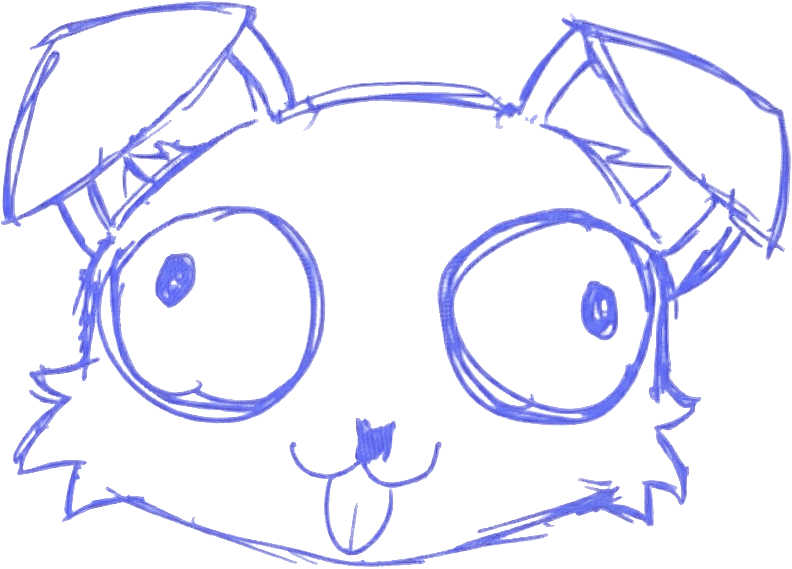
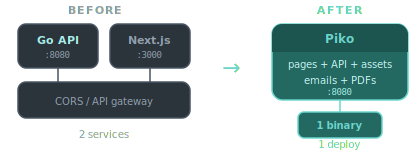
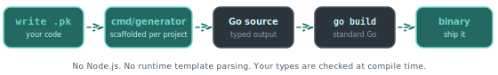
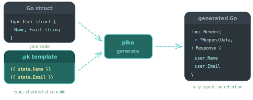
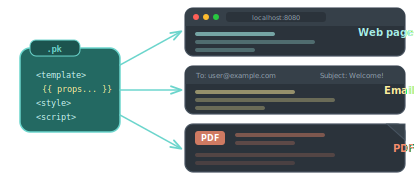
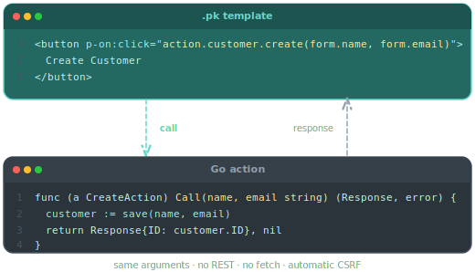
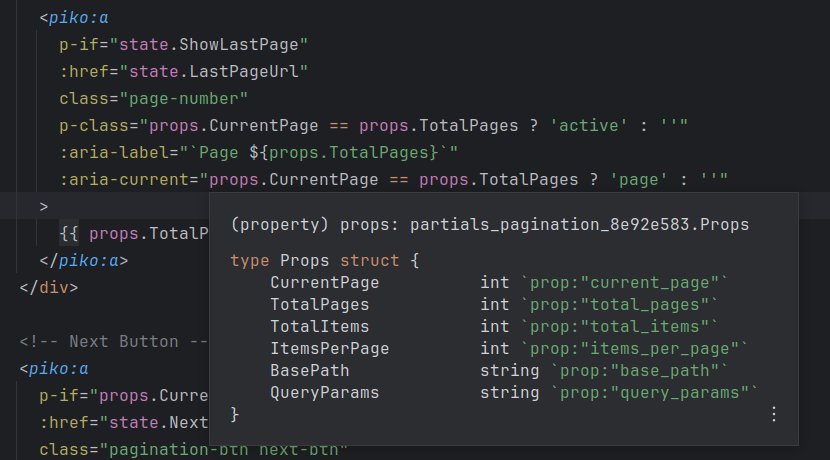
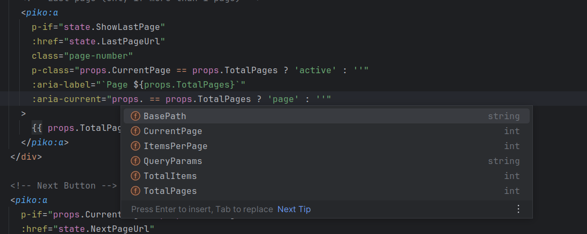
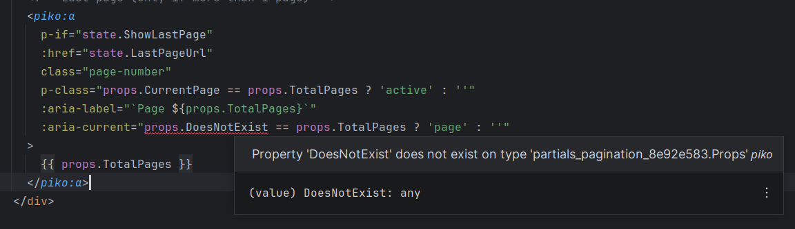
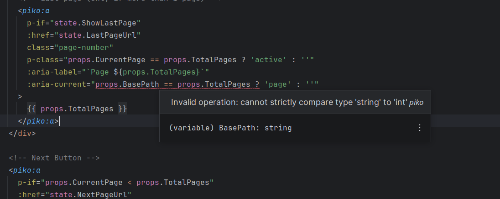

<div align="center">

# Piko

**Drop your JavaScript frontend. Ship one Go binary.**

Piko compiles .pk templates to typed Go code. No Node.js. No runtime template parsing. One `go build` and you're done.



[](https://go.dev/)
[](LICENSE)
[]()

[](hack/test/test.sh)
[](frontend/core/)
[](plugins/vscode/)
[](plugins/idea/)

[Getting Started](#getting-started) |
[Documentation](docs/) |
[Examples](examples/scenarios/) |
[Contributing](CONTRIBUTING.md)

</div>

---

> **Alpha:** Piko is under active development. Expect breaking changes between releases. The API will stabilise by version 0.5.0, targeting a 1.0.0 release after that.

---

## About

If you run Go on the backend and React, Vue, Next.js, or Nuxt on the frontend, you maintain two codebases in two languages with two build systems and two deploys. Your Go structs get serialised to JSON, then re-typed in TypeScript, then validated again on the client. A field rename means updating both sides and hoping nothing falls through.

Piko removes the frontend codebase. You write `.pk` templates alongside your Go code. The generator compiles them to Go source. Your types flow from struct definition to rendered HTML without a serialisation layer or API contract in between.



A Piko application is a Go program you control:

```go
func main() {
    ssr := piko.New(
        piko.WithCacheProvider("redis", redisProvider),
        piko.WithEmailProvider("ses", sesProvider),
        piko.WithMonitoring(),
    )

    // Add your own chi middleware and routes alongside file-based routing
    ssr.AppRouter.Use(myAuthMiddleware)
    ssr.AppRouter.Get("/api/health", healthHandler)

    if err := ssr.Run(piko.RunModeDev); err != nil {
        log.Fatal(err)
    }
}
```

---

## How it works



### .pk templates compile to Go

`.pk` files look like Vue single-file components: a `<template>`, a `<script type="application/x-go">` block, and optional `<style>`. But they are not interpreted at runtime.

The Piko generator statically analyses your Go types and compiles each template into Go source code. A `p-if` becomes a Go `if`. A `p-for` becomes a Go `for`. A comparison like `state.Count == 1` compiles to a direct integer comparison because the generator already knows the type. The generated code has no reflection and no `interface{}` boxing.

If you rename a field or change a type, you get a compile error. Not a broken page in production. See a [full .pk file in action](#pages) below.



### Hot reload without full rebuilds

During development, Piko runs a custom Go interpreter that executes compiled templates at runtime. You edit a `.pk` file, the generator re-compiles it, and the interpreter picks up the change without restarting the server. In production, everything is statically compiled and the interpreter is not included.

### One format for pages, emails, and PDFs

The `.pk` template format is the same whether you are rendering a web page, a transactional email, or a PDF document. The directives, Go script block, and scoped CSS all work across output types. Email templates use PML elements (`pml-row`, `pml-col`, `pml-button`) that produce Outlook-compliant HTML with VML fallbacks.



---

## Getting Started

### Prerequisites

- Go 1.26 or later

### Installation

```bash
# Add Piko to an existing Go project
go get piko.sh/piko

# Or start a new project with the CLI wizard
go install piko.sh/piko/cmd/piko@latest
piko new

# After the wizard creates your project:
cd my-app
air   # Compiles .pk templates and starts the dev server with hot reload
```

[air](https://github.com/air-verse/air) runs the generator and server together. You can also run them separately with `go run ./cmd/generator/main.go all` and `go run ./cmd/main/main.go dev`.

---

## Usage

### Pages

Each page is a `.pk` file with three blocks: a `<template>` for HTML, a `<script type="application/x-go">` block for Go logic, and an optional `<style>` for scoped CSS. The Go block defines a `Response` struct and a `Render` function. Whatever `Render` returns becomes `state` in the template.

The template directives (`p-if`, `p-for`, `p-key`, `:class`, `p-on:click`) will look familiar if you have used Vue. The difference is that these compile to Go, not JavaScript. The generated code has direct field access with no type assertions or map lookups at runtime.

```html
<!-- pages/customers.pk -->
<template>
  <piko:partial is="layout" :server.page_title="state.Title">
    <h1>{{ state.Title }}</h1>

    <p p-if="state.Total == 0">No customers found.</p>

    <ul p-else>
      <li p-for="(i, customer) in state.Customers"
          p-key="customer.ID"
          :class="{ 'highlight': customer.IsVIP }">
        {{ customer.Name }} - {{ customer.Email }}
        <button p-on:click="action.customer.delete(customer.ID)">Remove</button>
      </li>
    </ul>

    <p>Showing {{ state.Total }} customers</p>
  </piko:partial>
</template>

<script type="application/x-go">
package main

import (
    "piko.sh/piko"
    layout "my-app/partials/layout.pk"
)

type Customer struct {
    ID    int64
    Name  string
    Email string
    IsVIP bool
}

type Response struct {
    Title     string
    Customers []Customer
    Total     int
}

func Render(r *piko.RequestData, props piko.NoProps) (Response, piko.Metadata, error) {
    customers := fetchCustomers(r.Context())
    return Response{
        Title:     "Customers",
        Customers: customers,
        Total:     len(customers),
    }, piko.Metadata{}, nil
}
</script>

<style>
.highlight { background-color: #fef3c7; }
</style>
```

The `Render` function runs on the server. Its return value is available in the template as `state`, and the `Metadata` struct controls SEO tags, caching, and other page-level behaviour.

The `layout "my-app/partials/layout.pk"` import looks unusual, but the generator rewrites it into a standard Go import of the layout's generated package. This means you can import public types and functions from other `.pk` files the same way you would between normal Go packages.

Templates support conditionals, loops, two-way binding, event handling, slots, and more. See the [full directive reference](docs/) for the complete list.

### Actions

Actions are RPC-style calls from the frontend to the server. Your template calls a Go function directly, with the same arguments and return types on both sides. No REST endpoints to define, no fetch calls to write. Piko generates the dispatch code:



Actions support multiple transports (HTTP, SSE), structured error types that map to HTTP status codes (`ValidationError` → 422, `NotFoundError` → 404, `ForbiddenError` → 403), file uploads, and per-action middleware.

### Email templates

Email templates are `.pk` files with the same structure you already know. The only difference is you use PML layout elements (`pml-row`, `pml-col`, `pml-button`) instead of HTML. Piko produces Outlook-compliant output with VML fallbacks:

```html
<!-- emails/welcome.pk -->
<template>
  <pml-row class="header">
    <pml-col>
      <pml-img src="@/lib/email/logo.png" width="180px" alt="My App"></pml-img>
    </pml-col>
  </pml-row>

  <pml-row>
    <pml-col>
      <pml-p class="greeting">Welcome, {{ props.Name }}!</pml-p>
      <pml-p>Click the button below to activate your account.</pml-p>
      <pml-button :href="props.ActivationURL" background-color="#007bff">
        Activate Account
      </pml-button>
    </pml-col>
  </pml-row>
</template>

<style>
.header { background-color: #f5f5f5; }
.greeting { font-size: 20px; font-weight: bold; }
</style>

<script type="application/x-go">
package main

import "piko.sh/piko"

type WelcomeProps struct {
    Name          string
    ActivationURL string
}

func Render(r *piko.RequestData, props WelcomeProps) (piko.NoResponse, piko.Metadata, error) {
    return piko.NoResponse{}, piko.Metadata{Title: "Welcome!"}, nil
}
</script>
```

Loose content is automatically wrapped in the required `pml-row`/`pml-col` structure, so you can write flat markup without boilerplate.

---

## IDE Support

Piko includes IDE plugins and a language server for `.pk` templates. Because the generator statically analyses your Go types, the IDE can provide hover documentation, completions, and diagnostics inside your templates, the same way it would in a normal Go file.

- **VS Code** - Syntax highlighting, completions, and diagnostics ([plugin](plugins/vscode/))
- **JetBrains** - Full support for JetBrains IDEs ([plugin](plugins/idea/))
- **Language Server** - LSP implementation for any compatible editor

The LSP currently requires around 512MB to 1GB of RAM. JetBrains users should install [LSP4IJ](https://plugins.jetbrains.com/plugin/23257-lsp4ij) and use GoLand or IntelliJ IDEA, as the plugin embeds their Go language system for full type support.

### Hover documentation

Hover over `props` or `state` references in a template to see the full Go struct definition, including field names, types, and struct tags.



### Autocomplete

Get context-aware completions for all available properties, with their types displayed inline.



### Property validation

Reference a property that does not exist and the IDE flags it.



### Type checking

Type mismatches in template expressions are caught at compile time.  
Here, comparing a `string` field to an `int` field produces an inline diagnostic.



---

## Contributing

Contributions are welcome. Please read the [Contributing Guide](CONTRIBUTING.md) for details on our development process, how to submit pull requests, and coding standards.

---

## License

Distributed under the Apache 2.0 License. See [LICENSE](LICENSE) for more information.
