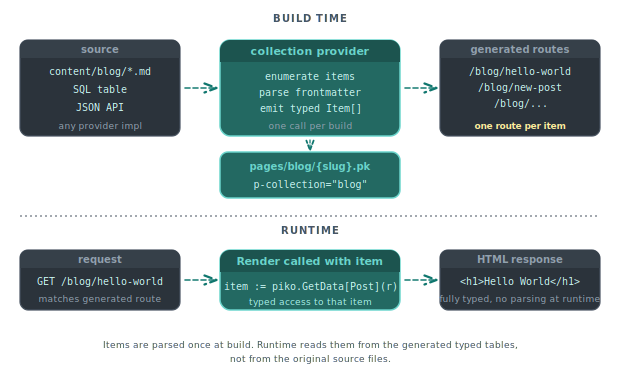

# About collections

A collection in Piko is a declarative mapping between a content source and a set of generated routes. The source can be a directory of markdown files, or any custom provider that wraps a JSON API, database, or other enumerable source. At build time, Piko reads the source, creates one route per entry, and passes the entry's structured data (frontmatter, columns, JSON keys) to the rendering page. This page explains why collections exist as a first-class concept and how the provider model keeps the surface uniform across sources that are nothing alike.

  

## The problem

Most websites have two kinds of content. The first is code, meaning pages with unique layouts. The second is data, meaning sets of pages with the same shape. A product catalogue, a blog, a docs site, a team-member directory are each a template plus a dataset. Building this in a conventional toolkit involves three separate concerns. The toolkit has to read the data, generate the routes, and render each route's template.

A toolkit can glue those together by convention, for example file-based routing for markdown, or a plugin for SQL sources. It can also push them onto the application, for example looping over rows in `main.go` and calling a router registration function for each. The convention route is brittle as data types multiply. The application route duplicates boilerplate per data source.

Piko's answer is to lift the concept of "data source bound to a template" into a first-class declaration. A PK template adds `p-collection="blog"` and `p-provider="markdown"` in its root element. The build looks up the `blog` provider, asks it for every entry, and generates one route per entry. The rendering template reads each entry's frontmatter through `piko.GetData[T](r)` with a Go type that matches the frontmatter shape.

## Why build-time, not runtime

Collections could have been a runtime concept, for example a query in the `Render` function, called once per request. We chose build-time because the cost and the semantics both improve.

Consider the cost side first. If a blog has two hundred posts and they do not change between deploys, fetching the list at every request (or caching it in memory) is wasteful. Generating two hundred static HTML files at build time eliminates both the query and the render cost at serving time. The hybrid provider model supports Incremental Static Regeneration for content that does change, so the build-time default does not close the door on dynamic content.

The semantics improve too. Building the list at build time means missing-slug handling and 404 behaviour are deterministic. A request to `/blog/foo` either matches a generated route or falls through to the error page. There is no race where Piko fetches the list between request arrival and response, no split-brain where one replica has a row another does not.

For projects where data truly changes per-request (user dashboards, search results), collections are the wrong tool. Actions or regular dynamic routes handle those cases by running their own queries.

## The provider interface

A provider implements a small interface: "given a collection name, return the list of items," with an optional "given an item key, return the full item" for lazy detail fetching. The markdown provider, which reads a directory of `.md` files with YAML frontmatter, ships in the box. A custom provider can wrap any data source that supports enumeration - a JSON API, a database query, a content-management backend.

This is deliberately the same pattern as Piko's storage, cache, email, and other services. Each has a domain-defined port (interface), one or more adapter implementations (providers), and a registration call at startup. Runtime providers register through `RegisterRuntimeProvider` from `piko.sh/piko/wdk/runtime`. The package uses the name `runtime`, but examples consistently import it under the `pikoruntime` alias to avoid colliding with the standard library `runtime` package, and the registration call is then written `pikoruntime.RegisterRuntimeProvider`. Registration typically happens from `init()` in the package that defines the provider. Piko then consults the global registry whenever a collection request resolves. The uniformity makes the codebase smaller and lets users who understand one service understand the others.

## Filters, sort, and pagination

Collections grow, and pages that enumerate them (a blog index, a product catalogue listing) need filtering, sorting, and pagination. Piko puts these on the collection service instead of making each page implement them.

A page calls `piko.SearchCollection[T](r, "name", query, opts...)` with a free-text query and option functions (`piko.WithSearchFields`, `piko.WithFuzzyThreshold`, `piko.WithSearchLimit`, and so on). The collection service evaluates the search against the provider's data. The built-in markdown provider loads entries and filters in memory, while a custom provider that wraps a database can push string matching into the backend if it chooses. For structured filters and pagination outside search, callers pass the lower-level `Filter`, `SortOption`, and `PaginationOptions` types through the collection's typed accessors (`piko.NewFilter`, `piko.And`, `piko.NewSortOption`, `piko.NewPaginationOptions`). The same service evaluates them.

This keeps the page template agnostic of the data backend. Swapping from markdown to a custom provider is a provider change, not a template rewrite.

## Trade-offs

Build-time generation is uncomfortable at extreme scale. Ten thousand blog posts is still fast. Ten million rows is not, and the output blows up to ten million HTML files. Piko handles this with hybrid routes, a model sometimes called Incremental Static Regeneration. Some routes render at build time, others render on demand and cache. The decision is per-collection, not global.

Heavy frontmatter schemas sometimes drift between what the template expects and what the files contain. The generated Go struct for frontmatter is an opt-in layer. A page calls `piko.GetData[Post](r)` to get the frontmatter typed against `Post`. The typed form trades looseness for compile-time guarantees about the field set. There is no `GetDataMap` helper. When code needs untyped access, read the raw collection data off the request.

## See also

- [Collections API reference](../reference/collections-api.md) for every function and directive.
- [How to markdown collections](../how-to/collections/markdown.md) for the default source.
- [How to querying and filtering](../how-to/collections/querying-and-filtering.md) for the `Filter`, `SortOption`, and `Pagination` APIs.
- [How to custom providers](../how-to/collections/custom-providers.md) for backing a collection with a non-markdown source.
