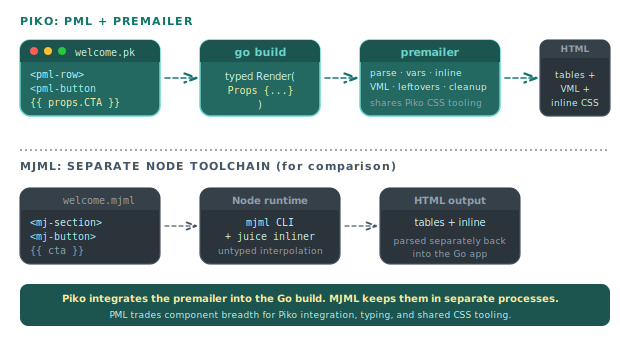

# About email rendering

Piko treats email templates as first-class PK files. They live under `emails/`, accept typed props, and render through the same template pipeline as web pages. Piko also ships a dedicated email-tag vocabulary (PML) and a premailer that prepares the output for real-world email clients. This page explains why Piko built that stack instead of adopting an external tool like MJML, and where the two stacks diverge.

  

## Email is not the web

Rendering HTML for a browser is a solved problem. Rendering HTML for email is not. Every major email client implements a different subset of CSS, and the surviving market leader on desktop (Outlook) renders through Microsoft Word. Gmail and Yahoo also inject their own stylesheet on top of yours. Any serious email-sending system has to:

1. Lay content out with nested tables, because tables are the only layout primitive Outlook renders reliably.
2. Inline CSS into `style` attributes, because Gmail strips `<style>` in `<head>` and webmail clients sanitise aggressively.
3. Emit Microsoft-specific VML fallbacks for backgrounds and buttons, because Outlook ignores CSS for those.
4. Validate against the feature matrix, because a flexbox property that looks right in development silently collapses in production.

A framework that wants to help with email has to accept all four constraints. The question is whether to build the tools inside the framework or pull them in.

"New Outlook" is a new rendering engine for Outlook based on the web rendering engine. It has a better rendering engine, but corporate users often adopt it slowly because it is not feature-comparable with the "Old Outlook". Expect "Old Outlook" to see high adoption for years to come.

## The case for integrating

MJML (mjml.io) is the most-used open-source email-template language. It is good. Projects can use MJML from Go today by invoking a CLI, piping a template through Node, and parsing the result. That path costs three things Piko is not willing to pay.

The first is the toolchain split. Piko compiles PK templates into Go code at build time. If emails used MJML, the pipeline would need a Node runtime, a separate parser, a separate asset-linking step, and a separate preview mode. The project would carry two template languages (PK for web, MJML for email) that share no components, themes, or props. Onboarding a contributor then means teaching them two systems.

The second is typing. MJML templates interpolate data through an untyped placeholder layer. Piko templates compile against Go structs. A prop type that drifts from the template's usage becomes a compiler error, not a runtime template-render bug. For transactional email, where a broken template sends a broken message to a real customer, that compile-time check carries weight.

The third is CSS integration. Piko already has a CSS parser (esbuild's) and already resolves CSS variables against a theme. A premailer built on top of those internals can reuse the parser, share the theme, share the shorthand-expansion code, and stay in lockstep with the rest of the generator. An external premailer would reimplement all of that.

## What PML is

PML is a tag vocabulary used inside email PK templates. The tags (`pml-row`, `pml-col`, `pml-button`, `pml-img`, `pml-hero`, etc.) render to table-based HTML that Outlook understands, plus VML fallbacks for the parts Outlook ignores. The [PML components reference](../reference/pml-components.md) documents every tag.

PML is deliberately small. Thirteen components cover layout (rows, columns, containers, no-stack), content (paragraphs, buttons, images, heroes, horizontal rules, line breaks), and lists. More specialised shapes compose from those primitives inside a regular `<table>` or wrap into a PKC component.

## How PML differs from MJML

MJML is the reference point. Concretely:

| Dimension | PML | MJML |
|---|---|---|
| Template language | Lives inside PK files; uses Piko's full template syntax (`{{ props.Name }}`, `p-if`, `p-for`, i18n, partials). | A standalone format with a more limited interpolation layer. |
| Types | Props are Go structs; the compiler enforces shape. | Interpolation carries no type information. |
| Toolchain | Runs in the Go build. | Requires a Node runtime. |
| CSS pipeline | The premailer shares the parser and theme with the rest of Piko. | Uses Juice, a separate JS premailer. |
| VML fallbacks | Auto-generated for button pills and row background images. | Covers buttons; backgrounds are less thorough. |
| Responsive breakpoint | Configurable via premailer options. | Fixed at 480 px. |
| Component surface | Thirteen primitives; anything more specialised composes from those or drops into raw HTML. | Larger built-in set: navbar, carousel, accordion, raw, social icons. |

Piko trades component breadth for framework integration. MJML trades framework integration for being a mature, specialised tool for email-only projects.

## How the premailer differs

Piko's premailer runs in ten stages (see the [premailer reference](../reference/premailer.md)). The stages are collection, variable resolution, parsing and cascade, shorthand expansion, colour normalisation, inlining, link-parameter injection, leftover placement, pseudo-element resolution, and cleanup. Each stage lives in Piko-internal code that reuses the framework's existing CSS tooling.

Three things about it are worth calling out.

First, variable resolution runs before inlining. Email clients cannot evaluate `var()`, so the premailer replaces every custom property with the value from a theme map. That theme map comes from the same source as the rest of the site's theme, so email and web share tokens.

Second, leftover rules (pseudo-classes, `@media` queries) move into a `<style>` block in the `<body>`, not `<head>`. Gmail strips `<style>` from `<head>`. Putting the block in `<body>` keeps it alive. An option marks declarations `!important` so they override Gmail's injected styles after an email forward.

Third, the validation stage is strict. Flexbox, grid, animations, transforms, shadows, gradients, position, and float surface as diagnostics. The intent is to fail fast in development, not to block sending.

## Where the tradeoffs bite

The integration path costs in three places.

Component breadth is the first cost. Projects that want a rich library of pre-built email blocks (navbars, carousels, accordions) find PML sparse compared with MJML. Filling the gap means raw HTML or PKC components, which works but is not as terse.

External tooling is the second. Some commercial email-testing tools plug into MJML directly. With Piko, the integration runs through rendered HTML, which those tools also support, but there is no Piko-specific plugin ecosystem.

Migration audit is the third. A team that already has MJML expertise and MJML templates cannot drop-in adopt Piko without porting. The templates look similar, but the attribute set and the expected parent-child relationships differ.

We accept these trade-offs. They are the cost of a typed, integrated, Go-native email stack.

## When emails belong elsewhere

Piko's email system targets transactional messages such as password resets, order confirmations, invoice receipts, and newsletter welcomes. Marketing campaigns with heavy visual design, A/B-tested subject lines, and segmentation logic belong in a dedicated email-service provider (SendGrid Marketing, Mailchimp, Customer.io). Use Piko to generate the event that calls the provider, not to render the marketing HTML itself.

The split matters because the feedback loops differ. Transactional email runs against golden HTML in CI. Campaign email runs against inbox-preview services, deliverability heuristics, and A/B metrics. Piko's premailer targets the first use case. It does not compete in the second.

## See also

- [PML components reference](../reference/pml-components.md).
- [Premailer reference](../reference/premailer.md).
- [Email API reference](../reference/email-api.md) for the service that dispatches rendered templates.
- [How to email templates](../how-to/email-templates.md) for authoring recipes.
- [Scenario 026: email contact form](../showcase/026-email-contact.md) for a runnable example.
