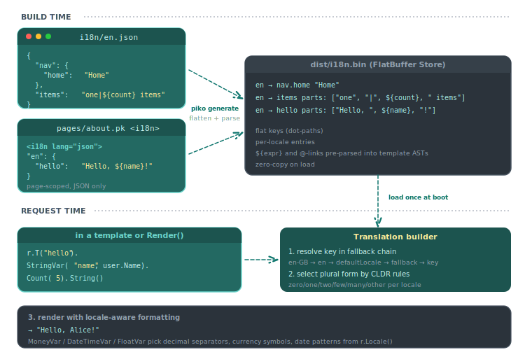

# About internationalisation

Piko's i18n system is a runtime translation store with a fluent, typed binding API. Translations live as JSON, get flattened into a single FlatBuffer-backed store at build time, and resolve at request time through a builder that takes typed variables and a CLDR-aware count. The shape is unusual on two axes at once: the storage is "big runtime store" (familiar from Vue i18n, gettext, and `golang.org/x/text`), but the binding is fluent typed Go (familiar from the SQL builders, less so for translation libraries). This page explains why we picked that combination.

<p align="center">
  
</p>

## The two problems

Conventional i18n has two shapes that make different trade-offs.

**Format-string-with-map** is the dominant pattern: `T("key", map[string]any{"name": x})`. It is concise to write and works fine for prose, but it shifts every error to runtime. A typo in a variable name, a `%s` where the translation expects a number, a missing key: all surface as broken UI in production. Reviewing diffs is also harder than it should be: an unbound variable in a long template string is invisible until rendering.

**Codegen-typed-functions** swings the other way: emit `t.Greeting(name string) string` per key so the compiler enforces signatures. The cost is that translations now live in two places (the JSON and the regenerated Go). Renaming a key, adding a parameter, or shipping a translation update without a redeploy all become deeper operations than they need to be. The model also struggles with plurals and locale-aware number/date formatting, where the typed signature would have to encode CLDR categories per language.

Piko's choice splits the difference: keep the translations in a runtime store (so they can be hot-reloaded, edited by translators, and shipped without code changes), but make the binding API a typed fluent builder that catches the common mistakes the format-string approach surfaces only at render time.

## The shape

A call site looks like this:

```go
greeting := r.T("user.greeting").
    StringVar("name", user.Name).
    IntVar("count", inboxCount).
    String()
```

`r.T(key)` returns a `*Translation` value. The fluent setters (`StringVar`, `IntVar`, `FloatVar`, `DecimalVar`, `MoneyVar`, `BigIntVar`, `TimeVar`, `DateTimeVar`, `Var`, `Count`) each take typed Go arguments and return the same `*Translation` for chaining. A terminal `String()` resolves the key against the locale store, applies the CLDR plural form when `Count(n)` was set, walks the template AST substituting the bound variables (with locale-aware formatting for money, dates, and floats), and returns the rendered string.

The builder is the typing layer. The Go compiler catches `MoneyVar("price", 19.99)` (wants `maths.Money`, got `float64`) before it can ever fail at render time. Misspelling a variable name still falls through to a literal, but those are caught quickly because the bound names are local to the call site.

## Why FlatBuffers, why a single binary

The build step flattens every translation source (global `i18n/<locale>.json` files plus every page's `<i18n>` block) and emits a single `dist/i18n.bin` FlatBuffer. At server boot, that file is mapped once. There is no per-request parse, no per-key allocation walk through nested maps, and no template-string parse on the hot path. Templates are parsed once at build time into typed parts (literal segments, expression placeholders, linked-message references) and the parts ship in the binary.

The wins are real:

- **Cold-start cost is one mmap** rather than walking N JSON files and parsing M template strings.
- **Translation builders pool** through `sync.Pool`. A request that calls `r.T(...).String()` ten times allocates effectively nothing.
- **Linked references** (`@common.brand`) resolve through pointer chases inside the loaded buffer, capped at depth 10 to break cycles.

The trade-off is that translations are not editable at runtime in production. A translation update requires regeneration. In development that is not noticeable (the dev server regenerates on save), but a project that genuinely needs translator-edits-without-deploy needs to ship JSON in the deploy artefact and reload it.

## Why a fluent builder over a format-string-with-map

The two viable shapes for the binding API were:

```go
// Map shape:
r.T("greeting", map[string]any{"name": x, "count": n})

// Fluent shape:
r.T("greeting").StringVar("name", x).IntVar("count", n).String()
```

The map shape is shorter for the common case. The fluent shape is harder to misuse for the cases that matter:

- **Each setter takes a typed value.** `MoneyVar` requires `maths.Money`; the compiler rejects the bare `float64` that a translator might have intended. The map shape can only enforce types at runtime.
- **`Count(n)` is a discoverable API surface.** With a map the plural-count is just another key; with a builder, the existence of `Count` tells the reader plurals exist.
- **Locale-aware formatting attaches to the value, not the format string.** `DateTimeVar` selects the formatting style separately from the placeholder, which keeps the translation source readable to non-engineers.
- **The builder pool model works.** `sync.Pool` reset semantics are easier to reason about for a builder than for an opaque map.

The cost is verbosity. For a translation that takes one string variable, the fluent form is wordier than the map form. We accept that trade-off.

## CLDR plurals

Piko sources its plural rules from the Unicode Common Locale Data Repository. A translation declares its plural variants as pipe-separated forms in a single string:

```json
{
  "items": "no items|one item|${count} items"
}
```

`Count(n)` selects the right form for the active locale at render time. English uses two forms (singular versus plural). Slavic languages use three (one, few, many). Arabic carries six (zero, one, two, few, many, other). The pipe form is dense, but it keeps the singular and plural variants visually adjacent, which is what translators want when editing.

Piko does not ship the full ICU MessageFormat. The select-on-arbitrary-key, ordinal, and gender forms add expressivity that pulls the syntax further from anything a translator can edit by hand. CLDR plural rules cover the cases that come up frequently; for the tail of complex grammatical rules, projects can fall through to bare Go and call `golang.org/x/text` directly.

## Two scopes: T versus LT

`r.T(key)` searches the global store first and the per-page `<i18n>` block second. `r.LT(key)` searches only the per-page block. The asymmetry is deliberate.

Most translations belong to global namespaces (nav labels, footer text, error messages, validation copy). `T` is the right tool for those: a page that uses `T("nav.home")` benefits from the same global key being available everywhere. A handful of strings, though, live entirely on one page (the page's own headline, an inline form label that has no global twin). Those go in the page's `<i18n>` block, and `LT` exists to make the lookup explicit. Using `LT` says "I expect this string to be local, surface a fallback if it ever escapes".

The fall-through still works in `T`'s favour: a page that defines `<i18n>` keys and calls `T("local-key")` finds them through the local-store fallback. `LT` is the stricter version for code that wants to know if a global key accidentally shadows a local one.

## Routing is separate

The strategy used to encode locale in URLs (`/about` vs `/fr/about` vs `fr.example.com`) is a router concern, not a translation concern. Piko keeps them apart: a page enables multi-locale routing by declaring `SupportedLocales() []string`, and the routing layer produces one route per locale under the configured strategy. Pages without `SupportedLocales` get a single route under the default locale even when other pages opt in.

The separation pays off when projects mix strategies. A user-facing site might want `prefix_except_default` for SEO, while an admin tool inside the same app uses `prefix` because it has no canonical default. Piko supports that mix because the routing strategy is global config, but the opt-in is per-page.

## When this design is the wrong fit

Two cases stretch the model:

**Translator-driven workflows that need runtime updates.** Piko regenerates on deploy, which is fine for most teams. If your translators commit JSON to a separate repository and expect the site to pick it up without a redeploy, you need a runtime-loadable translations layer, which Piko does not ship by default.

**Non-UI text from Go libraries.** The `<i18n>` block and the `T`/`LT` API target template and Render-time strings. Error messages from a third-party Go package, CLI output from an admin tool, and similar text live outside this surface. Use `golang.org/x/text` or a project-local string table for those; they coexist fine, but they are explicitly a separate path.

## See also

- [i18n API reference](../reference/i18n-api.md) for the full `T`/`LT` surface, all `*Var` setters, the `DateTime` builder, and `GenerateLocaleHead`.
- [How to add translations to a site](../how-to/i18n/basic-setup.md) for wiring a project from scratch.
- [How to choose an i18n routing strategy](../how-to/i18n/routing-strategy.md) for the URL options.
- [How to pluralise translations](../how-to/i18n/pluralisation.md) for the CLDR pipe form.
- [How to bind typed variables to translations](../how-to/i18n/variable-binding.md) for the typed setter surface.
- [How to format dates and times for a locale](../how-to/i18n/date-time-formatting.md) for `DateTime` and `TimeVar`.
