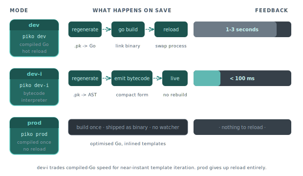

# About interpreted mode (dev-i)

Piko has three run modes: `dev` (compiled with hot reload), `prod` (compiled, optimised, no dev machinery), and `dev-i` (interpreted). This page explains what `dev-i` is, when to reach for it, and the tradeoffs.

  

## The three modes in one line

| Mode | Flag | Template engine | Hot reload | Who uses it |
|---|---|---|---|---|
| Dev | `piko dev` or `RunModeDev` | Compiled Go (regenerated on file change) | Yes | Default development |
| Dev interpreted | `piko dev-i` or `RunModeDevInterpreted` | Bytecode interpreter | Yes, immediate | Faster iteration for PK template changes |
| Production | `piko prod` or `RunModeProd` | Compiled Go, optimised | No | Shipping |

## What dev-i changes

In dev mode, every change to a `.pk` file triggers a regeneration and a partial rebuild of the Go binary. The feedback loop is fast but it runs four steps (detect change, regenerate, rebuild, reload). For small projects the cycle is sub-second. For large projects it can take two or three seconds.

In dev-i mode, there is no binary rebuild for template edits. Piko carries a bytecode interpreter that executes the template directly from a compact bytecode representation. When you save a `.pk` file, the generator produces new bytecode and the interpreter picks it up without restarting the server.

The interpreter reads the same template AST that the compiler uses, and the semantics match one-for-one. A template that renders the same output in `dev` renders the same output in `dev-i`.

## What you trade for the faster loop

Interpreted code is slower than compiled Go. For most development, that does not matter, as a page takes an extra millisecond or two to render. For performance-sensitive work or load testing, drop back to `dev`.

Not every Go symbol is available to the interpreter. The bytecode interpreter vendors a curated list of standard-library packages and Piko runtime functions. See [`piko-symbols.yaml`](https://github.com/piko-sh/piko/blob/master/piko-symbols.yaml) and [`piko-symbols-runtime.yaml`](https://github.com/piko-sh/piko/blob/master/piko-symbols-runtime.yaml). Template expressions that touch symbols outside the registered set fail to interpret. Compile-mode `dev` handles the same code fine. The [runtime symbols reference](../reference/runtime-symbols.md) lists what the interpreter provides.

## When to use each mode

**Use `dev` when**:
- Measuring rendering performance locally.
- Debugging an issue that only surfaces under compiled-code conditions (rare but happens).
- Working on Piko itself, where you want to test generator changes.

**Use `dev-i` when**:
- Iterating fast on templates and UI, with dozens of edits per minute.
- Working on a large project where the compiled rebuild is noticeable.
- Teaching or demoing, where sub-second feedback matters more than peak throughput.

**Use `prod` when**:
- Benchmarking production performance.
- Running integration tests that approximate production behaviour.
- Shipping.

## How the interpreter integrates with the generator

The generator emits two forms of output per template. One form is Go source that the compiler consumes for `dev` and `prod`. The other form is bytecode that `dev-i` loads. Each Piko project scaffolds its own generator entry point at `cmd/generator/main.go` inside the project tree (the example projects under `examples/scenarios/*/src/cmd/generator/main.go` show the shape). That entry point produces both. The generator does not distinguish development vs production output in its source-tree layout. The consumer decides which to load based on run mode.

To expose custom Go symbols to the interpreter, call `ssr.WithInterpreterProvider(provider)` (and optionally `ssr.WithSymbols(symbols)`) on the `*SSRServer` after `piko.New(...)`. Both are methods on the server, not package-level options. If you use `dev-i` and rely on a package that is not in the default symbol set, register it there.

## See also

- [CLI reference](../reference/cli.md) for `piko dev`, `piko dev-i`, and the per-project generator scaffolded into your own tree (typically run as `go run ./cmd/generator/main.go all`).
- [Runtime symbols reference](../reference/runtime-symbols.md) for what the interpreter can see.
- [Bootstrap options reference](../reference/bootstrap-options.md) for `WithInterpreterProvider`.
- Integration tests: [`tests/integration/interpreted_runner`](https://github.com/piko-sh/piko/tree/master/tests/integration/interpreted_runner) and [`interpreted_cache_invalidation`](https://github.com/piko-sh/piko/tree/master/tests/integration/interpreted_cache_invalidation).
