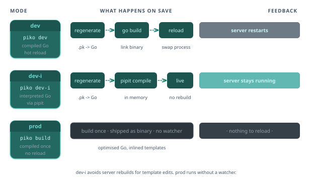

# About interpreted mode (dev-i)

Piko has three run modes, `dev`, `dev-i`, and `prod`. The two development modes reload templates after an edit. Production runs compiled Go without development machinery. Interpreted mode (`dev-i`) removes the server rebuild from the template editing loop.

  

## The three modes in one line

| Mode | Flag | Template engine | Hot reload | Who uses it |
|---|---|---|---|---|
| Dev | `piko dev` or `RunModeDev` | Compiled Go (regenerated on file change) | Yes | Default development |
| Dev interpreted | `piko dev-i` or `RunModeDevInterpreted` | Generated Go, interpreted by Pipit | Yes | Faster iteration for PK template changes |
| Production | `piko build` then `./bin/app prod`, or `RunModeProd` | Compiled Go, optimised | No | Shipping |

## What dev-i changes

In dev mode, a `.pk` edit triggers regeneration and a rebuild of the Go binary. The feedback loop detects the change, regenerates Go, rebuilds the binary, and reloads the server. Its duration depends on the project and build environment.

In dev-i mode, template edits do not rebuild the server binary. Piko runs the generated code through [Pipit](https://github.com/piko-sh/pipit), a Go bytecode interpreter. On each edit, the generator produces Go source and Pipit compiles it to bytecode in memory. The server then loads the updated templates without restarting.

Both modes use the same generated Go source. They differ in how they execute it, so interpreter support and available native symbols also affect what can run in `dev-i`.

## What you trade for the faster loop

Interpreted execution adds runtime overhead compared with compiled Go. The shorter rebuild cycle can help with template editing, but rendering performance in `dev-i` does not represent production performance.

Pipit supplies native symbol tables for the standard library, and Piko adds its runtime packages. Piko can compile local project packages from source or use registered native symbols. Third-party Go packages need native symbol tables. The [runtime symbols reference](../reference/runtime-symbols.md) describes the available packages.

Native symbols belong to the server binary. Changes to those packages require a rebuild and restart, even in interpreted mode. This makes the distinction between template edits and native package edits relevant when choosing a development workflow.

## When to use each mode

**Use `dev` when**:

- Measuring rendering performance locally.
- Debugging an issue that only surfaces under compiled-code conditions (rare but happens).
- Working on Piko itself, where you want to test generator changes.

**Use `dev-i` when**:

- Iterating on templates and UI without restarting the server.
- Working on a large project where the compiled rebuild is noticeable.
- Demonstrating template changes where rebuild time interrupts the flow.

**Use `prod` when**:

- Benchmarking production performance.
- Running integration tests that approximate production behaviour.
- Shipping.

## How the interpreter integrates with the generator

The generator emits Go source for each template in every run mode. In `dev` and `prod`, the Go toolchain compiles that source into the binary. In `dev-i`, Pipit compiles it to bytecode at runtime and runs the package initialisation functions that register template builders.

Each project has a generator entry point at `cmd/generator/main.go`. The output tree stays the same across run modes. The difference lies in when compilation happens and which runtime executes the generated code.

## See also

- [How to run interpreted mode](../how-to/interpreted-mode.md) for setup, native symbols, and bytecode inspection.
- [Interpreter API reference](../reference/interpreter-api.md) for resource limits and diagnostic output.
- [CLI reference](../reference/cli.md) for `piko dev`, `piko dev-i`, `piko extract`, and the per-project generator scaffolded into your own tree (typically run as `go run ./cmd/generator/main.go all`).
- [Runtime symbols reference](../reference/runtime-symbols.md) for what the interpreter can see.
- [Bootstrap options reference](../reference/bootstrap-options.md) for `WithInterpreterProvider`.
- Integration tests: [`tests/integration/interpreted_runner`](https://github.com/piko-sh/piko/tree/master/tests/integration/interpreted_runner) and [`interpreted_cache_invalidation`](https://github.com/piko-sh/piko/tree/master/tests/integration/interpreted_cache_invalidation).
