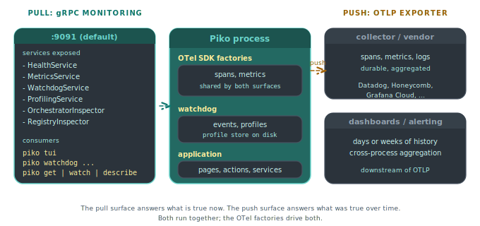

# About monitoring

A production Piko process exposes two separate observability surfaces. The first is the OpenTelemetry pipeline. It pushes traces and metrics outward through OTLP to a collector or vendor. The second is the **monitoring transport**, a local gRPC server. The transport sits separately from the application's HTTP traffic and exposes the *current* state of the process to anyone holding a connection. This page explains why both exist, what each does well, and why Piko treats them as complementary instead of alternatives.

  

## Push and pull observability are different products

OTLP is a push pipeline. The application periodically forwards traces, metrics, and logs to an external collector. A vendor backend stores the points, indexes them, and serves dashboards days or weeks later. The pipeline's strengths are durability and aggregation across a fleet of processes.

The monitoring transport is a pull endpoint. A local consumer (typically `piko tui`, sometimes a CLI like `piko get` or `piko watch`) connects to the running process and asks for *what is true right now*. That covers live metrics counters, current span backlog, file-descriptor pressure, the watchdog's recent decisions, and the list of stored diagnostic profiles. The transport's strengths are low latency and no external infrastructure. It also reaches data OTLP would not expose at all. That covers the watchdog event ring, the in-process profile store, and the inspector graph.

Both pipelines run together. The OTel SDK factories passed to `WithMonitoringOtelFactories` feed the same span and metric streams into both surfaces, so the gRPC transport shows the operator what the OTLP pipeline is *about* to push.

## Why gRPC and not another HTTP endpoint

The monitoring server is a gRPC server because the consumer is a long-lived client streaming structured messages. `piko tui` subscribes to event streams, pulls strongly typed protobuf messages for each panel, and round-trips small RPCs (`GetWatchdogStatus`, `ListProfiles`) to populate views. HTTP/JSON would have worked but would have cost Piko a hand-rolled schema layer, and would not have given streaming for free.

gRPC also lets the transport co-host every inspector service on one connection. Health, metrics, traces, watchdog, profiling, orchestrator, and registry all share a single authenticated link. Adding a new service later does not change the deployment shape.

## Why the transport binds to localhost by default

The default bind address is `127.0.0.1`. A misconfigured production server should not expose its profile store, span backlog, and inspector graph to the open internet. Operators who need remote access reach for SSH tunnelling, `kubectl port-forward`, or explicit `WithMonitoringBindAddress` plus `WithMonitoringTLS`. Piko treats remote exposure as an opt-in decision, not a default.

When TLS does come into play, `WithMonitoringTLS` covers the full set. The options span certificate paths, mTLS via a client CA, minimum TLS version, and hot reload so certificate rotation skips the restart. The same `MonitoringTLSOption` sub-options that secure a public OTLP endpoint also secure the monitoring transport.

## Auto-port selection in development

Multi-process developer setups (running two Piko apps locally, or running a test alongside a long-lived server) frequently collide on the default monitoring port. `WithMonitoringAutoNextPort(true)` makes the server step forward up to 100 consecutive ports if the configured one is busy. The actual port lands in the startup log, and `piko tui` accepts an `--endpoint` flag to point at the chosen address.

Auto-next-port defaults off. A port that silently shifts is a worse problem than a port that fails to bind, so Piko requires the operator to opt in.

## The watchdog plugs in here

The watchdog is *the* killer feature of the monitoring transport for most operators. The application configures it under `WithMonitoring`. The watchdog captures profiles on disk, fires events into an in-memory ring, and exposes that ring as a gRPC service. `piko tui` reads the watchdog panels through the same connection it uses for metrics and health. A single tool gives the operator the supervisor's recent decisions and the runtime telemetry that informed them. See [about the watchdog](about-the-watchdog.md).

## Profiling control is also bolted on

`WithMonitoringProfiling()` registers a gRPC profiling service on the same transport. `piko profiling enable 30m` flips block and mutex profiling on remotely, and `piko profiling capture heap` writes a heap profile to the running process's profile directory. The pprof HTTP server stays available for local debugging through `WithProfiling`, but the gRPC route is what an operator on a remote shell uses safely.

The two profiling routes do not duplicate state. Both write to the same on-disk profile store the watchdog uses, so a heap profile captured by `piko profiling capture` shows up in `piko watchdog list` exactly the same as one the watchdog captured automatically.

## What this means for application code

Application code rarely touches the monitoring transport directly. The operator-facing surface is `piko tui`, `piko watchdog`, `piko profiling`, `piko get`. The application's job is to enable the transport with `WithMonitoring(...)`, hand it the OTel factories that match the OTLP exporter, and (almost always) enable the watchdog. Everything else is configuration of which thresholds to enforce, which profiles to keep, and which channel to notify when something fires.

## See also

- [Monitoring API reference](../reference/monitoring-api.md) for the bootstrap surface.
- [About the watchdog](about-the-watchdog.md) for the supervisor that runs on top of the transport.
- [How to enable the monitoring endpoint](../how-to/observability/enable-monitoring.md) for the wiring recipe.
- [How to inspect a running app with piko tui](../how-to/observability/inspect-with-tui.md) for the consumer side.
- [About the hexagonal architecture](about-the-hexagonal-architecture.md) for the port-and-adapter split that the transport factories use.
