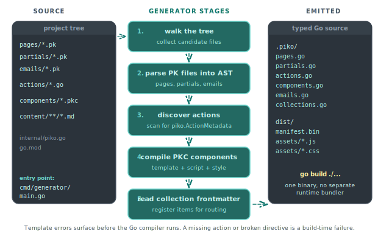

# About project structure

Every Piko project follows the same directory shape. The scaffolder (`piko new`) creates it, and the generator and the runtime both depend on it. This page explains what each directory is for, what the generator reads, and what the generator produces. Where reference detail lives elsewhere, this page links out.

## The scaffolded tree

```text
my-app/
├── .piko/                # Generator output read by the binary; do not edit, do not commit
├── dist/                 # Compiled assets and bundles served at runtime; do not edit, do not commit
├── actions/              # Server actions (Go)
├── components/           # Client components (.pkc)
├── pages/                # Page routes (.pk)
├── partials/             # Reusable template fragments (.pk)
├── emails/               # Email templates (.pk with PML)
├── content/              # Markdown collections (optional)
├── internal/             # Private Go packages
├── pkg/                  # Public Go packages (optional)
├── cmd/
│   ├── generator/main.go # Asset and manifest generator entry point
│   └── main/main.go      # Server entry point
├── config.json           # Runtime theme, frontend config
├── piko.yaml             # Base configuration
├── piko-prod.yaml        # Optional per-environment override
├── piko.local.yaml       # Gitignored per-machine override
├── .env                  # Gitignored environment variables
├── .gitignore
├── Dockerfile
├── go.mod
└── go.sum
```

Not every project has every directory. `emails/` exists when the project sends mail. `content/` exists when it uses collections. `components/` exists when it uses client reactivity.

## How the generator reads the tree

<p align="center">
  
</p>

`cmd/generator/main.go` invokes `piko.New(...).Run(piko.GenerateModeAll)` (or a narrower mode). The generator walks the project directory and:

1. Parses every `.pk` in `pages/`, `partials/`, and `emails/` into an abstract syntax tree.
2. Discovers every action struct in `actions/` by scanning Go files for the `piko.ActionMetadata` embed.
3. Discovers every PKC component under `components/` and compiles its template, script, and style sections.
4. Reads YAML frontmatter from markdown files under `content/` and registers them as collection items.
5. Emits Go code and runtime artefacts under `.piko/`, plus compiled assets and bundles under `dist/`, all of which the binary reads at request time.

Because the generator runs before the Go compiler, any template error surfaces before `go build`. A missing action, a broken directive, or a misspelled collection field is a build-time failure, not a runtime panic.

## Directory-by-directory

### `pages/`

Each `.pk` file in `pages/` becomes a route. The filename maps to the URL segment, with these conventions:

- `pages/index.pk` serves `/`.
- `pages/about.pk` serves `/about`.
- `pages/blog/{slug}.pk` serves `/blog/:slug` with `slug` available on the request.
- `pages/api/{...path}.pk` serves a catch-all route under `/api`.
- `pages/!404.pk` handles any 404 under its directory.

A page's `Render` function returns a typed `Response` struct, a `piko.Metadata`, and an error. The template binds to the response through `state.*`. See the [PK file format reference](../reference/pk-file-format.md) for the full syntax and the [about routing explanation](about-routing.md) for the design rationale.

### `partials/`

Partials are reusable template fragments that other `.pk` files import. They accept props (declared as a Go struct) and can receive slotted content. They are not routable, and no URL maps to a partial.

```text
partials/layout.pk
partials/card.pk
partials/site-nav.pk
```

See the [PK file format reference](../reference/pk-file-format.md) and the [passing props how-to](../how-to/partials/passing-props.md).

### `components/`

Client components use the `.pkc` extension. They compile to Web Components and run in the browser. They have their own template syntax and reactive state model. See the [client components reference](../reference/client-components.md).

```text
components/pp-counter.pkc
components/pp-chart.pkc
```

By convention, prefix project components with `pp-` to avoid collisions with built-in and third-party custom elements.

### `actions/`

Actions are the typed RPC surface used by client code to call the server. Each action lives in a package under `actions/` and embeds `piko.ActionMetadata`:

```
actions/
├── customer/
│   ├── upsert.go      # CustomerUpsertAction
│   └── delete.go      # CustomerDeleteAction
└── auth/
    └── login.go
```

The generator reads the package name and struct name to derive the endpoint: `actions/customer/upsert.go` with `type UpsertAction struct { piko.ActionMetadata }` serves `POST /actions/customer.Upsert`.

See the [server actions reference](../reference/server-actions.md) and the [about the action protocol explanation](about-the-action-protocol.md).

### `emails/`

Email templates are `.pk` files that use PML components instead of plain HTML. PML stands for the Piko mail language. They render through the email service, which handles CSS inlining, Outlook VML fallbacks, and CID asset embedding. See the [PML components reference](../reference/pml-components.md) and the [email templates how-to](../how-to/email-templates.md).

### `content/`

Markdown collections live here. Each subdirectory is a collection name, and the files inside become collection items. Piko reads the YAML frontmatter at build time and generates one route per item (when a PK page declares `p-collection`).

```
content/
├── blog/
│   ├── hello-world.md
│   └── second-post.md
└── docs/
    ├── getting-started.md
    └── routing.md
```

See the [collections API reference](../reference/collections-api.md) and the [markdown collections how-to](../how-to/collections/markdown.md).

### `cmd/generator/` and `cmd/main/`

Two entry points. The generator produces the manifests the runtime needs. The main binary is the HTTP server. Separating them lets CI produce the manifest in a build stage while the runtime image contains only the server binary and its generated output.

A typical `cmd/main/main.go`:

```go
package main

import (
    "os"

    "piko.sh/piko"
    "piko.sh/piko/wdk/logger"
)

func main() {
    logger.AddPrettyOutput()

    command := piko.RunModeDev
    if len(os.Args) > 1 {
        command = os.Args[1]
    }

    ssr := piko.New(
        // piko.With... options here
    )
    if err := ssr.Run(command); err != nil {
        panic(err)
    }
}
```

### `internal/`

Standard Go convention applies, so packages under `internal/` are private to the module. Put application-specific code here (domain models, service adapters, integrations).

### `pkg/`

Optional. Use for Go packages that you intend other modules to import.

### `.piko/` and `dist/`

Generator output. `.piko/` holds the typed Go code and runtime artefacts the binary reads. `dist/` holds compiled assets and bundles served at request time. The Dockerfile commits both in the build stage so the runtime image does not need `go` to run. Both are in the default `.gitignore` so developers regenerate them locally.

### `piko.yaml`, `piko-{env}.yaml`, `piko.local.yaml`, `.env`

Configuration sources in precedence order (lowest to highest): `piko.yaml` < `piko-{env}.yaml` < `piko.local.yaml` < `.env` < environment variables < flags < secret resolvers. The [environment-configuration how-to](../how-to/deployment/environment-config.md) covers the rules.

### `config.json`

Runtime configuration for the frontend (themes, fonts, module toggles). Loaded before the first request so the rendered HTML includes the right theme. See the [`config.json` reference](../reference/config-json-schema.md).

## Conventions the generator relies on

Four behaviours are not configurable:

- Action struct fields must be JSON-tagged for the dispatch layer to bind form data and JSON bodies.
- A `Render` function in a PK file is always `func Render(r *piko.RequestData, props <PropsType>) (<ResponseType>, piko.Metadata, error)`.
- A page's props type comes from position, not name. The generator uses the second parameter of `Render` as the prop shape.
- Error pages (`!NNN.pk`, `!NNN-NNN.pk`, `!error.pk`) resolve only inside the error path, and they do not accept normal traffic.

The conventions exist so the generator can work without user-supplied glue code. The trade-off is that the generator rejects some shapes the Go compiler would accept (a `Render` with a different signature, for example).

## What the generator produces

The generator writes three outputs. Template Go code lands under `.piko/`, with one compiled function per PK template plus dispatch tables for actions and collections. Asset bundles, hashed filenames, and PKC component bundles land under `dist/`, ready for the asset layer to serve. Querier code appears when `queries/` and `migrations/` exist, exposing typed `Query*` methods on the database dialect.

The runtime reads these manifests once at startup. They do not parse per request.

## Where scaffolded projects stop and application code takes over

The scaffold gives you a hello-world page, a layout partial, an example action, and an empty component. Everything else is optional and additive. You can delete the example files without breaking the build, as long as the `Render` in `pages/index.pk` still compiles.

Projects grow by adding more files in the same directories. The shape stays flat, with no `src/`, no `app/`, and no hidden routing config. `ls pages/` enumerates the routes. `ls actions/` enumerates the action namespaces. `ls emails/` enumerates the templates.

## See also

- [About routing](about-routing.md) for the file-to-route mapping rationale.
- [About the action protocol](about-the-action-protocol.md) for how `actions/` maps to endpoints.
- [About PK files](about-pk-files.md) for the single-file rationale.
- [About the hexagonal architecture](about-the-hexagonal-architecture.md) for why services are pluggable.
- [PK file format reference](../reference/pk-file-format.md).
- [client components reference](../reference/client-components.md).
- [bootstrap options reference](../reference/bootstrap-options.md).
