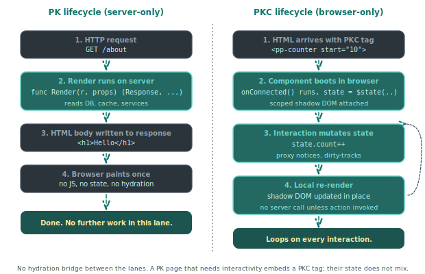

# About reactivity

Piko ships two component formats. `.pk` files produce server-rendered HTML, and `.pkc` files produce client-side Web Components. The split is deliberate. This page explains how the two formats relate and why Piko rejects the full-page hydration model that dominant React and Vue setups use.

  

The two lanes never share a reactive graph. A PK page renders once on the server. A PKC component owns its state in the browser. When a PK page needs interactivity it embeds a PKC tag, and the PKC component runs independently of the page it sits inside.

## The two formats at a glance

A PK file runs on the server. Its `Render` function returns a `Response` value and the template uses that value to produce HTML. The server sends that HTML to the browser, which displays it. The PK file does nothing after that, and the browser sees static HTML.

A PKC file runs in the browser. It compiles to a native Web Component that carries its own reactive state, re-renders when the state changes, and responds to events. The server knows about PKC components (it serves the JavaScript bundle) but does not run them.

A page can mix the two freely. One mix puts interactive quantity selectors on a server-rendered product page. Another gives a blog post a reactive counter. Another backs a form with client-side validation and a server action. The [reactivity how-to](../how-to/client-components/reactivity.md) shows the counter pattern, and the [forms how-to](../how-to/actions/forms.md) covers the action-backed form pattern end-to-end.

## Why split the two

Three reasons.

The first reason involves **cost**. Server rendering is cheap, meaning one `Render` call, one HTML response, done. Hydration, where the client rebuilds the server's render tree so it can re-render the whole page, is expensive. Piko sidesteps hydration entirely. [about SSR](about-ssr.md) covers the full argument. The server HTML arrives and stays. Only the islands of the page that need interactivity ship JavaScript, and each island reacts on its own.

The second reason is **clarity of responsibility**. A PK file is server state made visible. The `Render` function owns the data shape. A PKC file is client state made interactive. Its `state` object is its own. When a field lives in both worlds (a server-rendered list that the client can filter), the boundary is explicit. The server renders the initial state, and the client takes over from there. No shared reactive graph spans the network.

The third reason involves **typed signatures all the way down**. A PK file's Go types bind directly to its template expressions. A PKC file's TypeScript state binds directly to its template expressions. Neither format introduces an intermediate reactive layer that could lose the type information, so a server change that renames `state.CategoryId` to `state.CategoryID` fails the template compile immediately.

## Where the seam lives

The HTTP boundary. The server emits HTML. The browser receives HTML. Any subsequent interactivity comes from PKC components the server embedded in that HTML, plus server actions the PKC components call back to.

> **Note:** If you are coming from Next.js or Nuxt: there is no hydration step in Piko. The server's render is final HTML that the browser displays as-is, and PKC components boot independently inside it. The two never share a reactive graph or a render pass.

This is the opposite of the "everything is a React component" model. In React, the server pre-renders the same component tree that the browser then re-renders. In Piko, the server renders server-shaped components and the browser runs browser-shaped components. The seam is where they meet on the wire.

## What PKC reactivity actually does

A PKC component's `state` object is reactive. Writes to its fields trigger a re-render of the DOM subtree the component owns. The mechanism is coarse, not fine-grained:

- On construction, Piko wraps `state` (and any nested objects, lazily on first read) in a `Proxy`. The `get` trap only re-wraps nested objects so that writes deeper in the tree are also intercepted, and it does not record which fields the render touched.
- The `set` trap is the only seam that drives re-renders. Any write to any field on the proxy adds the property name to a `changedPropsSet` and calls `scheduleRender()`. There is no read-tracking and no per-field dependency set.
- `scheduleRender` coalesces a burst of synchronous writes by scheduling a single render via `queueMicrotask`. The next microtask runs `render()` once, produces a new virtual DOM tree, diffs it against the previous one, and patches the differences (`frontend/extensions/components/src/vdom/` plus `RenderScheduler.ts`).

The result is one re-render per microtask flush, regardless of which field changed or whether the template referenced it. The diff at the end is what keeps work proportional to what actually changed in the rendered output. Compare this with Vue's or Solid's signal-style reactivity, where reads build a per-node dependency graph and only those nodes re-evaluate. Piko's design accepts a whole-component re-render and relies on the VDOM patch to keep the DOM mutations small. The scope is local to the component, not global. A PKC component cannot reach into another's state. It dispatches events through `piko.event.dispatch` for DOM-bubbling events or `piko.bus` ([how to event bus](../how-to/client-components/event-bus.md)) for global pub/sub. It can also write another component's HTML attributes directly (see "PKC-to-PKC communication" below).

## Why PKC uses a small virtual DOM

A PKC file becomes a custom element, and the browser treats it as a Web Component. The reactive update logic inside the element runs through a small in-house virtual DOM that diffs successive `render()` outputs and applies the minimal DOM patch. Two reasons motivate that choice.

A targeted diff-and-patch outperforms re-rendering the whole subtree on every state change. Naive imperative DOM rewrites lose the structural information a virtual DOM gives the diff algorithm. Adding a single list item should not tear down and rebuild every other item. The virtual DOM is the data structure that makes the patch surgical.

The virtual DOM is intentionally small. It is not React's reconciliation algorithm with priorities, suspense, and concurrent mode. The work scope is "diff one component subtree against its previous render and patch the differences", scheduled on `queueMicrotask` so a burst of synchronous state writes coalesces into one render. The footprint stays small enough that the resulting bundle still loads faster than most reactive runtimes.

An alternative was a vdom-less compile-to-mutations runtime in the Svelte mould, where the compiler emits direct DOM mutations and skips the diff entirely. We prototyped it. The performance gain it offers, eliminating the diff cost on each render, is real but irrelevant for the work Piko targets. A Piko page is already rendered and interactive from the SSR. There is no hydration step, no virtual-DOM bring-up, no JavaScript-blocked first paint. PKC reactivity runs after first paint as a progressive enhancement on islands of interactivity, not on the critical path. Skipping a single subtree diff on a button click does not measurably change anything the user sees.

Compiling to a per-component virtual DOM with a microtask scheduler keeps the line between frontend and backend crisp. There is no shared reactive abstraction that tempts code to reach across the network. The frontend's contract with the backend is the HTTP boundary, not a shared reactive runtime.

## Why state and HTML attributes bind two-way

A PKC component's reactive `state` binds bidirectionally to the host element's HTML attributes. Writing to `state.item_count` reflects out as the attribute `item_count` on the custom element, and an outside party setting that attribute through the DOM API writes back into `state`. `AttributeSyncService` prevents loops through three sync flags (`applyingToState`, `reflectingToAttribute`, `initialising`).

Three reasons motivate that choice.

The first is **the attribute is the live state surface**. A reader inspecting a PKC element in browser DevTools should see the same field values the component is rendering against, because the attribute is the state. There is no "real state, hidden in the runtime" plus "ceremonial attribute that mirrors part of it". The attribute is the rendered truth. This makes debugging and ad-hoc state inspection direct. Change the attribute, the component re-renders.

The second is **outside code can drive a component without a JS handle**. Anything that can call `setAttribute`, `toggleAttribute`, or `removeAttribute` on the element drives its state. That covers a parent template, a partial reload that swaps the element's attributes, a server action's response, and a `.pk` page's `<script lang="ts">` block. It also covers vanilla JavaScript a developer drops on the page, and (most importantly) other PKC components on the same page. A PKC has no public method API to keep in sync. The attribute API is the public surface, and the runtime's job is to translate attribute writes back into typed state.

The third is **the state's TypeScript type is also its serialisation contract**. Because attributes are strings, the runtime needs to know what each field's type is to coerce the string back to the correct value. Users add an `as TypeName` annotation to each state field (`count: 0 as number`, `value: '' as string`, `flags: [] as string[]`). That annotation is the source of truth the compiler reads to emit the static `propTypes` getter. The runtime then reads it to call the right coercion path. Without the annotation, a `null` initialiser is ambiguous (is it `null | number` or `null | string`?), so the convention is to always annotate. The compiler does infer the type when the initialiser is itself typed: `'Hello'` infers `String`, `0` infers `Number`, `false` infers `Boolean`.

## How the binding behaves

Three mechanics matter.

**Naming**. The recommended convention is `snake_case` for state field names. The attribute name is the field name verbatim. Writing `state.is_logged_in` reflects to `is_logged_in="..."`, and reading `<x item_count="3">` writes to `state.item_count`. The reason is unambiguity. The runtime applies a conversion that lowercases capitals and inserts hyphens (`itemCount` would become `item-count`), so any camelCase field forces the reader to remember the conversion. snake_case skips the conversion entirely. State name and attribute name use the same spelling, in both directions, with no transformation rule to memorise.

**Reflection scope**. Only primitive types auto-reflect: `string`, `number`, and `boolean`. Arrays, objects, and JSON-typed fields do not appear as attributes by default, because serialising them through the DOM is slow and unreadable. A component that genuinely needs an array as an attribute can opt in through the metadata system. The common path is to keep complex state internal and project only the primitive flags out.

**Boolean and null semantics**. Booleans use attribute presence as the truth signal: `<x is_active>` and `<x is_active="true">` both set `state.is_active = true`. Only the literal `is_active="false"` sets it to `false`, and an absent attribute is `false`. Reflection uses `host.toggleAttribute`, so writing `state.is_active = false` removes the attribute entirely instead of leaving `is_active="false"` in the DOM. For non-boolean types, writing `null` or `undefined` to a state field also removes the attribute. A nullable field declared `as string | null` retains the `null` round-trip, and a non-nullable field falls back to its default when the attribute is absent.

## What this enables: PKC-to-PKC communication

Because the attribute API is the public surface, PKC components on the same page communicate by writing each other's attributes. A toolbar PKC that holds a search query can set the `query` attribute on a results-list PKC, and the results-list reacts because its state binds to that attribute. No event bus subscription, no message dispatch, no shared store, just one line of `setAttribute`. The same pattern handles parent-to-child, sibling-to-sibling, and page-script-to-component messaging.

Slot relationships extend the pattern. A PKC can call `pkc.attachSlotListener(slot_name, elements => { ... })` to receive a callback whenever its slotted content changes, and the callback receives the live list of assigned elements. The PKC then drives those elements with `setAttribute` or `toggleAttribute`, which (if the slotted element is itself a PKC) writes through to its state. A tab-strip PKC can flip `selected` on each tab PKC slotted into it without ever holding a JavaScript reference to them.

The same surface is available from outside the component system. A `.pk` page's `<script lang="ts">` block can manipulate any PKC on the page via plain DOM APIs (`pk.refs.my_widget.setAttribute('value', '42')`). The binding fires, the state updates, the component re-renders. There is no PKC-only escape hatch a non-PKC consumer would need to learn.

The general rule. **If you can describe a piece of state as an HTML attribute, you can set it from anywhere on the page**. The reactive system on the inside makes that one-line `setAttribute` feel like a method call, and the component handles the rest.

## What server actions add

A PKC component cannot save to a database. Server actions bridge the gap in four steps. The PKC component calls `action.customer.Upsert({...}).call()`. The browser posts to the server. The server runs the typed `Call` method. The PKC component receives the typed response. PKC reactive scripts have three runtime roots in scope: `pkc` (an alias for `this`, the component element), `piko` for the global runtime helpers, and `action` for typed server actions.

Server actions are RPC over HTTP with typed request and response shapes. They are not general request handlers. They are not route handlers. They are the only way a client component talks to the server. The [action protocol page](about-the-action-protocol.md) covers the design in detail.

## The cost of the split

PKC and PK components cannot share code directly. A function that belongs to both must live in two places, once in a `.go` file reachable by the PK script and once in a `.ts` file bundled with the PKC. This is a real cost for large applications. The mitigation is that most "shared" logic is actually server-only (it talks to a database or calls an external API) and belongs on one side of the seam. The duplicated cases are usually validation rules and formatters.

## When to reach for PK, when to reach for PKC

- Use **PK** for everything that does not need in-browser reactivity. Blog posts, product listings, dashboards that reload on navigation, even most forms. PK pages are cheap to render, cheap to cache, SEO-friendly by default.
- Use **PKC** when a component genuinely needs to respond to the user between server round-trips. A live search bar, a form wizard, a reactive counter, a chat interface. Do not reach for PKC because "modern sites use JavaScript"; reach for it when state changes would otherwise require a page reload.

## See also

- [About PK files](about-pk-files.md) for the server-rendered component format.
- [About the action protocol](about-the-action-protocol.md) for how PKC talks to the server.
- [Client components reference](../reference/client-components.md) for the PKC file format.
- [How to reactivity](../how-to/client-components/reactivity.md).
