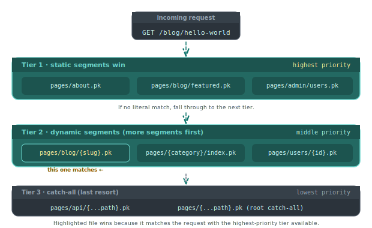

# About routing

Piko derives routes from files in the `pages/` directory. A file at `pages/blog/{slug}.pk` serves `/blog/:slug`, a file at `pages/{category}/index.pk` serves `/:category`, and a file at `pages/blog/{...path}.pk` serves `/blog/*`. No routing table, no registration code, no decorators. This page explains why.

## File-based routing is a trade

Code-based routing (Express-style `app.get("/blog/:slug", handler)`, or Gin's chi-tree registration) puts the URL and the handler together in source, where they can reference any shared state. File-based routing puts them apart. The URL lives in the filesystem, and the handler lives inside the file it names. Piko picks the second trade for three reasons.

The first reason is visibility. A project's route list should be visible without running the program. `ls pages/blog/` is faster than grepping a registration tree. For a docs site, marketing site, or product catalogue, this matters more than the flexibility of programmatic registration.

The second reason is hierarchy. The filesystem already encodes it. A page at `pages/admin/users/{id}.pk` is therefore under `/admin/users`, and therefore a child of the pages in `pages/admin/`. An existing mental model (directory structure) carries the route structure for free, without a separate nested-router abstraction.

The third reason is determinism. Tests, deploys, and incident response benefit from URL-to-file determinism. If a request to `/blog/hello-world` returns 500, the responsible file is `pages/blog/{slug}.pk`. There is no middleware chain or nested-router search to reverse-engineer.

## What we gave up

Code-based routing gives three things file-based routing makes harder.

Dynamic mounts. A plugin that wants to add fifty routes at runtime cannot do so without writing fifty files. Piko leans on collections, where a single template generates one route per data item. That plugs the gap for content-driven routes. A plugin that adds procedurally generated *behavioural* routes is still awkward.

Aliased or rewritten URLs. A "this path also serves that path" alias is one line in code-based routing. In Piko, it is either a redirect page (one file per alias) or a server-side rewrite via metadata. Neither is as terse.

Route-level middleware composition. Express can stack middleware per-route in one place. Piko requires each page to declare its middleware via an optional `Middlewares()` function inside the PK file. Sharing middleware across pages requires the usual Go-level abstraction (a helper returning a middleware slice). This is fine, but it is not free.

## Precedence

  

When two files could serve the same URL, Piko picks the more-specific one. Static segments win over parameters, more segments win over fewer, and exact file-name matches win over both dynamic and catch-all. The full [routing rules reference](../reference/routing-rules.md) enumerates every tiebreaker. The design goal is that reading the filenames makes the precedence predictable.

The predictability is load-bearing. It lets `pages/api/{...path}.pk` act as a catch-all backstop that real static files can shadow once they exist. It lets `pages/{category}/index.pk` render a category landing page without interfering with `pages/about/index.pk`. It lets `pages/!404.pk` hook the 404 flow at the root and `pages/admin/!404.pk` override it for the admin section.

## The error-page convention

The `!` prefix is the routing system's one deliberate departure from "files name URLs." `pages/!404.pk` does not serve `/` or `/404`. The router turns to it when it needs an error page. `pages/admin/!404.pk` overrides the root error page for admin routes.

This is ugly, and we considered alternatives (a `pages/_errors/` directory, a config-based mapping). We kept `!` because it puts the error page next to the routes it covers, preserves hierarchical override, and is visibly distinct from regular routes without inventing a second directory structure.

## Rendering happens server-side by default

A route in Piko is a page, and a page is a `Render` function that returns typed data. The template substitutes the data and emits HTML. There is no hydration step, no client-side router, no SPA-style route-to-component dispatch in the browser.

Client-side navigation layers on top. `<piko:a>` links intercept clicks, fetch the next page's HTML, and swap the body without a full reload. The server still owns the URL-to-HTML contract, and the browser is a consumer, not a participant. This is deliberate. See [About SSR](about-ssr.md) for the reasoning.

## When to reach past the filesystem

The file-based system covers most needs. When it does not, two escape hatches exist.

Middleware on individual pages adds a `Middlewares()` function that returns a chain of `http.Handler` wrappers. This handles auth, logging, header manipulation, and anything else that would live in code-based routing.

Fully manual HTTP handlers use `piko.WithHTTPHandler` at bootstrap to mount raw `http.Handler`s at arbitrary paths. Use this sparingly. It sits outside Piko's typed rendering pipeline and does not benefit from partials, actions, or the error-page convention.

## See also

- [Routing rules reference](../reference/routing-rules.md) for the full precedence and mapping rules.
- [How to static routes](../how-to/routing/basic-routes.md), [dynamic routes](../how-to/routing/dynamic-routes.md), [catch-all routes](../how-to/routing/catch-all-routes.md).
- [How to apply middleware to a page](../how-to/routing/page-middleware.md), [how to set a cache policy on a page](../how-to/routing/cache-policy.md), and [how to serve from a URL prefix](../how-to/routing/base-path.md).
- [About SSR](about-ssr.md) for the rendering model routes plug into.
