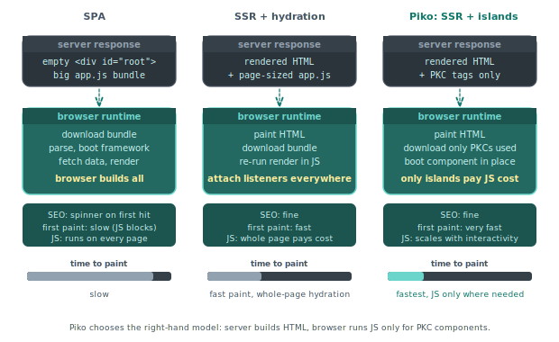

# About Server-Side Rendering

A Piko page is a server-side rendered page until we say otherwise. The browser receives HTML that is already complete. JavaScript does not compose the page. At most it sprinkles reactivity onto islands inside the page. This is different from the dominant SPA model, and the difference is deliberate. This page explains where Piko comes out on the rendering-model debate and what each choice costs.

## The starting question

Where does the HTML get built? Three common answers exist. A pure SPA ships an empty shell and lets the browser render everything from JavaScript. A hydration framework (Next.js, Nuxt) renders once on the server and again on the client, then reconciles. A pure server-side framework (Rails, Django, Piko) builds the HTML on the server and sends it as-is.

  

Each answer has consequences for SEO, time-to-first-paint, bundle size, state management, and developer ergonomics. The Piko answer is the third one, with a small concession for client-side islands.

## What "the server renders the page" gets us

A request arrives. The router finds the page file. The page's `Render` function runs, reads data, and returns a typed `Response`. The template engine substitutes the response into the `.pk` template and produces HTML. The HTTP handler writes the HTML back.

Four things fall out of this. Search engines see the real content because the HTML is real content on first request, not a loading spinner. The browser paints the page as soon as bytes arrive because no JavaScript has to run before layout. Social-sharing previews work because Open Graph tags sit in the first response. Assistive technologies read the page because screen readers do not need to wait for a JavaScript frame.

Access patterns get simpler. The page runs as a Go function. Data fetching is a function call, not a client-side hook with its own lifecycle. The `Render` function owns its request context, so anything the request provides (locale, auth, cookies) flows naturally into the data fetch. Open Graph tags, the canonical URL, and status-code controls live on `piko.Metadata`. See [metadata fields reference](../reference/metadata-fields.md).

## What "the server renders the page" costs

Interactivity that depends on reactive state cannot live in the page template. A counter, a modal, a typeahead search, a drag handle, all of those want to re-render locally without a server round-trip. Pure server-side rendering cannot answer that need.

Piko addresses the gap with PKC files. A PKC component compiles to a Web Component, ships to the browser as JavaScript, and handles its own reactivity after the initial page load. The page template places the component inline (`<pp-counter>`), the server renders the placeholder HTML, and the browser boots the component on arrival. See [client components reference](../reference/client-components.md) for the PKC file specification and [Scenario 003: reactive counter](../showcase/003-reactive-counter.md) for the simplest worked example.

The division of labour is explicit. PK files render server-side. PKC files render client-side. Neither hydrates the other. The browser does not re-run the page template. The server does not run the PKC component. The seam is the HTML the PK file emits with PKC custom elements already in place. See [about reactivity](about-reactivity.md) for the full PK/PKC split and why islands work.

This is narrower than the hydration model. A Nuxt page where every button, link, and form field participates in a reactive tree across the wire has no direct equivalent in Piko. If a project wants that shape, Piko is the wrong tool. For projects where most of the page is static content with specific interactive regions, the split works.

## Why Piko rejects hydration

Hydration is the middle path between SPA and server rendering. The server emits HTML. The client re-runs the same component tree and wires event listeners. The attractive bit is code-sharing, with one component model and one reactivity graph. The costly bit is that every page ships the JavaScript that re-renders it, and every component pays for both renders.

We rejected hydration for two reasons.

The first is type safety. Hydration works when both sides speak the same language. Piko's server is Go. Hydrating the server's render on a JavaScript client would mean one of two things. The first option would run a Go-to-JS compiler over every page, which is expensive and noisy. The second option would run a separate JavaScript component model for hydration, which loses the compile-time checks the server render provides. Neither trade is attractive.

The second is footprint. A Piko page that needs no interactivity ships no JavaScript. A hydration framework ships the hydration runtime on every page even when the page does not need it. For the sites Piko targets (content-heavy pages with localised interactivity) the runtime would be dead weight.

Islands architecture, which is what Piko practises, keeps the hydration cost where the interactivity actually lives. A PKC component pays for its own boot. A page without PKC components pays nothing.

## What the compiler sees

Since the page renders on the server, the page's template compiles against the `Response` struct's fields. A rename of `Title` to `Heading` in the struct is a compile error if the template still uses `state.Title`. A stale reference does not reach production.

This is invisible to the reader of the final HTML, but it changes the developer's working loop. Template edits fail at build time, not at request time. Type errors surface in the compiler output, not in a browser console.

## See also

- [About PK files](about-pk-files.md) for the single-file format the server renders.
- [About reactivity](about-reactivity.md) for the PK/PKC split and why islands work.
- [About the action protocol](about-the-action-protocol.md) for how PKC islands reach back to the server.
- [PK file format reference](../reference/pk-file-format.md) for the `Render` signature and `RequestData` surface.
- [metadata fields reference](../reference/metadata-fields.md) for SEO tags and status-code handling.
