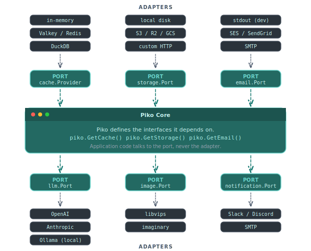

# About the hexagonal architecture

Piko follows the hexagonal-architecture pattern (sometimes called "ports and adapters"). Piko defines the interfaces it depends on, and the application supplies the implementations. Every external dependency, from the cache backend to the LLM provider, is swappable. This page explains why Piko takes that form and how it behaves.

  

The diagram above is the mental model for the rest of this page. The `Piko Core` in the middle is the runtime. Around it sit the ports, which are Go interfaces describing what Piko needs from the outside world. The chips around each port are adapters, the concrete implementations the project supplies at bootstrap.

## What "hexagonal" means here

The core of Piko is a set of Go interfaces describing what it needs from the outside world. A cache gets, sets, and invalidates keys. A storage provider puts and gets blobs and (optionally) signs URLs. An email provider sends a message. An LLM provider completes a prompt. An image provider resizes and reformats. Each interface is a port. Each implementation is an adapter. Piko does not know whether the cache is in-memory, Valkey, or Redis. It only knows that the adapter satisfies the `cache.Provider` interface.

Application code wires the adapters at startup, in a single call to `piko.New(...)` that lists the providers the project wants. The [bootstrap options reference](../reference/bootstrap-options.md) enumerates the full catalogue of `With*` options. A worked example of swapping one adapter for another lives in [how to swap database engines](../how-to/database/swapping-engines.md).

## Why it matters in practice

Three things fall out of the shape.

**Testing is direct.** Tests stand a fake provider up at the port boundary instead of mocking HTTP, so the action or page exercises the same Go interface it sees in production. Piko ships test harnesses that drive an action or component without booting the full server. The application's bootstrap is free to register in-memory fakes for any port using the same options it uses in production. The [testing how-to](../how-to/testing.md) and the [testing API reference](../reference/testing-api.md) document the relevant test entry points and fake adapters.

**Deployment shape follows choice.** A project might develop against SQLite and Valkey locally, deploy against Postgres and Redis in production, and run tests against in-memory versions of both. None of the PK or action code changes. Only the bootstrap does. This is the property the architecture pays for.

**Growth is additive.** A project that does not need email passes no email provider, and the email service is never wired. Adding email later is a matter of registering a provider in the bootstrap and resolving the service in an action via the relevant facade. No big refactor comes with it. Piko notices the new provider and wires it in.

## The bootstrap as the composition root

The bootstrap is the one place where concrete implementations meet Piko. Everywhere else, application code asks for an interface and receives whatever implementation the bootstrap wired. This is the "composition root" pattern from dependency-injection orthodoxy. Piko gives it structure. Every port has a single registration entry point. Every adapter is a value the project constructs. The boundary between Piko and the application runs cleanly along the option list.

A typical bootstrap picks one adapter per port. Adapters come from the library that ships with Piko (cache, storage, email, LLM, image, and so on). Projects also write their own in-house adapters. The catalogue evolves, so this page does not enumerate it. The [integrations directory](https://piko.sh/integrations/) lists every shipped provider, and the [bootstrap options reference](../reference/bootstrap-options.md) is the authoritative list of `With*` options. The [project structure explanation](about-project-structure.md) covers where adapter packages tend to live in a Piko codebase.

## What the pattern does not do

Hexagonal architecture does not pretend that all adapters behave identically. An in-memory cache behaves differently from Redis under concurrent load. A local-disk storage provider cannot natively sign URLs the way S3 can. An SMTP email adapter has different failure modes from an SES adapter. The interfaces describe the operations, not the guarantees. An application that switches adapters in production still has to test against the target adapter.

Piko's design preference is to fill those capability gaps where it sensibly can, so the same code path keeps working as the project evolves from local dev to production. The canonical example is the presigned URL on the disk provider. The adapter itself reports `SupportsPresignedURLs() == false`, but the storage service notices the gap and emits an HMAC-signed token that an in-process HTTP handler validates. From the application's perspective, `service.GeneratePresignedDownloadURL` returns a working URL whether the adapter is disk, S3, R2, or GCS. The point is not to pretend all backends are S3. It is to spare the application from a mode-switch every time the project moves from a laptop to a cloud bucket. The fallback is opt-out for cases where the project explicitly wants the gap to surface.

This is a "try to support, do not guarantee" stance. Some operations have no sensible fallback. A multipart-upload protocol does not arise from disk semantics, and a concurrent counter does not arise from a single-process cache. The adapter reports that honestly. The interface remains the contract, and the service layer fills the gaps where filling them is cheaper than asking the application to.

Hexagonal architecture also does not eliminate cross-adapter coupling. An action that uses the cache and the storage provider together has to reason about the interaction (does invalidating the cache also invalidate any URLs we signed?). Piko cannot solve that for you.

## When to add a new adapter

A new adapter is worth writing in three situations. The backend the project wants to use does not yet have one. An existing adapter cannot express a testing need (such as injecting specific failure modes). An external service has a nonstandard API that does not fit the port's interface. In the last case it is often better to grow the port itself than to wrap a mismatched service inside an existing adapter.

The recommended starting point is to copy an existing adapter from the Piko repository. Most services ship their in-tree adapters under [`wdk/<service>/<service>_provider_<name>/`](https://github.com/piko-sh/piko/tree/master/wdk) (for example `wdk/cache/cache_provider_redis/`, `wdk/storage/storage_provider_s3/`, `wdk/email/email_provider_smtp/`). Some services keep their adapters elsewhere. Notification providers live under `internal/notification/notification_adapters/driver_providers/` (`discord.go`, `slack.go`, `pagerduty.go`, and so on), and `internal/pdfwriter/` centralises PDF rendering instead of splitting it into per-provider directories. When in doubt, look at how a similar service exposes its adapters before deciding where the new one belongs.

The closest sibling to the backend the project wants gives a working scaffold. The port methods come stubbed out, the registration glue sits in place, the test harness comes wired up, and the capability flags (`SupportsX()` style methods) are already declared. Copy the directory into the project, rename the package, and replace the backend-specific calls. The diff is usually shorter than starting from the port interface alone, and the new adapter inherits the conventions every other adapter in the catalogue follows.

## See also

- [Bootstrap options reference](../reference/bootstrap-options.md) for every `With*` option and its provider interface.
- [About project structure](about-project-structure.md) for where adapters and bootstraps tend to live in a Piko project.
- [About PK files](about-pk-files.md) for the application shape the architecture serves.
- [About reactivity](about-reactivity.md) for how the PK/PKC split fits the architecture.
- [How to swap database engines](../how-to/database/swapping-engines.md) for a worked adapter swap.
- [How to testing](../how-to/testing.md) and [testing API reference](../reference/testing-api.md) for using fake adapters in tests.
