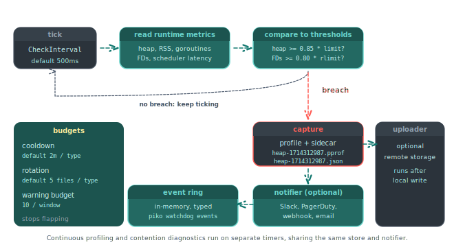

# About the watchdog

External alerting tools tell an operator that *something is wrong*. They do not, on their own, tell the operator *what was happening at the moment things went wrong*. By the time the alert fires, the on-call engineer has at best a Grafana panel showing the last fifteen minutes of a metric. The state that would actually explain the failure has vanished. The heap snapshot, the goroutine stacks, and the block profile have all rolled over with the next request, the next GC cycle, and the next minute of normal operation.

Piko's watchdog exists to close this gap. It runs inside the same process the operator wants to debug. It evaluates a small set of runtime thresholds on a tight loop. The moment a threshold trips, it captures the diagnostic profiles and fires a notification. The artefact and the alert ship together, from the same moment in time. This page explains why that design is the right one, what the watchdog watches, and how the budget rules keep it from becoming part of the problem.

<p align="center">
  
</p>

## The right time to capture is the moment the symptom appears

A naive observability strategy waits for an external system to detect a problem and then asks an operator to manually grab a profile. By that point the heap has churned and goroutines have come and gone. The captured artefact reflects whatever state the process is in *now*, not the state that triggered the alert. The remaining diagnostic value is small.

A continuous-pprof strategy goes the other way. It captures profiles on a fixed schedule and stores them all, hoping the right one happens to fall close enough to the incident. Storage costs grow without bound, most captures are useless, and the relevant capture (if it exists) lands somewhere in a haystack the operator has to grep through after the fact.

The watchdog strategy is to capture *because* the symptom appeared. The check loop runs at a 500 ms interval by default. When a threshold trips, the watchdog captures the relevant profile types within that same tick. The artefact lands on disk, a typed event lands in the in-memory ring, and the notifier (Slack, PagerDuty, email) receives the event with a pointer to the profile filename. The on-call engineer's first link in the alert is the artefact that was true at the breach.

## What the thresholds watch

The watchdog tracks five families of signal:

- **Heap pressure.** A fraction of `GOMEMLIMIT` (default 0.85) or an absolute byte threshold when `GOMEMLIMIT` is not set. A breach means the GC is about to start working harder, or the process is approaching an out-of-memory kill in a containerised deployment.
- **RSS pressure.** A fraction of the cgroup memory limit (default 0.85). RSS can diverge from heap when off-heap allocations dominate (cgo, mmap, large stacks). Watching both catches more failure modes.
- **Goroutine count.** A flat threshold (default 10,000). Sustained growth almost always means a leak. A worker that never returns, a channel that never closes, a context that never cancels.
- **File-descriptor pressure.** A fraction of `RLIMIT_NOFILE` (default 0.80). FD leaks are quiet until they are not, then everything fails at once.
- **Scheduler latency.** A p99 threshold on the runtime scheduler (default 10 ms). Sustained high values signal contention, a runaway goroutine, or a system-level CPU starvation problem.

Each rule fires its own typed event so a downstream alert routing rule can treat heap pressure differently from FD pressure. Defaults are deliberately conservative. The `With*Threshold*` options let operators tighten or relax each one independently.

## Budgets keep the watchdog from drowning the alert channel

A watchdog that fires every tick is worse than no watchdog. Three budgets keep firing in check:

- **Cooldown.** After a capture, the same metric type cannot capture again for a configurable cooldown (default two minutes). This prevents a flapping threshold from spamming the profile directory and the notifier.
- **Profile rotation.** Each profile type holds at most a configurable number of files (default five). When the budget is full, the oldest file rotates out as the new one lands. The profile directory's footprint stays bounded.
- **Warning budget.** Warning-only events (FD pressure, scheduler latency) get their own budget per capture window (default ten warnings) so they cannot crowd out actual profile captures.

The point is to make the watchdog cheap *and* boring. Operators should learn to trust that the alert and the artefact are both rare and meaningful.

## Continuous profiling fills in the routine background

Most of the time, nothing is wrong. The threshold-fired captures stay silent. The same on-call engineer who shows up at 3 AM for a heap alert sometimes also wants a baseline. They want to know what the heap looked like *yesterday*, when the process was healthy, so they can compare the breach against it.

`WithWatchdogContinuousProfiling` enables a separate routine loop. It captures a configurable set of profile types (default `heap`) on a fixed interval (default ten minutes) and rotates them through their own retention budget (default six). These captures do not notify by default. The operator does not want a Slack message every ten minutes. They sit on disk ready for `piko watchdog list` and `piko watchdog download`. The threshold-fired captures and the continuous captures share the same store and the same naming, so a `pprof` diff between them is straightforward:

```bash
go tool pprof -diff_base=./baseline-heap.pprof ./incident-heap.pprof
```

When `WithWatchdogDeltaProfiling` is on, the watchdog stores a baseline alongside each threshold capture so the diff is available without needing a separate continuous capture to land near the incident.

## Contention diagnostics are a separate, deliberate tool

Block and mutex profiling are expensive enough that the runtime keeps them off by default. Turning them on globally costs every running goroutine. Turning them on for a short window during an actual contention event is exactly what fits.

The contention diagnostic flips both on at configurable rates, runs for a configurable window (default 60 s), captures the resulting profiles, and turns them off again. An operator triggers it manually with `piko watchdog contention-diagnostic` (a one-shot, blocking call), or wires it to fire automatically on repeated scheduler-latency events with `WithWatchdogContentionDiagnosticAutoFire`. The diagnostic deliberately stays out of the regular tick loop because the cost of running block and mutex profiling continuously would itself become the contention.

## The startup-history ring catches the symptoms that crash the process

Some failures kill the process before any capture loop has a chance to run. The watchdog keeps a small startup-history ring on disk. Each process start writes a row, each clean stop closes that row, and a row that opens and never closes is a crash. `piko watchdog history` shows the operator the recent crash record, including process ID, timestamps, host, and version. A crash loop becomes immediately visible without external tooling. Together with the crash output configured by `WithCrashOutput` and `WithCrashTraceback`, the operator gets a process-level audit trail without standing up a separate logging service.

## Why this lives in Piko, not in the application

Every Go service that runs in production needs heap pressure detection, goroutine leak detection, FD pressure detection, contention profiling, and crash logging. Hand-rolling them per project produces twenty subtly different implementations, all of which are still wrong on the first incident because nobody actually used them until that incident.

Putting the watchdog in Piko means every Piko application gets the same well-tested supervisor wired by the same `WithMonitoringWatchdog` call. Operators learn one mental model that applies to every Piko service they run. New failure modes (a new threshold, a new capture type, a new event) ship in Piko and become available everywhere. The maintainers pay the cost of writing the watchdog once. Every deployment collects the benefit.

## See also

- [Watchdog API reference](../reference/watchdog-api.md) for every option, event type, and the `piko watchdog` CLI.
- [About monitoring](about-monitoring.md) for the gRPC transport that exposes the watchdog to `piko tui`.
- [How to configure the watchdog](../how-to/observability/configure-watchdog.md) for the wiring recipe.
- [How to capture continuous profiles](../how-to/observability/continuous-profiling.md) for the routine baseline.
- [How to capture a contention diagnostic](../how-to/observability/contention-diagnostic.md) for the on-demand block and mutex profile.
- [How to profile a Piko application](../how-to/profiling.md) for the manual `piko profile` flow that complements the watchdog's automatic capture.
