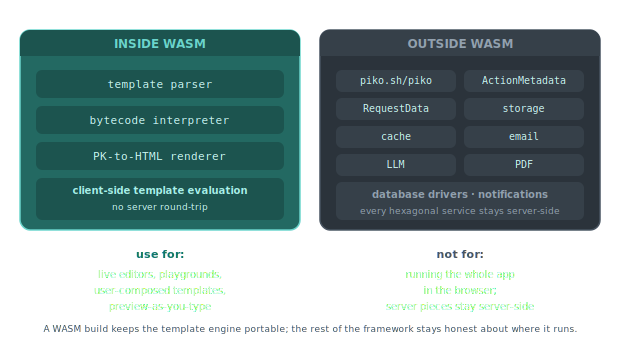

# About WebAssembly in Piko

Piko's WASM target is narrower than a typical Go build for the browser. A WASM binary ships the template engine and the bytecode interpreter, but it does not ship the server runtime. This page explains where the line sits, why it sits there, and what WASM Piko is good for.

  

## What sits inside a WASM build

A WASM build parses and compiles PK templates at runtime. It runs the same bytecode interpreter Piko uses in development mode for server-side rendering. It produces HTML strings the host page can inject into the DOM.

The use cases fall into one shape. Client-side template evaluation. Live editors, dashboards where users compose their own layouts, interactive tutorials that render PK snippets, and playgrounds that preview arbitrary templates are all natural fits. Each wants to evaluate a template the server did not pre-compile, with data the server did not see, and wants to stay responsive without a round-trip.

## What sits outside

A WASM build excludes the top-level `piko.sh/piko` package itself. In `piko-symbols-runtime.yaml`, that package carries a `!js` build tag, so the build strips its symbols from the WASM bundle. The smaller helper packages alongside it (`wdk/binder`, `wdk/logger`, `wdk/runtime`, `wdk/safeconv`) carry no such tag and remain available. Excluding the top-level package removes `ActionMetadata`, `RequestData`, and the entire bootstrap surface. That in turn removes the storage providers, email providers, cache services, LLM services, PDF renderer, and database drivers that bootstrap wires up. None of the hexagonal services ship into the browser.

Calls to server actions, health endpoints, and the orchestrator are also unavailable. Those are server-side concerns by design.

## Why the split is where it is

Server primitives assume a server. `RequestData` reads from an `http.Request`. `ActionMetadata` wires into the CSRF and rate-limit layers. Storage providers open network sockets. Shipping any of them into the browser would either need a compatibility shim that fakes the semantics or a second, browser-shaped version of each interface. Both paths multiply the surface area and divide what a "Piko app" means.

The narrow WASM scope keeps the template engine portable while keeping the rest of Piko honest about where it runs. The consequence is that WASM Piko is useful for template evaluation specifically, not for running a shrunken server in the browser.

## When to reach for WASM

Reach for a WASM build when the browser needs to render a template the server did not already render. A live playground is the reference shape. The user types a template, the browser compiles and runs it, and the host page displays the output without contacting the server.

Do not reach for WASM when the goal is "run the app in the browser". A Piko application is a server plus PK templates plus PKC components. The browser already runs PKC components (they compile to JavaScript). The server part belongs on a server.

## See also

- [How to compile Piko to WebAssembly](../how-to/wasm.md) for the build and serving steps.
- [About reactivity](about-reactivity.md) for the wider PK/PKC split that motivates the WASM scope.
