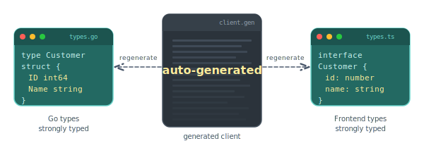
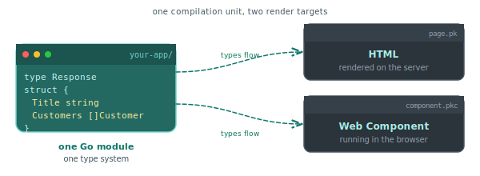
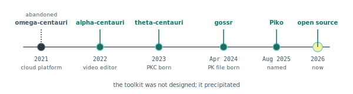

# Why Piko

Every web toolkit is an argument about how to build software. This page is Piko's argument. Not a feature list, not a comparison table, but the thesis that explains why Piko looks the way it looks and why building it was worth the effort. If you finish this page and decide Piko is not for your project, we have done our job. If you finish it and want to try, [Install and run](../get-started/install.md) gets you a server in five minutes.

  

## The frustration that started it

Late 2022. Our team was running two projects in parallel. A video editor with a Vue.js frontend. Client websites built with Nuxt. Both had Go backends. Both had JavaScript frontends. Both had the same problem.

The Go compiler finished in two seconds. The TypeScript type-checker took forty. The Go binary was 18 MB. The `node_modules` folder was 1.2 GB. The folder that existed to help our frontend talk to our backend was sixty-six times larger than the backend itself.

But the folder size was not the real problem. The real problem was the OpenAPI spec.

We had Go backends with strong types. We had frontends with strong types. Both sides knew what shape the data should be. And between them sat a large layer of auto-generated TypeScript that mirrored the Go types so the two halves of one application could talk to each other. Every time we changed a Go field, we regenerated the client. Then we fixed the things that broke because the generator was unreliable on our edge cases. Then we committed three or four files to change what was conceptually one field.

The video editor had the same friction without the spec. Vue components calling a Go API. Two type systems. Two build pipelines. Two sets of linting rules. Two package managers. We were spending more time on the glue between our frontend and backend than on either the frontend or the backend.

## The single decision that shaped everything

Piko rests on one load-bearing decision. Compile Vue-like single-file component templates to typed Go code.

Not "use Go everywhere" (that part was obvious). Not "write a new JavaScript framework" (that was a dead end). Not "fork Nuxt" (not possible from a small team). Your frontend and your backend become one Go module, sharing one type system, compiled by one compiler.

Every feature that seems quirky about Piko follows from this. The single-binary deployment follows. The absence of Node.js follows. The absence of a JavaScript build system follows. The absence of an API spec follows, because the caller and the callee live in the same compilation unit. The typed template syntax follows, because the compiler can see the struct and the template expression in the same pass. See [about PK files](about-pk-files.md) for the single-file rationale and [about SSR](about-ssr.md) for how the rendering model flows from the same choice.

  

One compilation unit. Two render targets. The same Go types reach both.

## What flows from that decision

The consequences show up in the day-to-day loop.

**Single-binary deployment.** `go build` produces one file. No `npm build`, no separate frontend bundle, no `dist/` folder to sync. Three commands ship a project. See [tutorial 04](../tutorials/04-shipping-a-real-site.md) for the full path from first edit to a running production server.

**No OpenAPI spec, no generated client.** An action is a Go function. The client calls it by name. The types are the contract. See [about the action protocol](about-the-action-protocol.md) for the wire format.

**No JavaScript build pipeline.** No Vite, no Webpack, no `node_modules`. Piko's generator compiles templates to Go source that the standard Go toolchain then builds. See [about the interpreted mode](about-interpreted-mode.md) for how the dev loop stays fast without bundlers.

**Types flow end-to-end.** Rename a field on a Go struct. Every template that referenced it stops compiling. Every action that consumed it stops compiling. No runtime discovery, no silent blank spaces in the UI, no 22:00 pager.

**Fast iteration.** The dev loop relies on the Go compiler and an interpreted template mode, so most edits land in the running server quickly. Piko has not published reproducible build benchmarks yet. This is a design goal carried by the toolchain, not a published number.

**Go tooling for Go problems.** `go test`, `go vet`, `pprof`, `delve`. Every tool a Go team already has. The testing harness in the [testing API reference](../reference/testing-api.md) integrates with `go test`, not a separate runner.

**LSP support across the template boundary.** Hover on `state.Customers` inside a template, see the `[]Customer` definition. Go-to-definition jumps into the Go struct. See the [pk-file format reference](../reference/pk-file-format.md) for the section layout the LSP relies on.

## Why the scope grew

Piko is wider in scope than a template library has any business being. Storage, cache, email, PDF, image processing, analytics, i18n, a browser-testing harness, a precision-maths package, a SQL-querier generator. The instinct on seeing the list is to suspect over-engineering. The honest story is simpler, and it arrived in the reverse order.

Piko was not designed. It precipitated. Each subsystem exists because a real client project hit a real wall and we built a piece to survive it. Piko is what remained when we stood back from four years of client work and counted the reusable pieces.

A provenance catalogue:

- **Storage providers** exist because every client had a different cloud. One on S3. One on Google Cloud. One on Cloudflare R2. One on local disk with a specific compliance requirement. The same application code runs on all of them because of [the hexagonal architecture](about-the-hexagonal-architecture.md).
- **The cache service** exists because the same workloads needed to run with different backends. In-process for single-instance dev. Distributed for multi-instance production. Tiered for low-latency-plus-shared-view. See [about caching](about-caching.md).
- **The email system** exists because Outlook renders HTML like a word processor from 2007 and we got tired of fixing it by hand. PML elements produce the table-and-VML markup email clients need. See [about email rendering](about-email-rendering.md).
- **The PDF renderer** exists because Puppeteer is a 400 MB dependency running an entire web browser to produce a document. Our layout engine does not need a browser because a PDF is not a web page. See [about PDF](about-pdf.md).
- **The image pipeline** exists because the video editor already had an image-transformation pipeline, and images on websites plugged into the same interfaces.
- **The template compiler** exists because Go's built-in `html/template` has no type checking. Misspell a field and find out in production.
- **The action system** exists because we refused to write another OpenAPI spec.
- **The querier** exists because [sqlc](https://sqlc.dev) is good but does not handle dynamic queries well, loses type information in places we needed it, and requires CGO if we wanted to import it. See [tutorial 05](../tutorials/05-data-backed-pages.md) for the resulting shape.
- **The browser-testing harness** exists because PKC components need integration tests and we wanted one test binary, not two. See [about browser testing](about-browser-testing.md).
- **The analytics layer** exists because every client asked for GA4 or GTM or Plausible and every one needed CSP adjustments. See [about analytics](about-analytics.md).
- **Collections** exist because some clients wanted markdown pages, and we have our own headless CMS for our clients. See [about collections](about-collections.md).
- **The maths package** exists because Go's `float64` silently loses precision on money, and client invoices started drifting by pennies. See [about maths](about-maths.md).

We did not build a framework and then go looking for problems it could solve. We solved problems and then realised we had built a framework. That is either inspiring or a warning about scope creep, depending on your perspective. We think it might be both.

This history explains why Piko is one monorepo. The integration is the point. A change to cache invalidation logic gets verified against the storage layer in the same commit. Splitting the subsystems into twenty repositories would make each piece easier to maintain in isolation and harder to trust as a whole.

  

## The philosophy in one pass

If you boil Piko down to its load-bearing principles, five show up.

**One language.** Go everywhere. No context-switching between Go and TypeScript, no style-guide drift, no import-path confusion. Your backend developers write the frontend. Your frontend developers write the backend, if you have any, which in a Go shop you usually do not.

**One type system.** Types flow from database row to rendered template without passing through YAML, JSON schema, or a generator. The compiler sees every layer. Renaming a field is a compile error wherever it breaks.

**One compiler.** The Go toolchain checks the whole application. Errors at build time, not at runtime.

**One binary.** Deployment is file copy plus restart. Scaling is horizontal replication of that binary. No process manager wrestling with a Node.js frontend and a Go backend.

**Go is a configuration language.** Bootstrap is Go code ([bootstrap options reference](../reference/bootstrap-options.md)), not YAML. The compiler catches your misspellings. The IDE autocompletes the option names. Type-checked configuration is more verbose than YAML and much harder to get wrong.

Hexagonal architecture is the seam where infrastructure plugs in. Swap S3 for Cloudflare R2 by changing a bootstrap option. Swap Redis for Valkey the same way. Application code does not change because it talks to an interface, not to an adapter.

## When Piko is the right choice

Honest positioning starts with who Piko fits.

- **Go teams.** Your backend is Go, your CLI tools are Go, your infrastructure tooling is Go. Piko lets you write the frontend in the same language.
- **Projects where the backend is the interesting part.** Admin panels, content-driven sites, catalogues, dashboards, internal tools. Anything where the server does the heavy lifting and the frontend covers forms, tables, and well-styled content.
- **Deployment environments that reward a single binary.** Serverless targets, small self-hosted server instances, container images where every megabyte costs money, offline environments where a runtime installer is friction.
- **Teams that value single-language stacks.** Fewer dependencies, fewer build pipelines, fewer roles to hire for, less to keep in your head.
- **Teams who have tried the JavaScript path and resent the tax.** A specific cohort of backend developers pushed into frontend work who would prefer not to write TypeScript.

## When Piko is not the right choice

The page is credible only if it also names who should go elsewhere.

- **Teams productive with React, Vue, or Svelte.** Do not switch because a blog post told you to. Your existing ecosystem has more component libraries, more community tooling, and more search-engine depth than Piko.
- **Frontend-heavy applications.** Rich interactivity, drag-and-drop editors, live collaboration, canvas tools, design software. Piko's island-of-interactivity model pushes against you when the whole page is an island. Next.js and Nuxt are the honest choice here.
- **Projects that depend on a specific large npm component library.** Material UI, Ant Design, a specific charting package. Piko has no `npm install` equivalent. If the ecosystem you rely on lives in npm, stay in npm.
- **Teams without Go expertise.** Piko reduces tooling cost but increases the language knowledge the team needs. A team that has never shipped Go before should not learn Go and Piko at the same time.
- **Applications that are SPAs at heart with a thin server.** If the frontend is the whole application and the server is ten endpoints, the backend is not the interesting part. Use a framework built for frontends.
- **Enterprise-integration stacks with Spring Boot or Jakarta expectations.** Piko is not trying to be an enterprise framework. No bean wiring, no dependency container beyond what Go's package system already provides, no XML configuration.

## What Piko is not trying to be

Six misreadings come up often. Killing them here saves three weeks of forum arguments.

- **Not competing with Next.js on feature count.** Next.js has an army of maintainers and a decade of compounding investment. We do not. Piko covers a smaller surface with tighter integration. If breadth is the question, Next.js wins.
- **Not chasing the frontend-framework meta.** No renderer war. No signals-versus-hooks debate. No virtual-DOM benchmark posturing. The question Piko answers is "how does Go talk to a browser", not "which reactivity primitive is fastest".
- **Not an enterprise framework in the Spring class.** No bean wiring, no service-locator abstraction, no aspect-oriented middleware. Go's package system is the dependency mechanism. Piko layers application structure on top and stops.
- **Not a static-site generator.** It is a server. Server-side rendering produces HTML at request time. See [about SSR](about-ssr.md).
- **Not a CMS.** It integrates with them. See [about collections](about-collections.md).
- **Not a JavaScript replacement.** JavaScript is not the problem. The two-language stack is the problem. If your project is one language already, Piko offers no improvement over your existing tooling.
- **Not claiming to be the best toolkit out there.** Claiming to be the best-fit option for the Go-team, backend-forward, deployment-simple cohort.

## What Piko is trying to be

After naming what it is not, the definition goes the other way.

A website development kit for teams already in Go that refuses to make them write TypeScript. A toolkit where the types you declare on the server are the types the template sees. A toolkit where deployment is file copy because deployment should be file copy.

The infrastructure behind every subsystem is pluggable because every project has a different infrastructure. The scope is wide because the integration is the point. One monorepo costs less to maintain than twenty small projects that have to agree with each other.

See [core concepts](core-concepts.md) for the mental model the rest of the documentation builds on. See [about the hexagonal architecture](about-the-hexagonal-architecture.md) for the provider pattern. See [about project structure](about-project-structure.md) for the folder layout the generator relies on.

## Your Go backend deserves a Go frontend

That is the thesis in one sentence.

If you write Go for your backend, you should be able to write Go for your frontend. Same language, same type system, same compiler, same tools. One binary. No YAML boundary. No node_modules tax. No OpenAPI regeneration ritual.

If that sounds right, start with [Install and run](../get-started/install.md) for a running server in five minutes, or [Your first page](../tutorials/01-your-first-page.md) for a guided build. If you want to understand the design choices first, [about PK files](about-pk-files.md) and [about reactivity](about-reactivity.md) are the two pages that feed the rest.

Piko is alpha. Version 0.1.0. The API surface may change. Some subsystems are more mature than others. We are shipping this in the open because it is useful to us and plausibly useful to the cohort we just described. If you are in that cohort, welcome.

## See also

- [Core concepts](core-concepts.md) for the mental model.
- [About PK files](about-pk-files.md) for why the single-file shape is the right unit.
- [About SSR](about-ssr.md) for the rendering model.
- [About reactivity](about-reactivity.md) for the PK and PKC split.
- [About the action protocol](about-the-action-protocol.md) for typed RPC over HTTP.
- [About the hexagonal architecture](about-the-hexagonal-architecture.md) for the provider pattern.
- [About Piko, Vue, and Nuxt](about-piko-vs-vue.md) for specific positioning against the closest alternatives.
- [Install and run](../get-started/install.md) for getting a server going.
- [Your first page](../tutorials/01-your-first-page.md) for the guided build.
