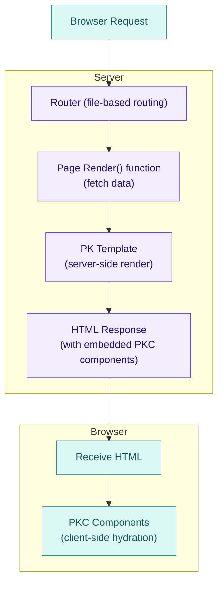

# Core concepts

Understanding these core concepts will help you be productive with Piko quickly.

## The big picture

Piko is a **website development kit** for building web applications with:
- **Server-side rendering** (PK templates)
- **Client-side interactivity** (PKC components)
- **Type safety** (Go's type system)
- **Clean architecture** (allows easy decoupling of your domain layer with third-party providers, such as storage)

## Project structure

When you scaffold a project with `piko new`, you get this structure:

```text
my-app/
├── actions/              # Server actions
│   ├── actions.go        # Action registry
│   └── submit.go         # Example action
├── cmd/
│   ├── generator/        # Build-time code generator
│   │   └── main.go
│   └── main/             # Application entry point
│       └── main.go
├── components/           # Client-side components (.pkc)
├── content/              # Markdown collections
├── emails/               # Email templates (.pk)
│   └── email.pk
├── dist/                 # Generated output (do not edit)
├── pages/                # Server-side pages (.pk)
│   └── index.pk
├── partials/             # Reusable server components (.pk)
│   └── layout.pk
├── pkg/                  # Business logic
├── piko.yaml             # Main configuration
├── piko-dev.yaml         # Development overrides
├── piko-prod.yaml        # Production overrides
├── config.json           # Theme configuration
└── go.mod
```

## How Piko works

### Request flow



### Two rendering modes

**Server-Side (PK)**:

- Renders HTML on the server
- Fast initial page load
- SEO-friendly
- Use for: Pages, layouts, static content

**Client-Side (PKC)**:
- Reactive components in browser
- Interactive UI elements
- TypeScript + reactive state
- Use for: Buttons, modals, forms, interactive widgets

## PK vs PKC

**PK files** (`.pk`) are **server-side templates** that live in `pages/` and `partials/`. They combine Go + HTML to render pages on the server: fast initial loads, SEO-friendly.

**PKC files** (`.pkc`) are **client-side components** that live in `components/`. They use TypeScript + HTML for interactive UI in the browser.

### PK example (server-side)

```piko
<!-- pages/about.pk -->
<template>
  <h1>{{ state.Title }}</h1>
  <p>{{ state.Description }}</p>
</template>

<script type="application/x-go">
package main

import "piko.sh/piko"

type Response struct {
    Title       string
    Description string
}

func Render(r *piko.RequestData, props piko.NoProps) (Response, piko.Metadata, error) {
    return Response{Title: "About Us", Description: "We build amazing things!"}, piko.Metadata{}, nil
}
</script>
```

**[Learn more about PK →](/docs/guide/pk-templates)**

### PKC example (client-side)

```piko
<!-- components/custom-counter.pkc -->
<template>
  <p>Count: {{ state.count }}</p>
  <button p-on:click="increment">+1</button>
</template>

<script lang="ts" name="custom-counter">
const state = { count: 0 as number };
function increment() { state.count++; }
</script>
```
Use on a page/partial:
```piko
<template>
  <h1>Counter page</h1>
  <pp-counter></pp-counter>
</template>
```
Any `.pkc` component created in `/components` is immediately available to be used in pages or partials, no need to import it.

> **Note**: Custom `.pkc` components need to contain at least one hyphen in their name, in accordance with [web component guidelines](https://developer.mozilla.org/en-US/docs/Web/API/Web_components/Using_custom_elements#name).

**[Learn more about PKC →](/docs/guide/client-components)**

## Partials and slots

Partials are reusable server-side components in `partials/`. They use `<piko:slot>` to define where child content is rendered. Named slots allow multiple content areas:

```piko
<!-- partials/layout.pk -->
<template>
  <header>
    <piko:slot name="header-actions">
      <button>Default Action</button>
    </piko:slot>
  </header>
  <main>
    <piko:slot></piko:slot>
  </main>
</template>
```

Provide content to a named slot by wrapping it in a `<piko:slot>` element:

```piko
<layout is="layout">
  <piko:slot name="header-actions">
    <button>Custom Action</button>
  </piko:slot>
  <p>Main content goes into the default slot.</p>
</layout>
```

**[Learn more about Partials →](/docs/guide/partials)**

## File-based routing

Your `pages/` directory structure determines URLs:

| File | URL |
|------|-----|
| `pages/index.pk` | `/` |
| `pages/about.pk` | `/about` |
| `pages/blog/{slug}.pk` | `/blog/:slug` |
| `pages/docs/{...slug}.pk` | `/docs/*` (catch-all) |

**[Learn more about Routing →](/docs/guide/routing)**

## Collections

Collections turn markdown files in `content/` into pages automatically. Add the `p-collection` directive to a page template, and Piko generates a route for each markdown file. Inside the `Render` function, use `piko.GetData[T](r)` to access the frontmatter as a typed struct:

```piko
<!-- pages/blog/{slug}.pk -->
<template p-collection="blog" p-provider="markdown">
  <h1>{{ state.Title }}</h1>
  <piko:content />
</template>

<script type="application/x-go">
package main

import "piko.sh/piko"

type Post struct { Title string; Slug string }
type Response struct { Title string }

func Render(r *piko.RequestData, props piko.NoProps) (Response, piko.Metadata, error) {
    post := piko.GetData[Post](r)
    return Response{Title: post.Title}, piko.Metadata{Title: post.Title}, nil
}
</script>
```
Example of a blog post (`content/blog/hello-world.md`):
```markdown
---
title: Hello World
slug: hello-world
date: 2024-01-15
author: Jane Doe
---

This is the content of my first blog post.

> *The human spirit must prevail over technology.*
> 
> - Albert Einstein
```

**[Learn more about Collections →](/docs/guide/collections)**

## Server actions

Handle form submissions and mutations. Actions live in `actions/`, embed `piko.ActionMetadata`, and have a typed `Call` method:

```go
// actions/contact/submit.go
package contact

import "piko.sh/piko"

type SubmitAction struct{ piko.ActionMetadata }

type SubmitInput struct {
    Name  string `json:"name"  validate:"required"`
    Email string `json:"email" validate:"required,email"`
}

type SubmitResponse struct {
    Message string `json:"message"`
}

func (a SubmitAction) Call(input SubmitInput) (SubmitResponse, error) {
    return SubmitResponse{
        Message: "Thanks " + input.Name + ", we'll be in touch!",
    }, nil
}
```

The action name comes from the package (`contact`) and the struct name minus the `Action` suffix (`Submit`). Input fields map to form fields via `json` tags, and `validate` tags enforce rules before `Call` runs.

A page calls the action with `p-on:submit.prevent` and `$form`:

```piko
<template>
  <form p-on:submit.prevent="action.contact.Submit($form)">
    <input name="name" placeholder="Name" />
    <input name="email" type="email" placeholder="Email" />
    <button type="submit">Submit</button>
  </form>
</template>
```

Actions return your own typed response struct. Side effects (helpers, cookies) are set via `a.Response()`:
- `a.Response().AddHelper(...)` → trigger client-side actions (toasts, redirects, modals)
- `a.Response().SetCookie(...)` → set HTTP cookies
- Return `piko.ValidationField("field", "msg")` for field-level validation errors

**[Learn more about Actions →](/docs/guide/server-actions)**

## Best practices & recommendations

### Architecture

Piko encourages clean architecture. Pages and actions sit at the edges: pages call domain services to fetch data, actions call them to mutate data. This keeps your business logic testable and decoupled from the web layer.

### When to use what

| Need | Use | Location |
|------|-----|----------|
| Page layouts, SEO content, static pages | **PK** (server-side) | `pages/`, `partials/` |
| Interactive forms, modals, dropdowns | **PKC** (client-side) | `components/` |
| Form submissions, data mutations | **Actions** | `actions/` |
| Blog posts, docs, content pages | **Collections** | `content/` |

### Development workflow

Start by creating pages in `pages/`, extract reusable UI into `partials/`, add interactivity with `components/`, and handle mutations with `actions/`. Keep business logic outside pk files.

## Next steps

Now that you understand the core concepts, dive deeper:

### Learn the basics
- **[Routing](/docs/guide/routing)** → How routing works in detail
- **[PK templates](/docs/guide/pk-templates)** → Template syntax and features

### Build features
- **[Collections](/docs/guide/collections)** → Content management
- **[Client components](/docs/guide/client-components)** → Add interactivity

### Best practices
- **[Testing](/docs/guide/testing)** → Testing strategies
