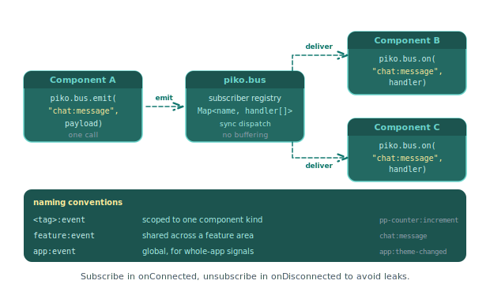

# How to use the event bus for cross-component messaging

Components that do not share a parent-child relationship cannot communicate via props or custom DOM events. The global `piko.bus` provides a publish/subscribe channel that any component can use. See the [client components reference](../../reference/client-components.md) for the broader API.

## When to prefer the bus, when to prefer attribute writes

The bus is for messages that do not map to a state field. If you want to push a value to another component (a search query, a selection, a flag), set the attribute on it instead. The receiving PKC's reactive state updates automatically (see [how to share state between components](share-state-between-components.md)). Reach for the bus when:

- The message is a one-shot signal (`'app:reload-needed'`, `'cart:flush'`).
- A single emit needs to fan out to unrelated subscribers.
- The publisher has no JavaScript reference to the subscriber's element and no way to look it up.
- The payload has no natural attribute representation (a complex object, a `Map`, a stream of partial events).

<p align="center">
  
</p>

## Emit an event

Any component can publish on the bus:

```typescript
function notifyUsers() {
    piko.bus.emit('chat:message', {
        user: state.currentUser,
        text: state.draft,
        at: new Date().toISOString(),
    });
}
```

The first argument is the event name. Use a prefix to avoid collisions. The second argument is the payload.

## Subscribe to an event

`piko.bus.on(name, handler)` returns a `() => void` unsubscribe function. Capture it in `onConnected` and call it in `onDisconnected`:

```typescript
let offMessage: (() => void) | undefined;

pkc.onConnected(() => {
    offMessage = piko.bus.on('chat:message', handleMessage);
});

pkc.onDisconnected(() => {
    offMessage?.();
});

function handleMessage(payload: { user: string; text: string; at: string }) {
    state.messages.push(payload);
}
```

Always pair subscription and unsubscription via the returned function. `piko.bus.off(name)` removes **every** listener for `name`, not the specific handler, so the function-return form is the only way to detach a single subscriber safely.

## Subscribe once

Register a handler that fires exactly once:

```typescript
piko.bus.once('app:ready', () => {
    console.log('ready');
});
```

## Naming convention

Use a namespace prefix to keep event names readable and non-overlapping:

| Prefix | Use |
|---|---|
| `<component-tag>:` | Events from a specific component: `pp-counter:changed` |
| `app:` | Application-wide events: `app:ready`, `app:locale-change` |
| `chat:`, `auth:`, etc. | Feature-area events |

## See also

- [How to share state between components](share-state-between-components.md) for the attribute-write alternative when a message maps to a state field.
- [How to events](events.md) for intra-component event handling.
- [Client components reference](../../reference/client-components.md).
- [About reactivity](../../explanation/about-reactivity.md) for the PK/PKC island model the event bus crosses.
