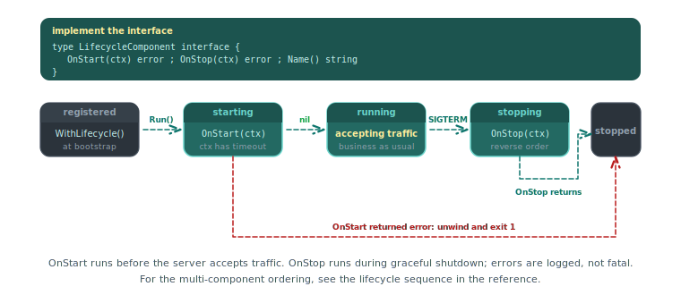

# How to register a lifecycle component

A lifecycle component runs code during Piko's managed startup and graceful shutdown. Use it for resources that need to open and close cleanly, such as database connections, message-queue workers, and background goroutines. This guide walks through the pattern. See the [lifecycle API reference](../reference/lifecycle-api.md) for the interfaces.

<p align="center">
  
</p>

## Implement the interface

A lifecycle component implements `LifecycleComponent`:

```go
package components

import (
    "context"
    "database/sql"
    "fmt"

    _ "github.com/jackc/pgx/v5/stdlib"
    "piko.sh/piko"
)

type PostgresComponent struct {
    db      *sql.DB
    connStr string
}

func NewPostgresComponent(connStr string) *PostgresComponent {
    return &PostgresComponent{connStr: connStr}
}

func (c *PostgresComponent) Name() string {
    return "postgres"
}

func (c *PostgresComponent) OnStart(ctx context.Context) error {
    db, err := sql.Open("pgx", c.connStr)
    if err != nil {
        return fmt.Errorf("connecting to postgres: %w", err)
    }

    if err := db.PingContext(ctx); err != nil {
        return fmt.Errorf("pinging postgres: %w", err)
    }

    c.db = db
    return nil
}

func (c *PostgresComponent) OnStop(ctx context.Context) error {
    if c.db == nil {
        return nil
    }
    return c.db.Close()
}

func (c *PostgresComponent) DB() *sql.DB {
    return c.db
}
```

The `OnStart` context carries a 30-second timeout by default. Return a non-nil error to stop the server from starting, and `OnStop` runs on every component that already started.

## Register with the server

Register after construction with `RegisterLifecycle`:

```go
postgres := components.NewPostgresComponent(os.Getenv("POSTGRES_URL"))

ssr := piko.New()
ssr.RegisterLifecycle(postgres)
```

Components start in registration order and stop in reverse.

## Extend the startup timeout

For components that need longer than 30 seconds (document ingestion, large migrations), implement `LifecycleStartTimeout`:

```go
func (c *DocumentIngestComponent) StartTimeout() time.Duration {
    return 5 * time.Minute
}
```

## Expose a custom health probe

A component that implements `LifecycleHealthProbe` contributes to `/live` and `/ready`:

```go
func (c *PostgresComponent) Check(ctx context.Context, checkType piko.HealthCheckType) piko.HealthStatus {
    start := time.Now()
    err := c.db.PingContext(ctx)

    state := piko.HealthStateHealthy
    message := "postgres connection OK"
    if err != nil {
        state = piko.HealthStateUnhealthy
        message = fmt.Sprintf("postgres connection failed: %v", err)
    }

    return piko.HealthStatus{
        Name:      c.Name(),
        State:     state,
        Message:   message,
        Timestamp: time.Now(),
        Duration:  time.Since(start).String(),
    }
}
```

A component that implements both `LifecycleComponent` and `LifecycleHealthProbe` is automatically registered as both.

## Avoid goroutine leaks

If `OnStart` spawns background goroutines, cancel them from `OnStop`:

```go
type WorkerComponent struct {
    cancel context.CancelFunc
    done   chan struct{}
}

func (c *WorkerComponent) OnStart(ctx context.Context) error {
    runCtx, cancel := context.WithCancel(context.Background())
    c.cancel = cancel
    c.done = make(chan struct{})

    go func() {
        defer close(c.done)
        c.run(runCtx)
    }()

    return nil
}

func (c *WorkerComponent) OnStop(ctx context.Context) error {
    c.cancel()
    select {
    case <-c.done:
        return nil
    case <-ctx.Done():
        return ctx.Err()
    }
}
```

The `OnStop` context carries the shutdown timeout. Return its error if the worker does not stop in time. The framework logs it and continues.

## See also

- [Lifecycle API reference](../reference/lifecycle-api.md).
- [How to health checks](health-checks.md) for contributing custom probes.
- [Bootstrap options reference](../reference/bootstrap-options.md) for `WithShutdownDrainDelay` and other shutdown knobs.
