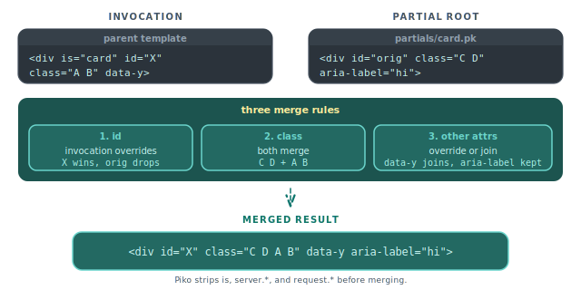

# How to control component attribute merging

When a parent template invokes a partial, Piko merges the invocation's attributes with the partial's root element using three rules. This guide explains the rules and how to predict the result. For the full template syntax see [template syntax reference](../../reference/template-syntax.md). For the partial format see [pk-file format reference](../../reference/pk-file-format.md).

<p align="center">
  
</p>

> **Note:** Piko emits merged static attributes in alphabetical order, not source order. The expander sorts the merged set by attribute name before writing it back to the node, so `class` always appears before `id` in the output regardless of how either side wrote them. The example outputs below reflect that order.

## Override the `id`

The invocation's `id` replaces the partial's `id`:

```html
<!-- partials/card.pk -->
<template>
    <div id="original-id" class="card">...</div>
</template>

<!-- Invocation -->
<div is="card" id="custom-id"></div>

<!-- Output -->
<div class="card" id="custom-id">...</div>
```

Piko keeps `id` overrideable so the parent can produce unique IDs for accessibility (`aria-labelledby`) or DOM lookups.

## Merge classes additively

Classes from the partial and the invocation join into one space-separated list:

```html
<!-- partials/card.pk -->
<template>
    <div class="card base-style">...</div>
</template>

<!-- Invocation -->
<div is="card" class="highlighted special"></div>

<!-- Output -->
<div class="card base-style highlighted special">...</div>
```

The partial keeps full ownership of its base styles. The parent decorates without rewriting the partial. Class order within the value is partial-first, invocation-second, since `mergeClassAttr` concatenates the existing value with the new one.

## Override or join other attributes

Any other attribute that appears on both the invocation and the partial root takes the invocation's value. Attributes only on one side pass through:

```html
<!-- partials/card.pk -->
<template>
    <div class="card" aria-label="Default label">...</div>
</template>

<!-- Invocation -->
<div is="card" data-testid="my-card" aria-hidden="true"></div>

<!-- Output -->
<div aria-hidden="true" aria-label="Default label" class="card" data-testid="my-card">...</div>
```

`aria-label` keeps its partial value because the invocation does not override it. `data-testid` and `aria-hidden` pass through. The output order is alphabetical (`aria-hidden`, `aria-label`, `class`, `data-testid`), driven by `rebuildSortedStaticAttrs` in `partial_expander_task.go`.

## Attributes Piko consumes

Some attributes never appear on the merged root because Piko routes them somewhere other than the DOM:

- `is`: the partial-invocation marker. The component linker reads it at compile time to resolve which partial to inline, then drops it.
- `server.*`: a prop-routing prefix. Piko forwards `server.` names as server-only props to the partial's `Props` struct, binding them to the matching `prop:"..."` field and never emitting the prefix as an attribute. See `partial_expander.go`.
- `request.*`: a per-request prop-override prefix. `request.` names override props for a single request and emit a warning if the named prop does not exist on the partial. See `component_linker_invocation.go`.

`server.` and `request.` are not generic attribute strip rules. Piko reserves both prefixes to route values into the partial's prop system. If you need a literal `server.foo` attribute on the rendered DOM, the partial cannot expose it through this path. Emit it directly inside the partial's template instead.

## See also

- [Template syntax reference](../../reference/template-syntax.md) for the broader expression and directive surface.
- [PK file format reference](../../reference/pk-file-format.md) for partials and props.
- [How to scope and bridge component CSS](scoped-css.md) for the styling counterpart of attribute merging.
- [How to passing props to partials](../partials/passing-props.md) for typed prop binding.
