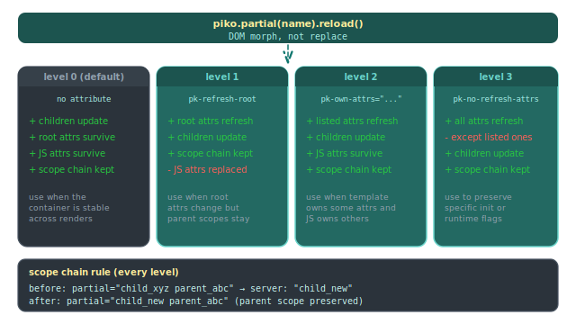

# How to control partial refresh behaviour

`piko.partial('name').reload()` replaces a partial's content via DOM morphing. Most refreshes work without configuration. Reach for the controls below when parent-contributed attributes, JS-added attributes, or CSS scope chains need explicit handling. For the directive surface see [directives](../../reference/directives.md).

<p align="center">
  
</p>

## Pick a refresh level

| Scenario | Level | Attribute on the partial root |
|---|---|---|
| Stable container, only inner content updates | 0 (default) | none |
| Root class or scope changes per refresh | 1 | `pk-refresh-root` |
| Mix of template-owned and JS-owned attributes | 2 | `pk-own-attrs="..."` |
| Initialisation flags must survive | 3 | `pk-no-refresh-attrs="..."` |

The default fits stable containers. The root's class, id, scope chain, and JS-added attributes all survive untouched.

```ts
piko.partial('cart').reload();
```

## Refresh the root while keeping parent CSS scopes

If the root's own attributes change but parent CSS scopes must stay attached, add `pk-refresh-root` to the partial's root element:

```html
<!-- partials/cart.pk -->
<template>
    <div pk-refresh-root class="{{ state.DynamicClass }}">
        ...
    </div>
</template>
```

The merge keeps parent scopes attached:

```text
Before: partial="child_xyz parent_abc"
Server: partial="child_new"
After:  partial="child_new parent_abc"
```

Parent `:deep()` rules continue matching after the refresh.

## Refresh only the attributes the template owns

When the template owns some attributes and JS owns others, declare the template-owned ones with `pk-own-attrs`:

```html
<!-- partials/cart.pk -->
<template>
    <div pk-own-attrs="class,data-count">
        ...
    </div>
</template>
```

```ts
piko.partial('cart').reloadWithOptions({
    level: 2,
    ownedAttrs: ['class', 'data-count'],
});
```

Use this when the server drives `class` and client interaction toggles `data-active`.

## Preserve specific attributes through a refresh

When most of the root refreshes but a small set of runtime flags must survive, use `pk-no-refresh-attrs`:

```html
<!-- partials/cart.pk -->
<template>
    <div pk-no-refresh-attrs="data-initialised,aria-expanded">
        ...
    </div>
</template>
```

## Preserve a specific element through a refresh

To freeze an element and its subtree, mark it with `pk-no-refresh`:

```html
<div>
    <span id="score">{{ state.Score }}</span>
    <span id="client-counter" pk-no-refresh data-count="0">0</span>
</div>
```

To opt a child back into morphing inside a `pk-no-refresh` subtree, add `pk-refresh`:

```html
<div pk-no-refresh>
    <span>Preserved</span>
    <span pk-refresh>Updates normally</span>
</div>
```

## Drive a refresh from JavaScript

To pass query params to the partial during a reload:

```ts
piko.partial('cart').reload({ highlight: 'new-item' });
```

To override the level Piko would otherwise infer:

```ts
piko.partial('cart').reloadWithOptions({
    data:       { highlight: 'new-item' },
    level:      1,
    ownedAttrs: ['class', 'data-count'],
});
```

## Style the loading state

Piko adds the `pk-loading` class to the partial element while the refresh is in flight, then removes it when the response replaces the content:

```css
.pk-loading {
    opacity: 0.6;
    pointer-events: none;
}
```

## Opt a form out of dirty tracking

Search and filter forms do not benefit from the unsaved-changes warning. To opt out, add `pk-no-track`:

```html
<form pk-no-track p-on:submit.prevent="action.search()">
    <input type="text" name="query" />
    <button type="submit">Search</button>
</form>
```

## See also

- [Directives reference](../../reference/directives.md) for the directive list and the full set of internal `pk-*` attributes.
- [Template syntax reference](../../reference/template-syntax.md) for the expression grammar.
- [How to scope and bridge component CSS](scoped-css.md) for how scope chains travel through the refresh.
- [How to passing props to partials](../partials/passing-props.md) for the prop-binding side of partial composition.
