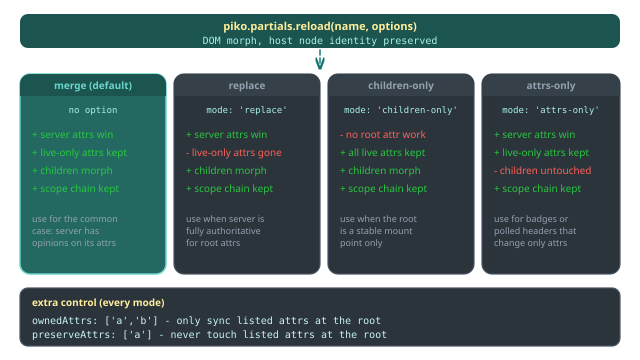

# How to control partial refresh behaviour

`piko.partials.reload('name')` refreshes a partial via DOM morphing. Most reloads need no configuration - the default `merge` mode does the right thing for the common case. Reach for the controls below when JS-mutated root attributes, parent CSS scope chains, or runtime initialisation flags need explicit handling. For the directive surface see [directives](../../reference/directives.md).

<p align="center">
  
</p>

## Pick a reload mode

| Scenario | `mode` |
|---|---|
| Server controls root attrs; JS-set classes/data-* should survive | `'merge'` (default) |
| Server fully owns the root, including removing stale attrs | `'replace'` |
| Stable container with no root attribute churn | `'children-only'` |
| Periodic attribute-only refresh (for example, a status badge) | `'attrs-only'` |

The default fits stable containers whose root attributes the server has opinions about. Anything you `setAttribute()`'d at runtime that the server does not re-emit survives the reload.

```ts
piko.partials.reload('cart');
```

## Give the server full authority over the root

When you want the server response to be the complete picture - including removing any attributes that are not in the response:

```ts
piko.partials.reload('header-status', { mode: 'replace' });
```

Use this for partials whose root attributes are 100% server-driven and where lingering client-side attributes would be a bug.

## Keep the container; only morph children

For partials where the root element is purely a stable mount point and its attributes never change:

```ts
piko.partials.reload('feed', { mode: 'children-only' });
```

## Refresh root attributes without touching children

For polling badges that update a count attribute on the host but should not re-render their subtree:

```ts
piko.partials.reload('notification-badge', {
    mode: 'attrs-only',
    args: { since: lastSeen },
});
```

## Tell the server which attributes it owns

When most of the root is JS-mutated and only specific attributes are server-driven:

```ts
piko.partials.reload('cart', {
    ownedAttrs: ['data-count', 'class'],
});
```

Piko copies only `data-count` and `class` from the response and keeps every other live attribute, even attributes the server happened to emit.

## Preserve specific attributes through a refresh

When most of the root refreshes but a small set of runtime flags must survive:

```ts
piko.partials.reload('cart', {
    preserveAttrs: ['data-initialised', 'aria-expanded'],
});
```

`preserveAttrs` wins over the server's value even in `replace` mode.

## Preserve a specific child element through a refresh

To freeze an element and its subtree inside the partial, mark it with `pk-no-refresh`:

```html
<div>
    <span id="score">{{ state.Score }}</span>
    <span id="client-counter" pk-no-refresh data-count="0">0</span>
</div>
```

To opt a descendant back into morphing inside a `pk-no-refresh` subtree, add `pk-refresh`:

```html
<div pk-no-refresh>
    <span>Preserved</span>
    <span pk-refresh>Updates normally</span>
</div>
```

To preserve only specific attributes on a single element (not the whole element), use `pk-no-refresh-attrs` on that element:

```html
<div pk-no-refresh-attrs="data-toggled">
    <!-- everything refreshes except data-toggled -->
</div>
```

These three element-level decorators apply inside the morph. They work in every mode, independent of the partial-root reload mode.

## Drive a refresh from JavaScript

Pass query params to the partial during a reload:

```ts
piko.partials.reload('cart', { args: { highlight: 'new-item' } });
```

Combine mode and args:

```ts
piko.partials.reload('cart', {
    args: { highlight: 'new-item' },
    mode: 'replace',
    preserveAttrs: ['data-client-mounted'],
});
```

## Style the loading state

Piko adds the `pk-loading` class to the partial element while the refresh runs, then removes it when the response replaces the content:

```css
.pk-loading {
    opacity: 0.6;
    pointer-events: none;
}
```

## Opt a form out of dirty tracking

Search and filter forms do not benefit from the unsaved-changes warning. To opt out, add `pk-no-track`:

```html
<form pk-no-track p-on:submit.prevent="action.search()">
    <input type="text" name="query" />
    <button type="submit">Search</button>
</form>
```

## See also

- [Directives reference](../../reference/directives.md) for the directive list and the full set of internal `pk-*` attributes.
- [Template syntax reference](../../reference/template-syntax.md) for the expression grammar.
- [How to scope and bridge component CSS](scoped-css.md) for how scope chains travel through the refresh.
- [How to passing props to partials](../partials/passing-props.md) for the prop-binding side of partial composition.
