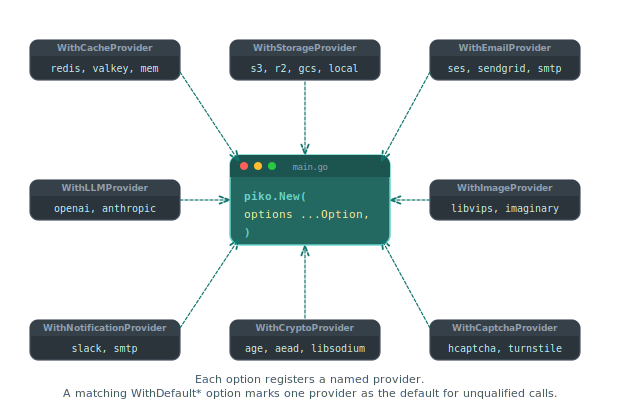

# Bootstrap options

`piko.New` accepts a variadic list of `piko.Option` values. Each option configures one aspect of the server. Examples include provider selection for storage or caching, frontend module registration, TLS handling, and metrics transport. This page groups every shipped option by concern. Source of truth: [`options.go`](https://github.com/piko-sh/piko/blob/master/options.go).

  

For the ports-and-adapters mental model that motivates every `With*Provider` option, see [About the hexagonal architecture](../explanation/about-the-hexagonal-architecture.md).

## Server

| Option | Purpose |
|---|---|
| `WithPort(port int)` | HTTP port. Default from `config.json`, else `8080`. |
| `WithTLS(opts ...TLSOption)` | Enables HTTPS. See [TLS](#tls-options). |
| `WithWatchMode(enabled bool)` | Enables the dev watcher. Normally set automatically by `piko dev`. |
| `WithE2EMode(enabled bool)` | Enables test hooks and fixed timestamps for E2E tests. |
| `WithStartupBanner(enabled bool)` | Toggles the ASCII banner emitted on start-up. |
| `WithShutdownDrainDelay(delay)` | Adds a grace period before the server stops draining connections. |
| `WithIAmACatPerson()` | No-op. Tests that the option wiring compiles. |

### TLS options

Passed inside `WithTLS(...)`:

| Option | Purpose |
|---|---|
| `WithTLSCertFile(path)` | Path to the PEM-encoded certificate chain. |
| `WithTLSKeyFile(path)` | Path to the PEM-encoded private key. |
| `WithTLSClientCA(path)` | Enables mTLS; path to the CA used to validate client certs. |
| `WithTLSClientAuth(mode)` | Client-cert policy: `"none"`, `"request"`, `"require-and-verify"`. |
| `WithTLSMinVersion(version)` | `"1.2"` or `"1.3"`. |
| `WithTLSHotReload(enabled bool)` | Watches cert files and reloads on change. |
| `WithTLSRedirectHTTP(port int)` | Redirects HTTP requests on the given port to HTTPS. |

## Dependency injection

Piko's hexagonal architecture lets a project substitute any backend at construction. Most ports offer three options. The first registers a named provider, the second marks one as the default, and the third overrides the service wrapper entirely.

### Cache

| Option | Purpose |
|---|---|
| `WithCacheProvider(name, provider)` | Register a named cache backend. |
| `WithDefaultCacheProvider(name)` | Select the default backend by name. |
| `WithCacheService(service)` | Replace the entire cache service. |
| `WithMemoryRegistryCache()` | In-memory metadata cache for the registry. |
| `WithJSONTypeInspectorCache()` | Cache the JSON type inspector to avoid re-reflection per request. |

### Crypto

| Option | Purpose |
|---|---|
| `WithCryptoProvider(name, provider)` | Register a named encryption provider. |
| `WithDefaultCryptoProvider(name)` | Select the default crypto backend. |
| `WithCryptoService(service)` | Replace the entire crypto service. |

### Email

| Option | Purpose |
|---|---|
| `WithEmailProvider(name, provider)` | Register a named email transport (SES, SendGrid, SMTP, etc.). |
| `WithDefaultEmailProvider(name)` | Select the default transport. |
| `WithEmailService(service)` | Replace the entire email service. |
| `WithEmailDispatcher(config)` | Configure the queue-backed dispatcher. |
| `WithEmailDeadLetterQueue(dlq)` | Route failed emails to a dead-letter queue. |

### Storage

| Option | Purpose |
|---|---|
| `WithStorageProvider(name, provider)` | Register a named storage provider (S3, R2, GCS, etc.). |
| `WithDefaultStorageProvider(name)` | Select the default provider. |
| `WithSystemStorageProvider(provider)` | Register the internal-system storage backend. |
| `WithStorageService(service)` | Replace the entire storage service. |
| `WithStorageDispatcher(config)` | Configure the storage dispatcher. |
| `WithStoragePresignBaseURL(url)` | Base URL for generated presigned URLs. |
| `WithStoragePublicBaseURL(url)` | Base URL for public download links. |

### LLM and embedding

| Option | Purpose |
|---|---|
| `WithLLMProvider(name, provider)` | Register a named LLM provider (OpenAI, Anthropic, local). |
| `WithDefaultLLMProvider(name)` | Select the default LLM. |
| `WithLLMService(service)` | Replace the entire LLM service. |
| `WithEmbeddingProvider(name, provider)` | Register a named embedding backend. |
| `WithDefaultEmbeddingProvider(name)` | Select the default embedding backend. |

### Captcha

| Option | Purpose |
|---|---|
| `WithCaptchaProvider(name, provider)` | Register a named captcha provider (Turnstile, hCaptcha, etc.). |
| `WithDefaultCaptchaProvider(name)` | Select the default. |

### Image and video

| Option | Purpose |
|---|---|
| `WithImageProvider(name, provider)` | Register a named image transformer (vips, imaginary, etc.). |
| `WithDefaultImageProvider(name)` | Select the default image backend. |
| `WithImageService(service)` | Replace the entire image service. |
| `WithImage(config)` | Register additional image profiles. |
| `WithVideoProvider(name, provider)` | Register a named video transcoder (ffmpeg, etc.). |
| `WithDefaultVideoProvider(name)` | Select the default video backend. |
| `WithVideoService(service)` | Replace the entire video service. |

### Notifications and events

| Option | Purpose |
|---|---|
| `WithNotificationProvider(name, provider)` | Register a named notification provider. |
| `WithDefaultNotificationProvider(name)` | Select the default notification backend. |
| `WithEventsProvider(provider)` | Provider for the internal event bus. |
| `WithEventBus(bus)` | Replace the event bus implementation. |

### Other services

| Option | Purpose |
|---|---|
| `WithRegistryService(service)` | Replace the route registry. |
| `WithCapabilityService(service)` | Replace the capability service. |
| `WithOrchestratorService(service)` | Replace the background-task orchestrator. |
| `WithI18nService(service)` | Replace the i18n service. |
| `WithHighlighter(h)` | Syntax highlighter for code blocks in markdown. |
| `WithMarkdownParser(parser)` | Markdown parser implementation. |
| `WithPMLTransformer(t)` | `Piko Markup Language` transformer. |

## Security

| Option | Purpose |
|---|---|
| `WithCSRFSecret(key []byte)` | 32-byte key used to sign CSRF tokens. |
| `WithCSRFTokenMaxAge(d)` | Token validity period. |
| `WithCSRFSecFetchSiteEnforcement(enabled)` | Enforce `Sec-Fetch-Site` header alongside the token. |
| `WithConfigResolvers(resolvers...)` | Register resolvers that populate `Secret[T]` from external sources. |
| `WithAuthProvider(provider)` | Authentication provider. |
| `WithAuthGuard(config)` | Route-level authorisation rules. |
| `WithTrustedProxies(cidrs...)` | CIDRs of reverse proxies whose `X-Forwarded-*` headers Piko should honour. |
| `WithCloudflareEnabled(enabled)` | Trusts Cloudflare's CF-Connecting-IP header. |
| `WithRateLimitEnabled(enabled)` | Enables the built-in rate limiter. |

### `Content Security Policy`

| Option | Purpose |
|---|---|
| `WithCSP(configure)` | Build a CSP programmatically. |
| `WithCSPString(policy)` | Supply a raw CSP string. |
| `WithPikoDefaultCSP()` | Use Piko's recommended default policy. |
| `WithStrictCSP()` | Strict policy (no inline scripts, no eval). |
| `WithRelaxedCSP()` | Permissive policy for legacy content. |
| `WithAPICSP()` | Minimal policy for API-only endpoints. |
| `WithReportingEndpoints(endpoints...)` | CSP violation reporting targets. |
| `WithCrossOriginResourcePolicy(policy)` | `Cross-Origin-Resource-Policy` header value. |

## Frontend

| Option | Purpose |
|---|---|
| `WithFrontendModule(module, config...)` | Enable a built-in frontend module (`ModuleAnalytics`, `ModuleToasts`, `ModuleModals`, etc.). |
| `WithCustomFrontendModule(name, content, config...)` | Ship a custom JS bundle as a first-class module. |
| `WithComponents(defs...)` | Register external `.pkc` components. |
| `WithDevWidget()` | Show the dev-mode overlay. |
| `WithDevHotreload()` | Enable hot reload in dev mode. |

## Performance and caching

| Option | Purpose |
|---|---|
| `WithCSSTreeShaking()` | Eliminate unused CSS at build time. |
| `WithCSSTreeShakingSafelist(classes...)` | Classes to exempt from tree-shaking. |
| `WithCSSReset(opts...)` | Apply the CSS reset. |
| `WithCSSResetComplete()` | Use the full reset variant. |
| `WithCSSResetPKOverride(css)` | Override the reset with project-specific CSS. |
| `WithAutoMemoryLimit(provider)` | Set a dynamic `GOMEMLIMIT` based on the environment. |
| `WithRegistryMetadataCacheConfig(config)` | Tune the metadata cache's TTL and size. |

## Monitoring

| Option | Purpose |
|---|---|
| `WithMonitoring(opts...)` | Enables the gRPC monitoring endpoint. |
| `WithMonitoringAddress(addr)` | Full address (host:port). |
| `WithMonitoringBindAddress(addr)` | Bind address override. |
| `WithMonitoringAutoNextPort(enabled)` | Pick the next available port if another process already holds the primary. |
| `WithMonitoringTLS(opts...)` | TLS for the monitoring endpoint. |
| `WithMonitoringTransport(factory)` | Transport factory (OTLP, Prometheus, etc.). |
| `WithMonitoringOtelFactories(factories)` | OpenTelemetry service factories. |
| `WithMonitoringProfiling()` | Attach profiling handlers to the monitoring endpoint. |
| `WithProfiling(opts...)` | Enables pprof HTTP server (separate from monitoring). |
| `WithGeneratorProfiling(opts...)` | Profile the generator during `piko generate`. |
| `WithMetricsExporter(exporter)` | Custom metrics exporter. |

### Profiling options

Passed inside `WithProfiling(...)`:

| Option | Purpose |
|---|---|
| `WithProfilingPort(port)` | Port for the pprof HTTP server. |
| `WithProfilingBindAddress(addr)` | Bind address. |
| `WithProfilingBlockRate(rate)` | pprof block profiler rate. |
| `WithProfilingMutexFraction(fraction)` | Mutex profiler fraction. |
| `WithProfilingMemProfileRate(rate)` | Memory profile sampling rate. |
| `WithProfilingRollingTrace()` | Enable rolling execution traces. |
| `WithProfilingRollingTraceMinAge(d)` | Minimum age before Piko retains a trace. |
| `WithProfilingRollingTraceMaxBytes(n)` | Max size of the rolling trace buffer. |

## Health

| Option | Purpose |
|---|---|
| `WithCustomHealthProbe(probe)` | Register a custom health probe. |
| `WithHealthTLS(opts...)` | TLS for the health endpoint. |
| `WithHealthTLSCertFile(path)` | Cert path. |
| `WithHealthTLSKeyFile(path)` | Key path. |
| `WithHealthTLSMinVersion(version)` | `"1.2"` or `"1.3"`. |

## SEO and assets

| Option | Purpose |
|---|---|
| `WithSEO(config)` | Generate `sitemap.xml` and `robots.txt`. |
| `WithAssets(config)` | Image profiles, breakpoints, densities. |
| `WithWebsiteConfig(config)` | Programmatic config; supersedes `config.json`. |

## Analytics

| Option | Purpose |
|---|---|
| `WithBackendAnalytics(collectors...)` | Register backend analytics collectors (see [analytics reference](analytics-api.md)). |

## Database

| Option | Purpose |
|---|---|
| `WithDatabase(name, registration)` | Register a database connection by name. |

## Miscellaneous

| Option | Purpose |
|---|---|
| `WithValidator(v)` | Override the struct validator used for action parameters. |
| `WithJSONProvider(provider)` | Override the JSON implementation. |
| `WithStandardLoader()` | Fallback type inspector; slower but stable. |
| `WithServerConfigDefaults(defaults)` | Supply defaults that `config.json` overrides. |

## See also

- [How to secrets](../how-to/secrets.md) for `WithConfigResolvers`.
- [How to health checks](../how-to/health-checks.md) for `WithCustomHealthProbe`.
- [How to analytics](../how-to/analytics.md) for `WithBackendAnalytics`.
- [Secrets API reference](secrets-api.md).
- [Lifecycle API reference](lifecycle-api.md).
- [Analytics API reference](analytics-api.md).

Source file: [`options.go`](https://github.com/piko-sh/piko/blob/master/options.go).
