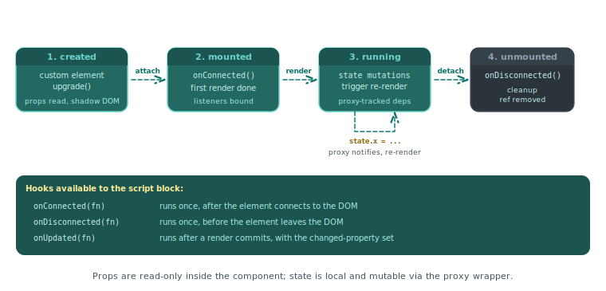

# Client components

A `.pkc` file is a client-side reactive component that compiles to a native Web Component with shadow DOM encapsulation. This page documents the file format and the runtime surface. For task recipes see the [reactivity how-to](../how-to/client-components/reactivity.md) and [events how-to](../how-to/client-components/events.md).

<p align="center">
  
</p>

## File structure

A `.pkc` file has three sections: `<template>`, `<script lang="ts">`, and `<style>`.

```pkc
<template name="pp-counter">
    <div>
        <p>Count: {{ state.count }}</p>
        <button p-on:click="increment">Increment</button>
    </div>
</template>

<script lang="ts">
    const state = {
        count: 0 as number,
    };

    function increment() {
        state.count++;
    }
</script>

<style>
    div { padding: 1rem; border: 1px solid #eee; }
</style>
```

## Template attributes

| Attribute | Values | Purpose |
|---|---|---|
| `name` | kebab-case custom element name | Required. Defines the registered tag (for example `pp-counter`). Must contain a hyphen per the Web Components specification. |
| `enable` | `"form"` | Opts into form association; the component exposes itself as a form control. |
| `enable` | `"animation"` | Opts into the animation timeline behaviour required by [`p-timeline:hidden`](directives.md#p-timeline). |

The `enable` attribute accepts a single value. Components that need both behaviours can declare them by listing both names separated by whitespace (`enable="form animation"`).

Project components use the reserved `pp-` prefix to avoid collisions with built-in and third-party custom elements.

## Script attributes

| Attribute | Values | Purpose |
|---|---|---|
| `lang` | `"ts"` | Required. The script is TypeScript. |

## Runtime roots in scope

A reactive `<script lang="ts">` block in a PKC file has three runtime roots available without import:

| Root | Source | Purpose |
|---|---|---|
| `pkc` | alias for `this`, injected by the compiler | the component element itself, plus its lifecycle hooks (`pkc.onConnected`, `pkc.onDisconnected`, `pkc.onBeforeRender`, `pkc.onAfterRender`, `pkc.onUpdated`, `pkc.onCleanup`) and the standard component DOM API |
| `piko` | global ambient namespace | runtime helpers: `piko.bus`, `piko.event`, `piko.nav`, `piko.form`, `piko.ui`, `piko.actions`, `piko.helpers`, `piko.assets`, `piko.loader`, `piko.modal`, `piko.network`, `piko.partial`, `piko.partials`, `piko.sse`, `piko.timing`, `piko.util`, `piko.trace`, `piko.autoRefreshObserver`, `piko.context`, `piko.hooks`, `piko.analytics` |
| `action` | generated `actions.gen.ts` | typed server actions, called as `action.<package>.<Name>(input).call()` |

## Reactive state

A `const state = { ... }` declaration inside `<script>` defines the reactive scope. Writes to its properties trigger a re-render. Arrays and objects nested in `state` are also reactive: `push`, `splice`, and property assignment all trigger updates.

```typescript
const state = {
    count: 0 as number,
    name: 'Guest' as string,
    is_active: false as boolean,
    items: [] as string[],
    user: null as { name: string; email: string } | null,
};
```

Variables declared outside the `state` object are not reactive: a `let count = 0` outside `state` compiles and mutates but does not trigger re-renders.

### Naming and attribute mapping

State field names map to HTML attributes through `propertyToAttributeName`:

| Field name | Reflected attribute |
|---|---|
| `is_active` | `is_active` |
| `itemCount` | `item-count` |
| `count` | `count` |

`snake_case` field names round-trip without transformation. `camelCase` field names lower to `kebab-case` attribute names. Components in `components/m3e/` use `camelCase` for historical reasons.

For the rationale see [about reactivity](../explanation/about-reactivity.md).

### Type annotations

Each state field carries an `as TypeName` annotation. The compiler reads the annotation to emit a static `propTypes` getter, which the runtime uses to coerce attribute strings back to typed values. Authors must annotate fields when the initialiser is `null` (ambiguous between `null | number` and `null | string`). Annotations are optional when the initialiser is itself typed (`'Hello'` infers `String`, `0` infers `Number`, `false` infers `Boolean`). The convention is to annotate every field for clarity.

## State and HTML attribute binding

The runtime binds state bidirectionally to the host element's HTML attributes:

| Direction | Trigger | Behaviour |
|---|---|---|
| **State -> attribute** | Writing a state field (`state.value = 'x'`) | The runtime calls `host.setAttribute(field, 'x')` (or `host.toggleAttribute` for booleans, or `host.removeAttribute` for `null`/`undefined`). |
| **Attribute -> state** | External code calls `setAttribute`/`toggleAttribute`/`removeAttribute` on the element, or the page initially carries the attribute | The runtime coerces the attribute string back to the field's declared type and writes it to state, triggering a re-render. |

Sync flags (`applyingToState`, `reflectingToAttribute`, `initialising`) prevent loops. A state-write-then-attribute-write does not trigger another state-write.

**Reflection scope**. Only primitive types auto-reflect: `string`, `number`, `boolean`. Arrays, objects, and JSON-typed fields stay internal unless explicitly opted in via the metadata system.

**Boolean semantics**. Attribute presence is the truth signal:

| Attribute form | Coerced state value |
|---|---|
| `<x flag>` | `true` |
| `<x flag="true">` | `true` |
| `<x flag="anything">` | `true` |
| `<x flag="false">` | `false` |
| `<x>` (attribute absent) | `false` |

Writing `state.flag = false` removes the attribute via `host.toggleAttribute`. The DOM never carries `flag="false"`.

**Null semantics**. Writing `null` or `undefined` to any state field removes the attribute. A field declared `as string | null` round-trips `null` faithfully. A non-nullable field falls back to its default when the attribute is absent.

This binding is the primary inter-component communication channel. A PKC drives another PKC by calling `setAttribute` on it. A `.pk` script drives any PKC the same way. See [about reactivity](../explanation/about-reactivity.md#what-this-enables-pkc-to-pkc-communication) for the design rationale.

## Props

There is no separate `const props` declaration. Reactive state declared in `const state = { ... }` is the single source for both internal mutable values and externally driven props. The compiler reads each field's `as Type` annotation and emits a static `propTypes` getter. The runtime uses that getter to coerce attribute strings to typed values when external code calls `setAttribute` on the host element.

```typescript
const state = {
    label: '' as string,
    variant: 'primary' as 'primary' | 'secondary',
    is_disabled: false as boolean,
};
```

Parent templates pass values through plain HTML attributes:

```html
<pp-button label="Save" variant="primary" is_disabled></pp-button>
```

Primitive-typed state fields (`string`, `number`, `boolean`) reflect bidirectionally to HTML attributes via the binding described in [State and HTML attribute binding](#state-and-html-attribute-binding). Arrays, objects, and JSON-typed fields stay internal unless opted in via the metadata system.

## Directives

`.pkc` templates support the directives described below. See the [directives reference](directives.md) for full syntax.

| Directive | Behaviour |
|---|---|
| `p-if`, `p-else-if`, `p-else` | Conditional rendering. |
| `p-show` | Toggle CSS `display` without removing from the DOM. |
| `p-for` | Iterate; pair with `p-key` for stable identity. |
| `p-on:<event>` | Attach an event listener. |
| `p-model` | Two-way binding on form inputs. |
| `p-bind:<attr>` or `:<attr>` | Attribute binding. |
| `p-text` | Text content. |
| `p-html` | Raw HTML (unsafe). |
| `p-class` | Dynamic class list. |
| `p-style` | Dynamic inline style. |
| `p-ref` | Create a ref to a child element. |

## Lifecycle hooks

Register lifecycle callbacks by calling registration methods on `pkc` inside the `<script>` body. Every hook is optional and additive. Calling the same registration method multiple times queues multiple callbacks that all fire in order.

| Hook | Fires |
|---|---|
| `pkc.onConnected(callback)` | After the custom element connects to the DOM. Once per mount cycle. |
| `pkc.onDisconnected(callback)` | When the element leaves the DOM. Resets so a re-mount fires `onConnected` again. |
| `pkc.onBeforeRender(callback)` | Immediately before each re-render. |
| `pkc.onAfterRender(callback)` | Immediately after each re-render finishes. |
| `pkc.onUpdated(callback)` | After a re-render commits when one or more reactive properties changed. The callback receives `Set<string>` of changed property paths. |
| `pkc.onCleanup(callback)` | After `onDisconnected` callbacks have run. Cleanups run once and the runtime clears the queue. |

```typescript
pkc.onConnected(() => {
    window.addEventListener('scroll', handleScroll);
    handleScroll();
});

pkc.onDisconnected(() => {
    window.removeEventListener('scroll', handleScroll);
});

pkc.onUpdated((changedProperties) => {
    if (changedProperties.has('count')) {
        piko.bus.emit('counter:changed', { count: state.count });
    }
});
```

## Slots

Slot APIs available on `pkc` (the host element):

| Method | Returns | Purpose |
|---|---|---|
| `pkc.getSlottedElements(slot_name?)` | `Element[]` | Returns elements assigned to the named slot, or the default slot when the caller omits the name. Returns `[]` before the shadow root attaches. |
| `pkc.attachSlotListener(slot_name, callback)` | `void` | Registers a callback that fires whenever the slot's assigned content changes. The callback receives the live array of assigned elements and fires once immediately with the current content. |
| `pkc.hasSlotContent(slot_name?)` | `boolean` | Returns whether the slot has any assigned elements. |

```typescript
pkc.attachSlotListener('', (elements) => {
    for (const tab of elements) {
        tab.toggleAttribute('selected', tab.getAttribute('value') === state.active);
    }
});
```

A PKC drives its slotted children by setting their HTML attributes. When a slotted element is itself a PKC, those attribute writes feed through to its reactive state via the binding described in [State and HTML attribute binding](#state-and-html-attribute-binding).

## Events

| API | Surface |
|---|---|
| `pkc.setAttribute(name, value)` / `pkc.toggleAttribute(name, force?)` | Writes an HTML attribute on the host element. Feeds through to the target component's reactive state via the bidirectional binding. |
| `piko.event.dispatch(target, name, detail?, options?)` | Dispatches a DOM `CustomEvent` from `target` (an element, CSS selector, or `p-ref` name). Bubbles by default. |
| `piko.bus.emit(name, detail?)` / `piko.bus.on(name, handler)` / `piko.bus.once(...)` / `piko.bus.off(name?)` | Global pub/sub bus, decoupled from the DOM. |

```typescript
piko.event.dispatch(this, 'pp-counter:change', { count: state.count });
piko.bus.emit('cart:updated', { item_count: 3 });
```

For when to choose each surface, see [about reactivity](../explanation/about-reactivity.md).

## Shadow DOM and styling

The compiler scopes `<style>` to the shadow root by default. Styles do not leak out, and outer page styles do not leak in.

| Selector | Scope |
|---|---|
| `div { ... }` | Only matches inside the shadow root. |
| `:host { ... }` | The component's host element. |
| `:host(.active) { ... }` | The host element when it carries the matching class. |
| `::slotted(<selector>) { ... }` | Matches elements projected through slots. |

## Form association

Add `enable="form"` to the `<template>` to participate in forms. The component then responds to:

- `form.elements[name]` lookup.
- Validation (`checkValidity()`, `reportValidity()`).
- `formdata` submission.
- `reset` events.

Inside the component, call `piko.form.setValues(formSelector, values)` to set form field values programmatically. Pass either a CSS selector or an `HTMLFormElement` plus a record of field names to values.

```typescript
piko.form.setValues('#edit-user', {
    name: 'John Doe',
    email: 'john@example.com',
});
```

## Registration

The CLI scans the project's `components/` directory by default. The compiler picks up locally authored `.pkc` files automatically. `piko.WithComponents` registers components shipped by external Go modules.

```go
ssr := piko.New(
    piko.WithComponents(
        piko.ComponentDefinition{
            TagName:    "pp-counter",
            SourcePath: "components/pp-counter.pkc",
            ModulePath: "github.com/myorg/piko-components",
            IsExternal: true,
        },
    ),
)
```

`ComponentDefinition` fields:

| Field | Purpose |
|---|---|
| `TagName` | The HTML custom element tag name. Must contain a hyphen per the Web Components specification. |
| `SourcePath` | Path to the `.pkc` source file. Project-relative for local components, or module-relative for external components. |
| `ModulePath` | Go module path that provides the component. Empty for local components. Required for external ones. |
| `AssetPaths` | Module-root-relative directories whose files the registry should seed alongside the PKC sources. |
| `IsExternal` | Whether the component came from `WithComponents` instead of auto-discovery from the local `components/` folder. |

## See also

- [How to reactivity](../how-to/client-components/reactivity.md).
- [How to events](../how-to/client-components/events.md).
- [How to event bus](../how-to/client-components/event-bus.md) for cross-component messaging.
- [Directives reference](directives.md).
- [Scenario 003: reactive counter](../../examples/scenarios/003_reactive_counter/), [Scenario 007: todo app](../../examples/scenarios/007_todo_app/), [Scenario 009: form wizard](../../examples/scenarios/009_form_wizard/).

Integration tests: [`tests/integration/pkc_serving/`](https://github.com/piko-sh/piko/tree/master/tests/integration/pkc_serving), [`tests/integration/asset_pipeline/`](https://github.com/piko-sh/piko/tree/master/tests/integration/asset_pipeline).
