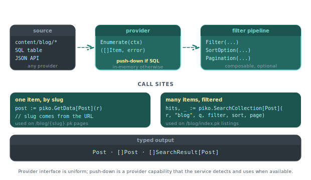

# Collections API

Collections hold structured content (usually markdown files with YAML frontmatter) under a shared schema. Piko reads them at build time and exposes them through the package-level functions and template attributes documented below. For task recipes see the [markdown collections how-to](../how-to/collections/markdown.md) and the [querying and filtering how-to](../how-to/collections/querying-and-filtering.md).

## Directory layout

A collection named `blog` lives at `content/blog/`. Piko reads every file matching the provider's pattern (typically `*.md`) at build time.

```
content/
  blog/
    hello-world.md
    second-post.md
  docs/
    getting-started.md
    routing.md
```

## Template attributes

When a PK page sets `p-collection`, Piko generates one route per item in that collection and binds the item's frontmatter to the page's render context.

| Attribute | Default | Purpose |
|---|---|---|
| `p-collection` | required | Collection name (the directory under `content/`) |
| `p-provider` | `"markdown"` | Provider backing the collection |
| `p-param` | `"slug"` | Route parameter used to look up the current item |
| `p-collection-source` | none | Import alias for a collection defined in an external module |

Inside the template, `<piko:content />` renders the parsed markdown body as HTML.

> **Note:** `<piko:content />` is a meta element. Tags in the `piko:` namespace render as their post-colon name with framework behaviour injected; this one disappears from the output, and the framework substitutes the rendered markdown body. See [about PK files](../explanation/about-pk-files.md) for the meta-element family.

## Data access

### `piko.GetData[T](r) T`

Returns the frontmatter for the current item, decoded into `T`. Signature:

```go
func GetData[T any](r *piko.RequestData) T
```

If `GetData` cannot decode the frontmatter into `T`, it returns the zero value.

### `piko.GetAllCollectionItems(name string) ([]map[string]any, error)`

Returns every item's frontmatter (no body content) in the named collection. Use for listing pages and dynamic navigation. Returns an error if the collection does not exist or its provider fails to enumerate.

### `piko.GetSections(r *piko.RequestData) []piko.Section`

Returns a flat list of headings extracted from the current item's markdown body, suitable for a table of contents.

### `piko.GetSectionsTree(r *piko.RequestData, opts ...piko.SectionTreeOption) []piko.SectionNode`

Returns the same headings as a nested tree. Options:

| Option | Default | Effect |
|---|---|---|
| `piko.WithMinLevel(n)` | 2 | Minimum heading level to include (for example 2 = h2). |
| `piko.WithMaxLevel(n)` | 6 | Maximum heading level to include. |

`SectionNode`:

```go
type SectionNode struct {
    ID       string
    Level    int
    Title    string
    Children []SectionNode
}
```

## Search and filtering

<p align="center">
  
</p>

### `piko.SearchCollection[T any](r *RequestData, collectionName, query string, opts ...SearchOption) ([]SearchResult[T], error)`

Fuzzy full-text search against the items of a named collection, with field weighting, fuzziness tuning, and relevance scoring. Type parameter `T` is the shape you want items decoded into.

### `piko.QuickSearch[T any](r *RequestData, collectionName, query string) ([]T, error)`

Convenience wrapper around `SearchCollection` with sensible defaults. Returns items directly without the `SearchResult` wrapper.

### Search options

Passed as variadic `SearchOption` values to `SearchCollection`:

| Option | Effect |
|---|---|
| `WithSearchFields(fields...)` | Restrict the search to specific fields. |
| `WithFuzzyThreshold(threshold)` | Minimum fuzzy-match score (0.0 - 1.0). |
| `WithSearchLimit(limit)` | Maximum number of results. |
| `WithSearchOffset(offset)` | Pagination offset. |
| `WithMinScore(score)` | Minimum relevance score to include. |
| `WithCaseSensitive(sensitive)` | Toggle case sensitivity. |
| `WithSearchMode(mode)` | Select a search mode (exact, prefix, fuzzy). |

## Filter API

| Function or type | Purpose |
|---|---|
| `piko.NewFilter(field, operator, value)` | Construct a single filter condition. |
| `piko.And(filters...)` | Combine filters with AND. |
| `piko.Or(filters...)` | Combine filters with OR. |
| `piko.NewSortOption(field, order)` | Construct a sort option. |
| `piko.NewPaginationOptions(limit, offset)` | Construct pagination options. |

Filter operators include `Equals`, `NotEquals`, `GreaterThan`, `GreaterEqual`, `LessThan`, `LessEqual`, `Contains`, `StartsWith`, `EndsWith`, `In`, `NotIn`, `Exists`, `FuzzyMatch`. Sort orders are `Asc` and `Desc`.

See the [querying and filtering how-to](../how-to/collections/querying-and-filtering.md) for usage.

## Navigation types

| Type | Purpose |
|---|---|
| `NavigationGroups` | Top-level grouping for sidebar and footer structures. |
| `NavigationTree` | Hierarchical view of groups and their children. |
| `NavigationNode` | Single node in a navigation tree. |
| `NavigationConfig` | Options that control how Piko builds trees. |

## Providers

The default provider is `markdown`. Other providers (SQL, JSON, custom) register via the bootstrap `WithCollectionProvider` option. See the [custom providers how-to](../how-to/collections/custom-providers.md) guide.

## See also

- [How to markdown collections](../how-to/collections/markdown.md) - end-to-end markdown walkthrough.
- [How to querying and filtering](../how-to/collections/querying-and-filtering.md) - the Filter, Sort, Pagination APIs.
- [How to custom providers](../how-to/collections/custom-providers.md) - writing a provider for data sources other than markdown.
- [Scenario 015: markdown blog](../showcase/015-markdown-blog.md) for a runnable markdown-driven site.

Integration tests: [`tests/integration/markdown_collection/`](https://github.com/piko-sh/piko/tree/master/tests/integration/markdown_collection), [`tests/integration/registry/search_integration_test.go`](https://github.com/piko-sh/piko/blob/master/tests/integration/registry/search_integration_test.go).
