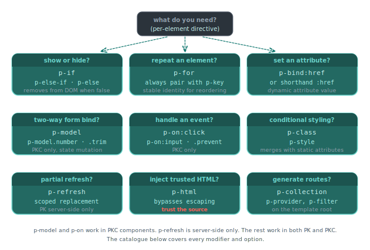

# Directives

Directives are special attributes that control rendering, handle events, bind data, and add behaviour to elements in a PK template. This page enumerates every directive Piko ships.

<p align="center">
  
</p>

## Conditional rendering

For task patterns using the conditional directives, see the [conditionals how-to](../how-to/templates/conditionals.md) and [loops how-to](../how-to/templates/loops.md).

### `p-if`

Conditionally render an element based on a boolean expression. When the condition is false, Piko removes the element from the DOM entirely.

**Basic Usage**:

```piko
<template>
  <div>
    <p p-if="state.IsLoggedIn">Welcome back!</p>
    <p p-if="!state.IsLoggedIn">Please log in.</p>
  </div>
</template>

<script type="application/x-go">
package main

import "piko.sh/piko"

type Response struct {
    IsLoggedIn bool
}

func Render(r *piko.RequestData, props piko.NoProps) (Response, piko.Metadata, error) {
    return Response{IsLoggedIn: true}, piko.Metadata{}, nil
}
</script>
```

**Output** (when `IsLoggedIn` is `true`):
```html
<div>
  <p>Welcome back!</p>
</div>
```

**Expressions**:

```piko
<template>
  <div>
    <!-- Comparison -->
    <p p-if="state.Count > 0">You have items</p>

    <!-- Equality -->
    <p p-if="state.Status == 'active'">Status is active</p>

    <!-- Logical AND -->
    <p p-if="state.IsLoggedIn && state.IsPremium">Premium member</p>

    <!-- Logical OR -->
    <p p-if="state.Count == 0 || state.IsEmpty">No items</p>

    <!-- Negation -->
    <p p-if="!state.HasErrors">All good!</p>

    <!-- Complex expressions -->
    <p p-if="state.Age >= 18 && state.Country == 'UK'">Eligible</p>
  </div>
</template>
```

### `p-else-if` and `p-else`

Chain multiple conditions together for mutually exclusive rendering.

```piko
<template>
  <div class="status-indicator">
    <p p-if="state.Status == 'ok'" class="text-green">
      Everything is running smoothly
    </p>
    <p p-else-if="state.Status == 'warning'" class="text-yellow">
      Warning: Check system logs
    </p>
    <p p-else-if="state.Status == 'error'" class="text-red">
      Error: System malfunction
    </p>
    <p p-else class="text-gray">
      Status unknown
    </p>
  </div>
</template>

<script type="application/x-go">
package main

import "piko.sh/piko"

type Response struct {
    Status string
}

func Render(r *piko.RequestData, props piko.NoProps) (Response, piko.Metadata, error) {
    return Response{Status: "warning"}, piko.Metadata{}, nil
}
</script>
```

**Output**:
```html
<div class="status-indicator">
  <p class="text-yellow">Warning: Check system logs</p>
</div>
```

`p-else-if` and `p-else` must immediately follow a `p-if` or another `p-else-if` at the same nesting level. Only the first matching condition renders.

**User role example**:

```piko
<template>
  <div>
    <div p-if="state.Role == 'admin'">
      <h2>Admin dashboard</h2>
      <p>Full system access</p>
    </div>
    <div p-else-if="state.Role == 'moderator'">
      <h2>Moderator panel</h2>
      <p>Content management access</p>
    </div>
    <div p-else-if="state.Role == 'user'">
      <h2>User dashboard</h2>
      <p>Basic access</p>
    </div>
    <div p-else>
      <h2>Guest view</h2>
      <p>Limited access</p>
    </div>
  </div>
</template>
```

### `p-show`

Toggle element visibility using CSS `display` property. Unlike `p-if`, the element stays in the DOM but becomes invisible.

> **Note:** `p-if` removes the element; `p-show` toggles `display: none`. Event listeners, focus state, and form values survive `p-show` toggles, but every `p-if` flip discards and recreates them.

```html
<template>
  <div>
    <div p-show="state.IsExpanded" class="details-panel">
      Detailed content here...
    </div>
  </div>
</template>
```

Use `p-show` when you expect to toggle visibility frequently, as it avoids the overhead of adding/removing elements from the DOM.

## Loops

### `p-for`

Iterate over slices, arrays, or maps. Supports two syntax forms.

**Value-only syntax** (simpler, most common):

```piko
<template>
  <ul>
    <li p-for="item in state.Items" p-key="item.ID">
      {{ item.Name }}
    </li>
  </ul>
</template>

<script type="application/x-go">
package main

import "piko.sh/piko"

type Item struct {
    ID   int
    Name string
}

type Response struct {
    Items []Item
}

func Render(r *piko.RequestData, props piko.NoProps) (Response, piko.Metadata, error) {
    return Response{
        Items: []Item{
            {ID: 1, Name: "Milk"},
            {ID: 2, Name: "Bread"},
            {ID: 3, Name: "Eggs"},
        },
    }, piko.Metadata{}, nil
}
</script>
```

**Index and Value Syntax** (when you need the index):

```piko
<template>
  <div>
    <h1>Shopping list</h1>
    <ul>
      <li p-for="(idx, item) in state.Items" :data-index="idx">
        Item {{ idx + 1 }}: {{ item }}
      </li>
    </ul>
    <p p-if="len(state.Items) == 0">Your list is empty.</p>
  </div>
</template>

<script type="application/x-go">
package main

import "piko.sh/piko"

type Response struct {
    Items []string
}

func Render(r *piko.RequestData, props piko.NoProps) (Response, piko.Metadata, error) {
    return Response{
        Items: []string{"Milk", "Bread", "Eggs"},
    }, piko.Metadata{}, nil
}
</script>
```

**Output**:
```html
<div>
  <h1>Shopping list</h1>
  <ul>
    <li data-index="0">Item 1: Milk</li>
    <li data-index="1">Item 2: Bread</li>
    <li data-index="2">Item 3: Eggs</li>
  </ul>
</div>
```

**Ignoring the Index** (use `_` placeholder):

```piko
<template>
  <ul>
    <li p-for="(_, item) in state.Items">
      {{ item.Name }}
    </li>
  </ul>
</template>
```

**Struct Slices**:

```piko
<template>
  <div>
    <h2>Team members</h2>
    <div p-for="member in state.Team" class="member-card" p-key="member.Email">
      <h3>{{ member.Name }}</h3>
      <p>{{ member.Role }}</p>
      <p>{{ member.Email }}</p>
    </div>
  </div>
</template>

<script type="application/x-go">
package main

import "piko.sh/piko"

type TeamMember struct {
    Name  string
    Role  string
    Email string
}

type Response struct {
    Team []TeamMember
}

func Render(r *piko.RequestData, props piko.NoProps) (Response, piko.Metadata, error) {
    return Response{
        Team: []TeamMember{
            {Name: "Alice", Role: "CEO", Email: "alice@example.com"},
            {Name: "Bob", Role: "CTO", Email: "bob@example.com"},
        },
    }, piko.Metadata{}, nil
}
</script>
```

**Map Iteration** (key, value):

```piko
<template>
  <div>
    <h2>Configuration</h2>
    <dl>
      <div p-for="(key, value) in state.Config" p-key="key">
        <dt>{{ key }}</dt>
        <dd>{{ value }}</dd>
      </div>
    </dl>
  </div>
</template>

<script type="application/x-go">
package main

import "piko.sh/piko"

type Response struct {
    Config map[string]string
}

func Render(r *piko.RequestData, props piko.NoProps) (Response, piko.Metadata, error) {
    return Response{
        Config: map[string]string{
            "theme":    "dark",
            "language": "en",
            "timezone": "UTC",
        },
    }, piko.Metadata{}, nil
}
</script>
```

Map iteration order is deterministic (sorted by key) in Piko for consistent rendering.

**Nested Loops**:

```piko
<template>
  <div>
    <section p-for="category in state.Categories" class="category" p-key="category.Name">
      <h2>{{ category.Name }}</h2>
      <ul>
        <li p-for="product in category.Products" p-key="product.Name">
          {{ product.Name }} - {{ product.Price }}
        </li>
      </ul>
    </section>
  </div>
</template>
```

**Empty Lists**:

```piko
<template>
  <div>
    <div p-if="len(state.Items) > 0">
      <div p-for="item in state.Items" p-key="item.ID">
        {{ item.Name }}
      </div>
    </div>
    <p p-else>No items found.</p>
  </div>
</template>
```

### `p-key`

Provide a unique identifier for list items to enable efficient DOM reconciliation. Always use `p-key` when iterating over lists where items may enter, leave, or change position.

```piko
<template>
  <ul>
    <li p-for="item in state.Items" p-key="item.ID">
      {{ item.Name }}
    </li>
  </ul>
</template>
```

The key expression can be:
- A simple field: `p-key="item.ID"`
- A string: `p-key="item.Slug"`
- A computed expression: `p-key="'item-' + strconv.Itoa(item.ID)"`
- A method call: `p-key="item.GetKey()"`

> **Performance Tip**: For large lists (1000+ items), consider pagination or virtual scrolling.

## Event handling

### `p-on`

Attach event handlers to elements. Events can trigger server actions, client-side functions, or helper utilities.

**Client-side handler** (calls JavaScript function defined in `<script>` tag):

```html
<template>
  <div>
    <button p-on:click="handleClick()">Click Me</button>
  </div>
</template>

<script>
function handleClick() {
  console.log('Button clicked!');
}
</script>
```

**Server action** (use `action.` prefix):

```html
<template>
  <div>
    <button p-on:click="action.deleteUser(state.UserID)">
      Delete User
    </button>
  </div>
</template>
```

**With parameters**:

```html
<template>
  <div>
    <button p-on:click="action.deleteItem(123)">
      Delete Item 123
    </button>

    <button p-on:click="action.updateStatus('active')">
      Set Active
    </button>
  </div>
</template>
```

**Form submission**:

```html
<template>
  <form p-on:submit.prevent="handleSubmit(event)">
    <input name="username" placeholder="Username" />
    <input name="email" type="email" placeholder="Email" />
    <button type="submit">Save Profile</button>
  </form>
</template>

<script>
function handleSubmit(event) {
  event.preventDefault();
  const formData = new FormData(event.target);
  // Process form data
}
</script>
```

**Handler types**:

| Prefix | Description |
|--------|-------------|
| *(none)* | Call an exported function from the client script |
| `action.` | Call a registered server action |
| `helpers.` | Call a framework helper function |

**Event modifiers** (append to event name with `.`):

| Modifier | Description |
|----------|-------------|
| `.prevent` | Call `event.preventDefault()` before the handler |
| `.stop` | Call `event.stopPropagation()` before the handler |
| `.once` | Handler fires only on the first event |
| `.self` | Handler fires only when `event.target === event.currentTarget` |
| `.passive` | Register listener with `{ passive: true }` for scroll performance |
| `.capture` | Register listener in the capture phase |

**Common events**:

```html
<template>
  <div>
    <!-- Click events -->
    <button p-on:click="handleClick()">Click Me</button>
    <button p-on:click="action.serverAction()">Server Call</button>

    <!-- Form events -->
    <form p-on:submit.prevent="handleSubmit(event)">...</form>

    <!-- Input events -->
    <input p-on:change="handleChange()" />
    <input p-on:input="handleInput()" />

    <!-- Mouse events -->
    <div p-on:mouseenter="handleEnter()">Hover me</div>
    <div p-on:mouseleave="handleLeave()">Leave me</div>

    <!-- Keyboard events -->
    <input p-on:keyup="handleKeyup()" />
    <input p-on:keydown="handleKeydown()" />
  </div>
</template>
```

### `p-event`

Handle custom component events (similar to `p-on` but for custom event names).

```html
<template>
  <my-component p-event:update="action.handleUpdate()"></my-component>
</template>
```

## Text and HTML binding

### `p-text`

Set the text content of an element. Content is automatically HTML-escaped for security.

**Basic Usage**:

```piko
<template>
  <div>
    <p p-text="state.Message"></p>
    <span p-text="state.Count"></span>
  </div>
</template>

<script type="application/x-go">
package main

import "piko.sh/piko"

type Response struct {
    Message string
    Count   int
}

func Render(r *piko.RequestData, props piko.NoProps) (Response, piko.Metadata, error) {
    return Response{
        Message: "Hello, World!",
        Count:   42,
    }, piko.Metadata{}, nil
}
</script>
```

**Output**:
```html
<div>
  <p>Hello, World!</p>
  <span>42</span>
</div>
```

**With expressions**:

```html
<template>
  <div>
    <!-- String concatenation -->
    <span p-text="state.FirstName + ' ' + state.LastName"></span>

    <!-- Method call -->
    <span p-text="state.FormatPrice(state.Price)"></span>

    <!-- Ternary expression -->
    <span p-text="state.IsActive ? 'Active' : 'Inactive'"></span>
  </div>
</template>
```

**`p-text` vs Interpolation**:

```html
<template>
  <div>
    <!-- These are equivalent -->
    <p p-text="state.Message"></p>
    <p>{{ state.Message }}</p>

    <!-- p-text is cleaner when the element contains only dynamic content -->
    <span p-text="state.Count"></span>

    <!-- Interpolation is better for mixed content -->
    <p>You have {{ state.Count }} messages</p>
  </div>
</template>
```

> **When to use `p-text`**: Use for elements that contain only dynamic text. Use `{{ }}` interpolation when mixing dynamic values with static text.

### `p-html`

Render raw HTML without escaping. **Use with extreme caution.**

**Basic Usage**:

```piko
<template>
  <div>
    <div p-html="state.SafeHTML"></div>
  </div>
</template>

<script type="application/x-go">
package main

import "piko.sh/piko"

type Response struct {
    SafeHTML string
}

func Render(r *piko.RequestData, props piko.NoProps) (Response, piko.Metadata, error) {
    return Response{
        SafeHTML: "<strong>Bold text</strong> and <em>italic text</em>",
    }, piko.Metadata{}, nil
}
</script>
```

**Output**:
```html
<div>
  <div><strong>Bold text</strong> and <em>italic text</em></div>
</div>
```

**Common use cases**:

```html
<template>
  <div>
    <!-- Markdown-rendered content -->
    <article p-html="state.ArticleHTML" class="prose"></article>

    <!-- Rich text editor output -->
    <div p-html="state.EditorContent"></div>

    <!-- SVG icons -->
    <span p-html="state.IconSVG"></span>
  </div>
</template>
```

> **Security warning**: Never use `p-html` with user input or untrusted content. This bypasses HTML escaping and can lead to Cross-Site Scripting (`XSS`) attacks. Only use with content you fully control and trust.

**Safe patterns**:

```go
import "html"

func Render(r *piko.RequestData, props piko.NoProps) (Response, piko.Metadata, error) {
    // DANGEROUS: Never do this with user input
    userInput := r.URL.Query().Get("comment")
    // dangerousHTML := userInput  // Could contain <script> tags!

    // SAFE: Escape user input for display
    safeText := html.EscapeString(userInput)

    // SAFE: Use trusted markdown renderer with sanitisation
    trustedHTML := renderMarkdownToHTML(trustedMarkdownSource)

    return Response{
        SafeHTML: trustedHTML,
    }, piko.Metadata{}, nil
}
```

## Attribute binding

### `:attribute` (shorthand)

Bind dynamic values to element attributes using the `:` prefix shorthand.

**Basic binding**:

```piko
<template>
  <div>
    <!-- Static attribute -->
    <a href="/about">About</a>

    <!-- Dynamic attribute -->
    <a :href="state.Link">{{ state.LinkText }}</a>

    <!-- Multiple dynamic attributes -->
    
  </div>
</template>

<script type="application/x-go">
package main

import "piko.sh/piko"

type Response struct {
    Link     string
    LinkText string
    ImageURL string
    ImageAlt string
    Width    int
}

func Render(r *piko.RequestData, props piko.NoProps) (Response, piko.Metadata, error) {
    return Response{
        Link:     "/products/laptop",
        LinkText: "View Laptop",
        ImageURL: "/images/laptop.jpg",
        ImageAlt: "Laptop computer",
        Width:    600,
    }, piko.Metadata{}, nil
}
</script>
```

**Class binding**:

```html
<template>
  <div>
    <!-- Conditional class -->
    <div :class="state.IsActive ? 'active' : 'inactive'">
      Status indicator
    </div>

    <!-- Template literal -->
    <button :class="`btn btn-${state.Type} btn-${state.Size}`">
      Button
    </button>

    <!-- String concatenation -->
    <div :class="'card ' + state.Theme + (state.IsHighlighted ? ' highlight' : '')">
      Card
    </div>
  </div>
</template>
```

**Data attributes**:

```html
<template>
  <div>
    <div
      :data-id="state.UserID"
      :data-role="state.Role"
      :data-active="state.IsActive"
    >
      User card
    </div>
  </div>
</template>
```

**ARIA attributes**:

```html
<template>
  <button
    :aria-label="`Delete ${state.ItemName}`"
    :aria-disabled="!state.CanDelete"
    :aria-pressed="state.IsPressed"
  >
    Delete
  </button>
</template>
```

**Style binding**:

```html
<template>
  <div>
    <!-- Inline style string -->
    <div :style="`background-color: ${state.Colour}; width: ${state.Width}px`">
      Coloured box
    </div>

    <!-- Conditional style -->
    <div :style="state.IsVisible ? 'display: block' : 'display: none'">
      Toggle visibility
    </div>
  </div>
</template>
```

**Boolean attributes**:

```html
<template>
  <div>
    <!-- Checkbox -->
    <input type="checkbox" :checked="state.IsChecked" />

    <!-- Button -->
    <button :disabled="!state.CanSubmit">Submit</button>

    <!-- Input -->
    <input :readonly="state.IsReadOnly" :required="state.IsRequired" />
  </div>
</template>
```

### `p-bind`

The explicit form of attribute binding. Equivalent to the `:` shorthand.

```html
<template>
  <div>
    <!-- These are equivalent -->
    <a :href="state.Link">Link</a>
    <a p-bind:href="state.Link">Link</a>

    <!-- p-bind is useful when attribute names conflict with directives -->
    <button p-bind:disabled="state.IsProcessing">Submit</button>
  </div>
</template>
```

### `p-class`

Conditionally apply CSS classes using object or array syntax.

```html
<template>
  <div>
    <!-- Object syntax: key is class name, value is condition -->
    <div p-class="{ 'text-primary': state.IsPrimary, 'border-accent': state.IsHighlighted }">
      Styled content
    </div>
  </div>
</template>
```

### `p-style`

Dynamically apply inline styles.

```html
<template>
  <div>
    <div p-style="{ backgroundColor: state.BgColour, fontSize: state.FontSize + 'px' }">
      Styled content
    </div>
  </div>
</template>
```

## Form binding

### `p-model`

Create two-way data binding between form inputs and state. Piko synchronises the input value with the specified state field.

```piko
<template>
  <form>
    <input type="text" p-model="state.Username" placeholder="Username" />
    <input type="email" p-model="state.Email" placeholder="Email" />
    <input type="number" p-model="state.Quantity" min="1" :max="state.MaxQuantity" />
    <textarea p-model="state.Message"></textarea>
  </form>
</template>

<script type="application/x-go">
package main

import "piko.sh/piko"

type Response struct {
    Username    string
    Email       string
    Quantity    int
    MaxQuantity int
    Message     string
}

func Render(r *piko.RequestData, props piko.NoProps) (Response, piko.Metadata, error) {
    return Response{
        Username:    "",
        Email:       "",
        Quantity:    1,
        MaxQuantity: 100,
        Message:     "",
    }, piko.Metadata{}, nil
}
</script>
```

## Element references

### `p-ref`

Create a reference to a DOM element for use in client-side JavaScript.

```html
<template>
  <div>
    <input p-ref="searchInput" type="text" placeholder="Search..." />
    <button p-on:click="focusSearch()">Focus Search</button>
  </div>
</template>

<script>
function focusSearch() {
  pk.refs.searchInput.focus();
}
</script>
```

References are available through the `pk.refs` object in client-side JavaScript.

## Collection binding

For `p-collection`, `p-provider`, and content-driven routing, see [Collections](collections-api.md).

## Directive combinations

Templates can combine directives for flexible patterns.

### Conditional loops

```piko
<template>
  <div>
    <div p-if="len(state.Items) > 0">
      <div p-for="item in state.Items" p-key="item.ID">
        <span p-text="item.Name"></span>
      </div>
    </div>
    <p p-else>No items found.</p>
  </div>
</template>
```

### Loop with conditionals

```piko
<template>
  <ul>
    <li p-for="item in state.Items" p-key="item.ID">
      <span p-if="item.IsActive" class="badge-active">Active</span>
      <span p-else class="badge-inactive">Inactive</span>
      <span p-text="item.Name"></span>
    </li>
  </ul>
</template>
```

### Dynamic attributes in loops

```piko
<template>
  <div>
    <div p-for="(idx, item) in state.Items" p-key="item.ID" :class="`item-${idx}`" :data-id="item.ID">
      {{ item.Name }}
    </div>
  </div>
</template>
```

### Event handlers in loops

```piko
<template>
  <div>
    <button
      p-for="item in state.Items"
      p-key="item.ID"
      p-on:click="action.deleteItem(item.ID)"
    >
      Delete {{ item.Name }}
    </button>
  </div>
</template>
```

### Loops with keys and conditions

```piko
<template>
  <table>
    <tr p-for="row in state.TableRows" p-key="row.ID" p-if="row.Header">
      <th p-for="cell in row.Cells" p-key="cell.ID" p-text="cell.Text"></th>
    </tr>
    <tr p-for="row in state.TableRows" p-key="row.ID" p-if="!row.Header">
      <td p-for="cell in row.Cells" p-key="cell.ID" p-text="cell.Text"></td>
    </tr>
  </table>
</template>
```

## Quick reference

### Conditional directives

| Directive | Purpose | Example |
|-----------|---------|---------|
| `p-if` | Conditional render | `<div p-if="state.Show">...</div>` |
| `p-else-if` | Chained condition | `<div p-else-if="state.Other">...</div>` |
| `p-else` | Fallback | `<div p-else>...</div>` |
| `p-show` | Toggle visibility (CSS) | `<div p-show="state.Visible">...</div>` |

### Loop directives

| Directive | Purpose | Example |
|-----------|---------|---------|
| `p-for` | Iterate collection | `<li p-for="item in state.Items">{{ item }}</li>` |
| `p-for` | With index | `<li p-for="(i, item) in state.Items">{{ i }}: {{ item }}</li>` |
| `p-key` | Unique identifier | `<li p-for="item in items" p-key="item.ID">...</li>` |

### Event directives

| Directive | Purpose | Example |
|-----------|---------|---------|
| `p-on:event` | Client handler | `<button p-on:click="handleClick()">Click</button>` |
| `p-on:event (action.)` | Server action | `<button p-on:click="action.deleteItem()">Delete</button>` |
| `p-on:event.prevent` | Prevent default | `<form p-on:submit.prevent="handleSubmit(event)">...</form>` |
| `p-event:name` | Custom event | `<my-widget p-event:update="onUpdate()">...</my-widget>` |

### Binding directives

| Directive | Purpose | Example |
|-----------|---------|---------|
| `:attr` | Dynamic attribute | `<a :href="state.Link">Link</a>` |
| `p-bind:attr` | Explicit binding | `<a p-bind:href="state.Link">Link</a>` |
| `p-text` | Text content | `<p p-text="state.Message"></p>` |
| `p-html` | Raw HTML (caution) | `<div p-html="state.TrustedHTML"></div>` |
| `p-model` | Two-way binding | `<input p-model="state.Username" />` |
| `p-class` | Conditional classes | `<div p-class="{ active: state.IsActive }">...</div>` |
| `p-style` | Dynamic styles | `<div p-style="{ color: state.TextColour }">...</div>` |
| `p-ref` | Element reference | `<input p-ref="searchInput" />` |

### Collection directives

| Directive | Purpose | Example |
|-----------|---------|---------|
| `p-collection` | Content source | `<template p-collection="blog">...</template>` |
| `p-provider` | Content provider | `<template p-collection="blog" p-provider="markdown">` |


## See also

- [Template syntax reference](template-syntax.md) for the expression language used inside directive values.
- [PK file format reference](pk-file-format.md) for the surrounding file structure.
- [How to conditionals](../how-to/templates/conditionals.md) and [how to loops](../how-to/templates/loops.md) for task recipes.
- [How to control component attribute merging](../how-to/templates/attribute-merging.md), [how to scope and bridge component CSS](../how-to/templates/scoped-css.md), and [how to control partial refresh behaviour](../how-to/templates/partial-refresh.md).
- [Scenario 004: product catalogue](../showcase/004-product-catalogue.md) for directives in action.
