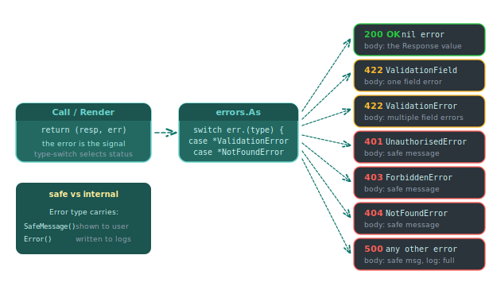

# Errors

Piko's error handling separates the message shown to end users from the internal detail recorded in logs. The `Error` type carries both. Helpers `NewError` and `Errorf` construct instances. Development mode shows the internal detail, and production shows only the safe message. This page documents the API. Source file: [`errors.go`](https://github.com/piko-sh/piko/blob/master/errors.go).

<p align="center">
  
</p>

## Type

### `Error`

Type alias for `safeerror.Error`. Any error in a wrap chain can implement the interface. Piko discovers it via `errors.As`.

Interface:

| Method | Returns |
|---|---|
| `Error() string` | Full internal string (logged server-side). Inherited from the standard `error` interface. |
| `SafeMessage() string` | User-visible message. |

Concrete instances returned by `NewError` and `Errorf` also implement `Unwrap() error`, so `errors.Is` and `errors.As` traverse the wrapped cause. The interface itself does not require `Unwrap`. Any error type that adds a `SafeMessage() string` method satisfies it.

## Functions

### `NewError(safeMessage string, cause error) error`

Wraps a cause error with a user-safe message.

```go
func Render(r *piko.RequestData, props piko.NoProps) (Response, piko.Metadata, error) {
    user, err := loadUser(r.Context(), id)
    if err != nil {
        return Response{}, piko.Metadata{}, piko.NewError("could not load user profile", err)
    }
    return Response{User: user}, piko.Metadata{}, nil
}
```

In production, the end user sees "could not load user profile". The log line contains the full underlying cause.

### `Errorf(safeMessage string, internalFormat string, args ...any) error`

Same contract as `NewError` but with a `fmt.Errorf`-style internal format:

```go
return piko.Errorf("could not process order",
    "loading order %s from database: %w", orderID, err)
```

The `%w` verb still produces a wrapped error compatible with `errors.Is` and `errors.As`.

### `IsDevelopmentMode(r *RequestData) bool`

Reports whether Piko is serving the current request in development mode (`piko dev` or `piko dev-i`). Returns `false` when `r` is nil or the context lacks development-mode information.

Use inside error-page `Render` functions to decide whether to expose internal detail:

```go
func Render(r *piko.RequestData, props piko.NoProps) (Response, piko.Metadata, error) {
    errCtx := piko.GetErrorContext(r)
    if errCtx == nil {
        return Response{Message: "Unknown error"}, piko.Metadata{}, nil
    }

    message := errCtx.Message
    if piko.IsDevelopmentMode(r) && errCtx.InternalMessage != "" {
        message = errCtx.InternalMessage
    }

    return Response{Code: errCtx.StatusCode, Message: message}, piko.Metadata{}, nil
}
```

## Typed errors for validation

| Helper | Use | HTTP status |
|---|---|---|
| `piko.ValidationField(field, message)` | Attach a validation message to a specific form field. | 422 |
| `piko.NewValidationError(fields map[string]string)` | Multi-field validation error. | 422 |

These integrate with action forms. The dispatch layer maps each field error to the matching input.

## HTTP status mapping

Action `Call` and page `Render` return an `error` that Piko maps to an HTTP status:

| Error shape | HTTP status |
|---|---|
| `nil` | 200 |
| `piko.ValidationField`, `piko.NewValidationError` | 422 |
| `piko.BadRequestError` | 400 |
| `piko.UnauthorisedError` | 401 |
| `piko.ForbiddenError` | 403 |
| `piko.NotFoundError` | 404 |
| `piko.ConflictError` | 409 |
| `piko.TeapotError` | 418 |
| `piko.GenericPageError` | 500 |
| Any other `error` | 500 (logged with full detail; user sees a generic message) |

## Error-page context

`GetErrorContext(r)` returns the error details available to a custom error page:

```go
type ErrorPageContext struct {
    Message         string
    InternalMessage string
    OriginalPath    string
    StatusCode      int
}
```

| Field | Purpose |
|---|---|
| `Message` | Human-readable error message safe for display to users. |
| `InternalMessage` | Full internal error detail, populated only in development mode (`piko dev` or `piko dev-i`). Empty in production. |
| `OriginalPath` | Request path that triggered the error. |
| `StatusCode` | HTTP status code for the error (for example, 404 or 500). |

## See also

- [How to error pages](../how-to/error-pages.md).
- [Server actions reference](server-actions.md) for validation errors.
- [Routing rules reference](routing-rules.md) for setting status codes.
- Source: [`errors.go`](https://github.com/piko-sh/piko/blob/master/errors.go).
