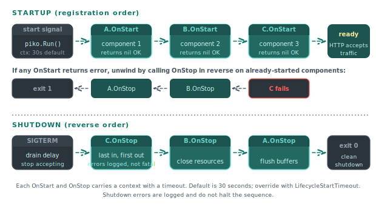

# Lifecycle API

Components that need managed startup or graceful shutdown implement one or more of the lifecycle interfaces. Piko starts registered components in declaration order before accepting HTTP traffic, and stops them in reverse order during shutdown. This page documents the interfaces. For task recipes see the [lifecycle how-to](../how-to/lifecycle.md). Source file: [`lifecycle.go`](https://github.com/piko-sh/piko/blob/master/lifecycle.go).

<p align="center">
  
</p>

## Interfaces

### `LifecycleComponent`

The base interface. Every lifecycle-managed component implements it.

```go
type LifecycleComponent interface {
    OnStart(ctx context.Context) error
    OnStop(ctx context.Context) error
    Name() string
}
```

| Method | Behaviour |
|---|---|
| `OnStart(ctx)` | Runs during startup before the server accepts traffic. Returning an error stops the server from starting. The context carries a timeout (default 30 seconds). |
| `OnStop(ctx)` | Runs during graceful shutdown. The context carries a timeout. Piko logs any returned error but does not halt shutdown. |
| `Name()` | Returns a human-readable name used for logs and health-endpoint output. |

Registration order. Components start in registration order and stop in reverse.

> **Note:** Order matters. A component registered after its dependency starts after that dependency, and stops *before* it on shutdown. The framework unwinds in reverse so a tear-down can still call into anything it depends on.

### `LifecycleStartTimeout`

Optional interface for components that need longer than the default 30-second startup timeout.

```go
type LifecycleStartTimeout interface {
    StartTimeout() time.Duration
}
```

Implement on long-running initialisations such as database migrations or document ingestion.

### `LifecycleHealthProbe`

Optional interface. Implementing components are automatically registered as health probes and participate in the `/live` and `/ready` endpoints.

```go
type LifecycleHealthProbe interface {
    healthprobe_domain.Probe
}
```

`Probe` requires a `Check(ctx, checkType)` method that returns a `HealthStatus`. See the [health API reference](health-api.md) for the full shape.

### `LifecycleWithHealth`

Convenience combination. Implement both `LifecycleComponent` and `LifecycleHealthProbe`, and the server handles both managed lifecycle and health probing automatically.

```go
type LifecycleWithHealth interface {
    LifecycleComponent
    LifecycleHealthProbe
}
```

## Default health behaviour

A component that implements `LifecycleComponent` but not `LifecycleHealthProbe` still produces a probe. The default probe reports:

| Check | State |
|---|---|
| Liveness | `Healthy` with message "Component is running (no custom health check provided)". |
| Readiness | `Degraded` with message "Component does not provide readiness check". |

Implement `LifecycleHealthProbe` to override.

## Startup failure handling

If any `OnStart` returns an error:

1. Piko logs the error with the component name.
2. Piko calls `OnStop` on every component that has already started, in reverse order.
3. The server exits without accepting traffic.

## Shutdown sequence

On `SIGTERM` or `SIGINT`:

1. The server stops accepting new connections.
2. The configured shutdown drain delay elapses (see [`WithShutdownDrainDelay`](bootstrap-options.md#server)).
3. Every registered `LifecycleComponent`'s `OnStop` runs in reverse order.
4. The process exits.

## See also

- [How to lifecycle](../how-to/lifecycle.md).
- [Health API reference](health-api.md).
- [Bootstrap options reference](bootstrap-options.md).
- Source: [`lifecycle.go`](https://github.com/piko-sh/piko/blob/master/lifecycle.go).
