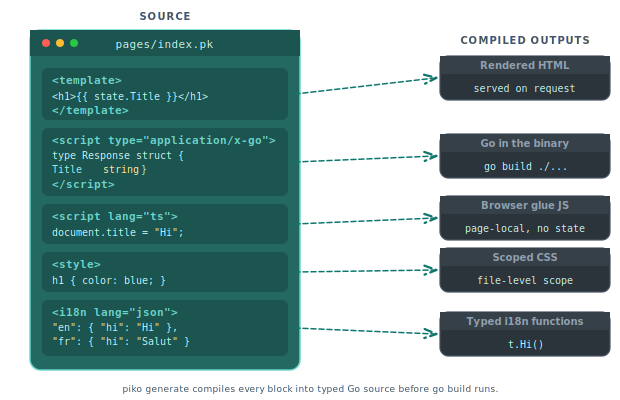

# PK file format

A PK file is a single-file component format that combines HTML template, Go server logic, CSS, and internationalisation in one file. This page describes every section and attribute.

<p align="center">
  
</p>

## File structure

A PK file consists of up to five sections, all optional except the template:

- `<template>`: HTML markup with Piko directives (required for the file to render).
- `<script type="application/x-go">`: server-side Go code.
- `<script lang="ts">`: frontend TypeScript or JavaScript for page-local glue (no reactive state; see [about PK files](../explanation/about-pk-files.md#what-the-client-script-block-is-for)).
- `<style>`: component-scoped CSS.
- `<i18n lang="json">`: translations, keyed by locale.

Minimal example:

```piko
<template>
  <h1>{{ state.Title }}</h1>
</template>

<script type="application/x-go">
package main

import "piko.sh/piko"

type Response struct {
    Title string
}

func Render(r *piko.RequestData, props piko.NoProps) (Response, piko.Metadata, error) {
    return Response{Title: "Hello"}, piko.Metadata{}, nil
}
</script>

<style>
h1 { color: blue; }
</style>

<i18n lang="json">
{
  "en": { "greeting": "Hello" },
  "fr": { "greeting": "Bonjour" }
}
</i18n>
```

The sections can appear in any order. You can have multiple `<style>` blocks and multiple `<i18n>` blocks per file.

## Template section

The `<template>` section contains your HTML markup with Piko directives and interpolation.

### Interpolation

Display data using double curly braces. The `state` object contains the data returned from your `Render` function:

```html
<h1>{{ state.Title }}</h1>
<p>{{ state.Description }}</p>
<span>Count: {{ state.Count }}</span>
```

For all available directives (`p-if`, `p-for`, `p-on`, `p-class`, etc.), see [directives](directives.md).

## Script section

The `<script type="application/x-go">` section contains your Go server logic.

### Package declaration

The package name can be `main` or match the component's directory name:

```go
<script type="application/x-go">
package main
// or
package card
</script>
```

### Response struct

Define a struct to hold data for your template. The template accesses this via `state`:

```go
type Response struct {
    Title    string
    Posts    []Post
    UserID   int
    IsAdmin  bool
}
```

For components that do not return data, use `piko.NoResponse`:

```go
func Render(r *piko.RequestData, props piko.NoProps) (piko.NoResponse, piko.Metadata, error) {
    return piko.NoResponse{}, piko.Metadata{}, nil
}
```

### Render function

The `Render` function is the entry point. It receives request data and props, returning state, metadata, and an optional error:

```go
func Render(r *piko.RequestData, props piko.NoProps) (Response, piko.Metadata, error) {
    posts, err := domain.GetRecentPosts(10)
    if err != nil {
        return Response{}, piko.Metadata{}, err
    }

    return Response{
        Title: "Blog",
        Posts: posts,
    }, piko.Metadata{
        Title:       "My Blog",
        Description: "Latest blog posts",
    }, nil
}
```

### RequestData methods

The `*piko.RequestData` provides access to request information:

| Method | Description |
|--------|-------------|
| `Context()` | Returns the request context |
| `Method()` | HTTP method (GET, POST, etc.) |
| `Host()` | Request host |
| `URL()` | Parsed request URL (defensive copy) |
| `Locale()` | Current request locale |
| `DefaultLocale()` | Fallback locale |
| `PathParam(key)` | URL path parameter value |
| `QueryParam(key)` | First query parameter value |
| `QueryParamValues(key)` | All query parameter values |
| `FormValue(key)` | First form field value |
| `FormValues(key)` | All form field values |
| `T(key, fallback...)` | Global translation lookup |
| `LT(key, fallback...)` | Local (component-scoped) translation lookup |

For all metadata fields (SEO, Open Graph, redirects, status codes), see [metadata](metadata-fields.md).

### Optional functions

> **Note:** The generator detects these functions by exact name. It looks for `Middlewares`, `CachePolicy`, and `SupportedLocales` literally; renaming them silently disables the behaviour.

Components can export additional functions:

```go
// Define middleware for this component
func Middlewares() []string {
    return []string{"auth", "csrf"}
}

// Configure caching behaviour
func CachePolicy() piko.CachePolicy {
    return piko.CachePolicy{
        Enabled:       true,
        MaxAgeSeconds: 60,
    }
}

// Declare supported locales
func SupportedLocales() []string {
    return []string{"en", "fr", "de"}
}
```

For props (struct tags, validation, defaults, coercion, query binding), see the [passing props to partials how-to](../how-to/partials/passing-props.md).

## Style section

The `<style>` section contains CSS for your component:

```html
<style>
h1 {
    color: var(--g-colour-primary);
    font-size: 2rem;
}

.card {
    background: white;
    border-radius: 0.5rem;
    padding: 1rem;
}
</style>
```

You can have multiple style blocks:

```html
<style>
div { border: 1px solid black; }
</style>
<style>
div { background: white; }
</style>
```

Use the `scoped` attribute for component-scoped styles:

```html
<style scoped>
h1 { color: navy; }
</style>
```

For the `<i18n>` block and translation functions (`T()`, `LT()`), see [i18n](i18n-api.md).

For importing and using partials (import paths, `is` attribute), see [how to layout partials](../how-to/partials/layout.md).

## Client-side scripts

For client-side JavaScript, use additional script blocks:

```html
<script type="application/javascript">
// JavaScript code
const app = {
    init() {
        console.log('App initialised');
    }
};
</script>

<script type="module">
// ES module
import { utils } from './utils.js';
export function setup() {
    utils.configure();
}
</script>
```

## See also

- [Directives](directives.md) - every directive available in a PK template.
- [How to layout partials](../how-to/partials/layout.md) - build reusable partials.
