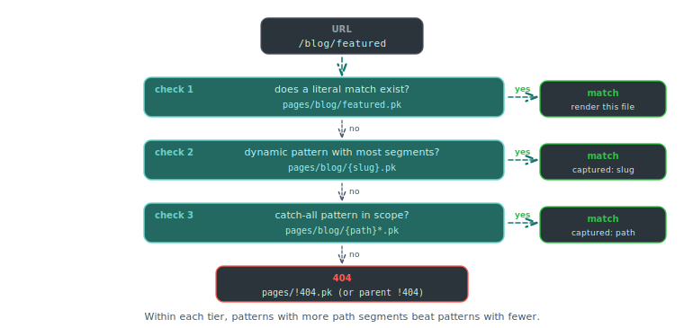

# Routing rules

Piko routes requests by walking the `pages/` directory at build time. This page documents the mapping rules, parameter syntax, precedence, and accessor methods. For task recipes see the how-to guides on [basic routes](../how-to/routing/basic-routes.md), [dynamic routes](../how-to/routing/dynamic-routes.md), and [catch-all routes](../how-to/routing/catch-all-routes.md).

## File-to-route mapping

Each `.pk` file in `pages/` becomes one route.

| File path | URL |
|---|---|
| `pages/index.pk` | `/` |
| `pages/about.pk` | `/about` |
| `pages/blog/index.pk` | `/blog` |
| `pages/blog/{slug}.pk` | `/blog/:slug` |
| `pages/docs/{...slug}.pk` | `/docs/*` |
| `pages/users/{userId}/posts/{postId}.pk` | `/users/:userId/posts/:postId` |

The build resolves routing. Changes to `pages/` require a rebuild (`piko generate` or `piko dev`).

## Segment syntax

| Syntax | Matches | Example file | Matches URL |
|---|---|---|---|
| Literal | exact segment | `pages/about.pk` | `/about` |
| `{name}` | one segment | `pages/blog/{slug}.pk` | `/blog/my-post` |
| `{...name}` | one or more segments | `pages/docs/{...slug}.pk` | `/docs/a/b/c` |
| `index.pk` | directory base | `pages/blog/index.pk` | `/blog` |

Dynamic segments capture whatever segment appears in the URL. Catch-all segments capture the remainder of the path including slashes.

## Precedence

<p align="center">
  
</p>

When two or more patterns match the same URL, Piko selects the most specific:

1. Static routes (literal match only).
2. Dynamic routes (one `{name}` or more).
3. Catch-all routes (`{...name}`).

Within a tier, routes with more path segments win.

Example: `pages/blog/featured.pk` beats `pages/blog/{id}.pk` on `/blog/featured`. `pages/blog/{id}.pk` beats `pages/blog/{...slug}.pk` on `/blog/42`.

## Route parameter accessors

Routes expose their captured parameters through `piko.RequestData`:

| Method | Returns | Behaviour |
|---|---|---|
| `r.PathParam(name)` | `string` | Returns the captured value or an empty string if the name is not in the route. |
| `r.PathParams()` | `map[string]string` | Returns every captured parameter. |
| `r.QueryParam(name)` | `string` | First value of the query-string parameter, or empty string. |
| `r.QueryParamValues(name)` | `[]string` | All values for a repeated query-string parameter. |

Catch-all parameters surface the full trailing path as a single string (for example `a/b/c` from `/docs/a/b/c`).

## Index routes

A file named `index.pk` handles the base path of its directory:

```
pages/
  index.pk          # /
  blog/
    index.pk        # /blog
    {id}.pk         # /blog/:id
```

## HTTP methods

`Render` handles `GET` by default. Piko rejects `POST`, `PUT`, `PATCH`, `DELETE`, and `OPTIONS` requests to page URLs. Use [server actions](server-actions.md) for mutations.

## Status codes

Return a non-zero `piko.Metadata.Status` from `Render` to override the default 200:

```go
return Response{}, piko.Metadata{Status: 404}, nil
```

Common values:

| Status | Use |
|---|---|
| 200 | Default success. |
| 301, 302, 307, 308 | Redirects. Set `piko.Metadata.ClientRedirect` (changes browser URL) or `piko.Metadata.ServerRedirect` (internal rewrite) as well. |
| 404 | Resource not found. |
| 410 | Gone. |
| 500 | Internal error (preferred over panicking). |

## See also

- [How to basic routes](../how-to/routing/basic-routes.md).
- [How to dynamic routes](../how-to/routing/dynamic-routes.md).
- [How to catch-all routes](../how-to/routing/catch-all-routes.md).
- [How to apply middleware to a page](../how-to/routing/page-middleware.md) for authentication and request shaping.
- [How to enable i18n routing for a page](../how-to/routing/i18n-page-opt-in.md) for locale-prefixed routes.
- [How to control route priority](../how-to/routing/route-priority.md) for resolving overlap between dynamic routes.
- [How to serve from a URL prefix](../how-to/routing/base-path.md) for `BaseServePath` configuration.
- [Metadata reference](metadata-fields.md) for status codes and redirects.

**Used in**: [Scenario 004: product catalogue](../showcase/004-product-catalogue.md), [Scenario 005: blog with layout](../showcase/005-blog-with-layout.md), [Scenario 006: data table](../showcase/006-data-table.md).
