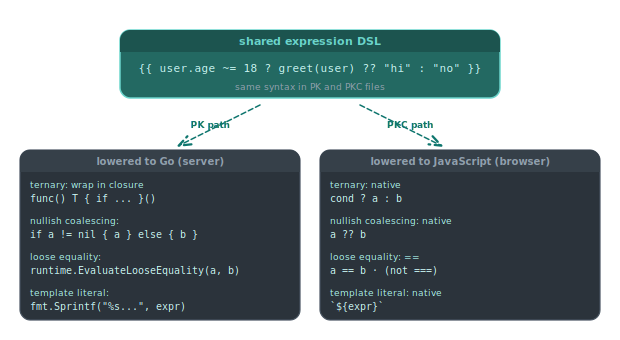

# Template syntax

Piko templates share one expression language. The same domain-specific language (DSL) appears inside `{{ ... }}` and directive attributes in both PK files and PKC files. PK files compile to Go and render server-side, while PKC files compile to JavaScript and execute in the browser. The DSL is intentionally Go-like, and it adds extensions that plain Go does not support.

This page enumerates the interpolation syntax, expression operators, DSL extensions, and template helpers available inside expressions. For the surrounding file structure see the [PK file format reference](pk-file-format.md). For directives (`p-if`, `p-for`, `p-on`, and others) see the [directives reference](directives.md). For the types and functions available inside expressions see the [runtime symbols reference](runtime-symbols.md).

## DSL extensions beyond Go

<p align="center">
  
</p>

The expression language adds conveniences that are not valid Go.

| Syntax | Meaning | Lowered form in Go | Lowered form in JavaScript |
|---|---|---|---|
| `cond ? a : b` | Ternary. | Immediately invoked function returning `a` or `b`. | Native `cond ? a : b`. |
| `a ~= b` | Non-strict equality with type coercion. | `runtime.EvaluateLooseEquality` helper. | `==`. |
| `a !~= b` | Non-strict inequality. | Negated `runtime.EvaluateLooseEquality` helper. | `!=`. |
| `~expr` | Truthy coercion: true when the value is non-zero, non-empty, non-nil. | `runtime.EvaluateTruthiness` helper. | JavaScript truthiness. |
| `a ?? b` | Nullish coalescing: `a` if non-nil, otherwise `b`. | `runtime.EvaluateCoalesce` helper. | Native `??`. |
| `` `text ${expr} text` `` | Template literal with embedded expressions. | `fmt.Sprintf` with the expressions as arguments. | Native template literal. |

The runtime helpers live in `internal/generator/generator_helpers/parse_truthiness.go` and are re-exported under the `piko.sh/piko/wdk/runtime` package.

Plain Go operators (`==`, `!=`, `<`, `>`, `<=`, `>=`, `&&`, `||`, `!`, `+`, `-`, `*`, `/`, `%`) work as expected. Field access, method calls on exposed methods, and slice/map indexing follow Go's rules.

`==` is strict (Go semantics). `~=` is the loose form. JavaScript's `===` does not parse.

The DSL does not support struct literals, function declarations, or block constructs.

## Basic interpolation

`{{ }}` interpolates an expression value into surrounding HTML.

```piko
<template>
  <div>
    <h1>Hello, {{ state.Name }}!</h1>
    <p>You have {{ state.MessageCount }} messages.</p>
  </div>
</template>
```

Inside `{{ }}`, the `state` identifier resolves to the value returned by `Render`. See the [PK file format reference](pk-file-format.md) for `state`.

## Expressions

### Arithmetic operators

The DSL accepts `+`, `-`, `*`, `/`, `%` (modulo).

```piko
<template>
  <p>Total: ${{ state.Price * state.Quantity }}</p>
  <p>Tax (10%): ${{ state.Price * state.Quantity * 0.10 }}</p>
  <p>Remainder: {{ 10 % 3 }}</p>
</template>
```

### String concatenation

`+` concatenates two strings when both operands resolve to strings at compile time. Mixing types is a compile error. Embedding a non-string value into a string requires a [template literal](#template-literals), a Response method that returns a formatted string, or `p-format` on the interpolation.

```html
<template>
  <p>{{ state.FirstName + " " + state.LastName }}</p>
</template>
```

### Comparison operators

| Operator | Semantics |
|---|---|
| `==`, `!=` | Strict equality (Go semantics). |
| `~=`, `!~=` | Loose equality with type coercion. |
| `<`, `>`, `<=`, `>=` | Ordered comparison. |

```html
<template>
  <p>{{ 5 == "5" }}</p>       <!-- false (different types) -->
  <p>{{ 5 ~= "5" }}</p>       <!-- true (coerced) -->
  <p>{{ state.Age >= 18 }}</p>
</template>
```

The unary `~` operator coerces any value to its boolean truthiness.

### Logical operators

`&&` (and), `||` (or), `!` (not).

```html
<template>
  <p>{{ state.ItemCount > 0 && state.IsLoggedIn }}</p>
  <p>{{ state.Stock < 10 || state.Discontinued }}</p>
  <p>{{ !state.EmailVerified }}</p>
</template>
```

### Nullish coalescing operator

`??` returns the right operand only when the left operand is `nil`. `||` returns the right operand for any falsy left operand (`0`, `""`, `false`, `nil`).

```html
<template>
  <p>{{ state.MaybeNil ?? "default" }}</p>
  <p>{{ state.EmptyString ?? "fallback" }}</p>  <!-- empty string, not fallback -->
  <p>{{ state.ZeroValue ?? 100 }}</p>           <!-- 0, not 100 -->
  <p>{{ state.First ?? state.Second ?? "default" }}</p>
</template>
```

## Function calls

Methods and function fields on the Response struct are callable.

```piko
<template>
  <div>
    <p>Full Name: {{ state.GetFullName() }}</p>
    <p>Formatted Date: {{ state.FormatDate(state.CreatedAt) }}</p>
  </div>
</template>
```

## Ternary operator

`condition ? valueIfTrue : valueIfFalse`.

```piko
<template>
  <p>Status: {{ state.IsActive ? "Active" : "Inactive" }}</p>
  <div :class="state.IsActive ? 'status-active' : 'status-inactive'">
    {{ state.IsActive ? "Online" : "Offline" }}
  </div>
  <p>Priority: {{ state.Score > 80 ? "High" : state.Score > 50 ? "Medium" : "Low" }}</p>
</template>
```

## Optional chaining

`?.` traverses a chain of fields where any link may be nil. Each link evaluates `nil` if the previous link is nil. The chain returns the leaf field's zero value in that case.

```piko
<template>
  <p>{{ state.User?.Address?.Street }}</p>
  <p>{{ state.User?.Address?.City }}</p>
</template>
```

`?.[index]` performs the same protection on array or slice access. An out-of-bounds index returns the element type's zero value.

```piko
<template>
  <p>{{ state.User?.Tags?.[0] }}</p>
  <p>{{ state.User?.Orders?.[0]?.ItemName }}</p>
</template>
```

The chain lowers to `var temporary T; if base != nil { temporary = base.Field }`. The result type is the leaf field type (`T`), and the fallback is `T`'s zero value (`""`, `0`, `nil`, the zero struct). Pair `?.` with `??` to substitute a different fallback.

```html
<template>
  <p>{{ state.User?.Address?.Street ?? "No address on file" }}</p>
  <p>{{ state.User?.Tags?.[0] ?? "No tags" }}</p>
</template>
```

## Attribute binding

The colon prefix binds an expression to an HTML attribute.

```html
<template>
  <a :href="state.Link">{{ state.LinkText }}</a>
  <div :class="state.IsActive ? 'active' : 'inactive'">Status</div>
  <div :data-user-id="state.UserID" :aria-label="`Profile for ${state.Username}`">User card</div>
</template>
```

For all binding patterns (boolean attributes, style binding, `p-bind`, `p-class`, `p-style`), see [directives](directives.md).

## Template literals

Backtick-delimited strings with `${expression}` interpolation.

```piko
<template>
  <div :class="`card theme-${state.Theme} status--${state.Status}`">User card</div>
  <p :aria-label="`User profile for ${state.Username} (ID: ${state.UserID})`">{{ state.Username }}</p>
  <h1>{{ `Welcome, ${state.FirstName} ${state.LastName}!` }}</h1>
  <p>{{ `You have ${state.Count} item${state.Count != 1 ? 's' : ''}` }}</p>
</template>
```

`\`` escapes a backtick. `\${` escapes a literal `${`.

## Built-in literal types

### Decimal literals

`Nd` denotes a fixed-point decimal value.

```html
<template>
  <p>Price: {{ 99.99d }}</p>
  <p>Total: {{ 10.5d + 2.5d }}</p>
  <p>Is expensive: {{ state.Price > 100d }}</p>
</template>
```

### Date and time literals

| Literal | Format |
|---|---|
| `d'YYYY-MM-DD'` | Date. |
| `t'HH:mm:ss'` | Time of day. |
| `dt'RFC3339'` | DateTime. |
| `du'1h30m'` | Duration. |

```html
<template>
  <p>Launch date: {{ d'2025-01-15' }}</p>
  <p>Start time: {{ t'09:30:00' }}</p>
  <p>Event: {{ dt'2025-01-15T10:00:00Z' }}</p>
  <p>Duration: {{ du'1h30m' }}</p>
  <p>Tomorrow: {{ d'2025-01-15' + du'24h' }}</p>
</template>
```

### BigInt literals

`Nn` denotes an arbitrary-precision integer.

```html
<template>
  <p>{{ 12345678901234567890n }}</p>
  <p>{{ 100n + 50n }}</p>
</template>
```

### Rune literals

`r'X'` denotes a single Unicode code point.

```html
<template>
  <p>{{ r'a' }}</p>
  <p>{{ r'\n' }}</p>
</template>
```

## Array and object literals

```piko
<template>
  <div p-for="item in [1, 2, 3]">{{ item }}</div>
  <div :data-config="{ theme: 'dark', fontSize: 16 }">Config</div>
  <div p-for="item in ['text', 123, true, nil]">{{ item }}</div>
</template>
```

The parser accepts trailing commas.

## HTML escaping

Interpolated content is HTML-escaped to prevent injection. The characters `<`, `>`, `&`, `"`, and `'` become entity references. Attribute bindings escape the same characters for attribute context.

```piko
<template>
  <p>{{ state.UserInput }}</p>  <!-- <script> tags emit as &lt;script&gt; -->
</template>
```

The `p-html` directive bypasses escaping for trusted content. See [directives reference](directives.md#p-html).

For formatting patterns see [how to pluralise translations](../how-to/i18n/pluralisation.md), [how to bind typed variables to translations](../how-to/i18n/variable-binding.md), and [how to format dates and times for a locale](../how-to/i18n/date-time-formatting.md).

## Limitations

The DSL does not accept multi-statement expressions, variable declarations, or loop constructs. Logic of that shape belongs in the `Render` function or in a method on the Response struct.

## Cheat sheet

| Feature | Syntax | Example |
|---------|--------|---------|
| Interpolation | `{{ expression }}` | `{{ state.Name }}` |
| Ternary | `condition ? yes : no` | `{{ state.Active ? "On" : "Off" }}` |
| Optional chain | `?.` | `{{ state.User?.Name }}` |
| Optional array | `?.[index]` | `{{ state.Items?.[0] }}` |
| Nullish coalescing | `??` | `{{ state.Value ?? "default" }}` |
| Template literal | `` `text ${expr}` `` | `` `Hello ${state.Name}` `` |
| Attribute bind | `:attr="expr"` | `:class="state.Theme"` |
| Arithmetic | `+`, `-`, `*`, `/`, `%` | `{{ state.Price * 1.10 }}` |
| Comparison | `==`, `!=`, `<`, `>`, `<=`, `>=` | `{{ state.Count > 0 }}` |
| Loose equality | `~=`, `!~=` | `{{ state.Value ~= "5" }}` |
| Truthiness | `~` | `{{ ~state.Value }}` |
| Logical | `&&`, `\|\|`, `!` | `{{ state.A && state.B }}` |
| Function call | `func()` | `{{ state.Format() }}` |
| Decimal | `99.99d` | `{{ state.Price > 100d }}` |
| Date | `d'YYYY-MM-DD'` | `{{ d'2025-01-15' }}` |
| Time | `t'HH:mm:ss'` | `{{ t'15:04:05' }}` |
| DateTime | `dt'RFC3339'` | `{{ dt'2025-01-15T10:00:00Z' }}` |
| Duration | `du'...'` | `{{ du'1h30m' }}` |
| BigInt | `123n` | `{{ 12345678901234567890n }}` |
| Rune | `r'x'` | `{{ r'A' }}` |


## See also

- [Directives reference](directives.md) for the `p-*` directives that use these expressions.
- [Runtime symbols reference](runtime-symbols.md) for every helper callable inside expressions.
- [PK file format reference](pk-file-format.md) for the surrounding file structure.
- [About SSR](../explanation/about-ssr.md) for the rendering model templates plug into.
- [How to conditionals](../how-to/templates/conditionals.md) and [how to loops](../how-to/templates/loops.md) for task recipes.
