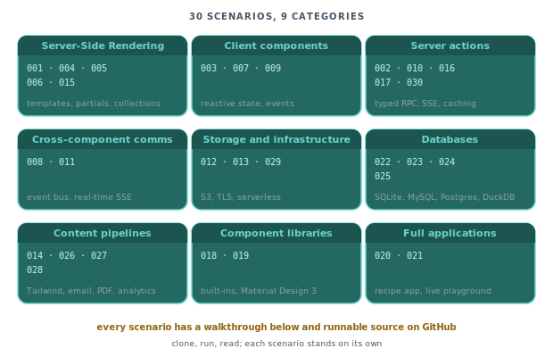

# Showcase

Each entry below walks through a self-contained project that lives under [`examples/scenarios/`](https://github.com/piko-sh/piko/tree/master/examples/scenarios) in the repository. The walkthroughs explain what the project demonstrates, and the runnable code is the source of truth.

  

Use [Your first page](../tutorials/01-your-first-page.md) to learn Piko step by step, the how-to guides for focused task recipes, and the reference for API lookup. Showcase entries sit alongside those, forming a gallery of complete examples to clone, run, and read.

## Server-Side Rendering

| # | Example | Demonstrates |
|---|---------|----------|
| [001](001-hello-world.md) | Hello world | Template sections, `Render` function, text interpolation, scoped CSS |
| [004](004-product-catalogue.md) | Product catalogue | `p-for`, `p-if`, partials, prop passing, dynamic attributes |
| [005](005-blog-with-layout.md) | Blog with layout | Layout partials, nested partials, slots, CSS custom properties |
| [006](006-data-table.md) | Sortable data table | Query parameters, server-side sorting, `p-class` |
| [015](015-markdown-blog.md) | Markdown blog | Markdown collections, generated routes, TOC, RSS |

## Client-side components

| # | Example | Demonstrates |
|---|---------|----------|
| [003](003-reactive-counter.md) | Reactive counter | Reactive state, `p-on:click`, `p-class`, shadow DOM, custom elements |
| [007](007-todo-app.md) | Todo app | `p-for` with `p-key`, `p-model`, array reactivity, event args |
| [009](009-form-wizard.md) | Form wizard | `p-if` / `p-else-if` / `p-else`, `p-model`, lifecycle hooks, validation |

## Server actions

| # | Example | Demonstrates |
|---|---------|----------|
| [002](002-contact-form.md) | Contact form | Actions, form data mapping, validation, `$form` |
| [010](010-progress-tracker.md) | Progress tracker | `StreamProgress`, SSE streaming, action builder API |
| [016](016-cached-api.md) | Cached API | `CacheConfig`, TTL caching, `X-Action-Cache` header |
| [017](017-rate-limited-api.md) | Rate-limited API | `RateLimit()`, token bucket, HTTP 429, rate-limit headers |
| [030](030-captcha.md) | CAPTCHA-protected action | CAPTCHA provider, action verification, anti-spam flow |

## Cross-component communication

| # | Example | Demonstrates |
|---|---------|----------|
| [008](008-event-bus-chat.md) | Event bus chat | `piko.bus.emit()`, `piko.bus.on()`, decoupled components |
| [011](011-instant-messaging.md) | Instant messaging | Real-time SSE chat, `withRetryStream()`, event ID resumption |

## Storage and infrastructure

| # | Example | Demonstrates |
|---|---------|----------|
| [012](012-file-upload.md) | S3 file upload | Storage providers, `UploadBuilder`, presigned URLs |
| [013](013-tls-https.md) | TLS and HTTPS | Certificate hot-reload, HTTP-to-HTTPS redirect |
| [029](029-aws-serverless.md) | AWS serverless | Lambda deployment sketch with managed AWS services |

## Databases

| # | Example | Demonstrates |
|---|---------|----------|
| [022](022-database-sqlite.md) | SQLite | Generated querier, embedded database |
| [023](023-database-mysql.md) | MySQL / MariaDB | Generated querier against MySQL-family databases |
| [024](024-database-postgres.md) | PostgreSQL | Generated querier, PostgreSQL-specific types |
| [025](025-database-duckdb.md) | DuckDB | DuckDB for embedded analytics queries |

## Content pipelines

| # | Example | Demonstrates |
|---|---------|----------|
| [014](014-tailwind-css.md) | Tailwind CSS | Tailwind integration via the shared styles library |
| [026](026-email-contact.md) | Email contact form | Transactional emails through an email provider |
| [027](027-pdf-invoice.md) | PDF invoice | Generate a PDF from a PK-rendered HTML template |
| [028](028-analytics-ecommerce.md) | Analytics ecommerce | Pageview, add-to-cart, and revenue events via a custom collector |

## Component libraries

| # | Example | Demonstrates |
|---|---------|----------|
| [018](018-builtin-components.md) | Built-in components | `components.Piko()`, `piko-counter`, `piko-card`, named slots |
| [019](019-m3e-components.md) | M3E components | `components.M3E()`, Material Design 3 library |

## Full applications

| # | Example | Demonstrates |
|---|---------|----------|
| [020](020-m3e-recipe-app.md) | M3E recipe app | M3E components, SSE streaming, email actions, LLM integration, multi-page routing |
| [021](021-live-playground.md) | Live playground | In-browser PK playground backed by a WASM-compiled runtime |
