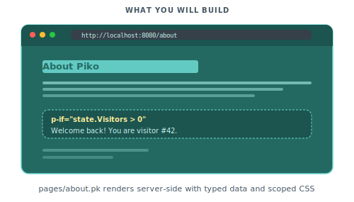

# Your first page

In this tutorial we build an "About" page that pulls data from a Go struct and styles itself with scoped CSS. The page swaps content on a boolean and slots into a shared layout partial.

<p align="center">
  
</p>

## Prerequisites

Make sure you have:
- Read [Concepts](../get-started/concepts.md) for the Piko vocabulary
- Installed the Piko CLI and scaffolded a project (see [Install and run](../get-started/install.md))
- Started the dev server with `air` or `go run ./cmd/main/main.go dev`

## Step 1: Create your first page

Create `pages/about.pk` with the following content:

```piko
<template>
  <div class="about-page">
    <h1>About Us</h1>
    <p>Welcome to our website!</p>
  </div>
</template>

<script type="application/x-go">
package main

import "piko.sh/piko"

func Render(r *piko.RequestData, props piko.NoProps) (piko.NoResponse, piko.Metadata, error) {
    return piko.NoResponse{}, piko.Metadata{
        Title: "About Us | MyApp",
    }, nil
}
</script>
```

Visit `http://localhost:8080/about`. The heading and welcome text appear. The dev server reloads on save.

For the file format and the `Render` signature see [pk-file format reference](../reference/pk-file-format.md).

## Step 2: Add dynamic data

Define a `Response` struct so the template can read fields from it. Update the `<script>` section:

```piko
<script type="application/x-go">
package main

import "piko.sh/piko"

type Response struct {
    CompanyName string
    Founded     int
    TeamSize    int
    Mission     string
}

func Render(r *piko.RequestData, props piko.NoProps) (Response, piko.Metadata, error) {
    return Response{
        CompanyName: "Acme Corporation",
        Founded:     2020,
        TeamSize:    12,
        Mission:     "Welcome to our company",
    }, piko.Metadata{
        Title: "About Acme | MyApp",
    }, nil
}
</script>
```

Update the `<template>` to use this data:

```html
<template>
  <div class="about-page">
    <h1>About {{ state.CompanyName }}</h1>
    <p>{{ state.Mission }}</p>

    <div class="stats">
      <div class="stat">
        <strong>Founded: </strong>{{ state.Founded }}
      </div>
      <div class="stat">
        <strong>Team size: </strong>{{ state.TeamSize }} people
      </div>
    </div>
  </div>
</template>
```

Reload `/about`. The page renders the company name, mission, founding year, and team size. For the full `{{ ... }}` expression grammar see [template syntax reference](../reference/template-syntax.md).

## Step 3: Add scoped styles

Add a `<style>` section to style your page:

```html
<style>
.about-page {
    max-width: 800px;
    margin: 0 auto;
    padding: 2rem;
    font-family: system-ui, -apple-system, sans-serif;
    h1 {
        color: #6F47EB;
        font-size: 2.5rem;
        margin-bottom: 1rem;
    }
    p {
        font-size: 1.125rem;
        line-height: 1.7;
        color: #374151;
        margin-bottom: 2rem;
    }
    .stats {
        display: flex;
        gap: 2rem;
        margin-top: 2rem;
        .stat {
            background: #f3f4f6;
            padding: 1.5rem;
            border-radius: 0.5rem;
            flex: 1;
            text-align: center;
            strong {
                display: block;
                color: #6b7280;
                font-size: 0.875rem;
                text-transform: uppercase;
                letter-spacing: 0.05em;
                margin-bottom: 0.5rem;
            }
            span {
                display: block;
                color: #1f2937;
                font-size: 1.5rem;
                font-weight: 600;
            }
        }
    }
}
</style>
```

Reload `/about`. The heading turns purple and the stat blocks gain padding and rounded corners. Piko scopes styles to this page automatically. For the full scoping model see [how to scope and bridge component CSS](../how-to/templates/scoped-css.md).

## Step 4: Add conditional rendering

Add an `IsHiring` field and a banner that shows only when it is `true`. Update your Response:

```go
type Response struct {
    CompanyName string
    Founded     int
    TeamSize    int
    Mission     string
    IsHiring    bool
}

func Render(r *piko.RequestData, props piko.NoProps) (Response, piko.Metadata, error) {
    return Response{
        CompanyName: "Acme Corporation",
        Founded:     2020,
        TeamSize:    12,
        Mission:     "Welcome to our company",
        IsHiring:    true,
    }, piko.Metadata{
        Title: "About Acme | MyApp",
    }, nil
}
```

Update the template:

```piko
<template>
  <div class="about-page">
    <h1>About {{ state.CompanyName }}</h1>
    <p>{{ state.Mission }}</p>

    <div p-if="state.IsHiring" class="hiring-banner">
      <strong>We're hiring!</strong>
      <p>Join our growing team of {{ state.TeamSize }} talented people.</p>
      <piko:a href="/careers" class="button">View Open Positions</piko:a>
    </div>
    <div p-else class="not-hiring">
      <p>We're not currently hiring, but check back soon!</p>
    </div>

    <div class="stats">
      <div class="stat">
        <strong>Founded</strong>
        <span>{{ state.Founded }}</span>
      </div>
      <div class="stat">
        <strong>Team Size</strong>
        <span>{{ state.TeamSize }} people</span>
      </div>
    </div>
  </div>
</template>
```

Add styles for the banner:

```css
.hiring-banner {
    background: linear-gradient(135deg, #6F47EB 0%, #8B5CF6 100%);
    color: white;
    padding: 1.5rem;
    border-radius: 0.5rem;
    margin-bottom: 2rem;
    text-align: center;
    strong {
        display: block;
        font-size: 1.25rem;
        margin-bottom: 0.5rem;
    }
    p {
        color: rgba(255, 255, 255, 0.9);
        margin-bottom: 1rem;
    }
    .button {
        display: inline-block;
        background: white;
        color: #6F47EB;
        padding: 0.75rem 1.5rem;
        border-radius: 0.375rem;
        text-decoration: none;
        font-weight: 600;
        transition: transform 0.2s;
        &:hover {
            transform: translateY(-2px);
        }
    }
}
.not-hiring {
    background: #f3f4f6;
    padding: 1.5rem;
    border-radius: 0.5rem;
    margin-bottom: 2rem;
    text-align: center;
}
```

Change `IsHiring: true` to `false` and reload. The hiring banner disappears and the "not hiring" block takes its place.

For `p-if`, `p-else`, and the `<piko:a>` meta-element see [directives reference](../reference/directives.md).

## Step 5: Render a list

Add a `Leaders` slice and loop over it. Update your Response:

```go
type TeamMember struct {
    Name string
    Role string
}

type Response struct {
    CompanyName string
    Founded     int
    TeamSize    int
    Mission     string
    IsHiring    bool
    Leaders     []TeamMember
}

func Render(r *piko.RequestData, props piko.NoProps) (Response, piko.Metadata, error) {
    return Response{
        CompanyName: "Acme Corporation",
        Founded:     2020,
        TeamSize:    12,
        Mission:     "Welcome to our company",
        IsHiring:    true,
        Leaders: []TeamMember{
            {Name: "Alice Williams", Role: "CEO"},
            {Name: "Bob Smith", Role: "CTO"},
            {Name: "Carol Davis", Role: "Head of Design"},
        },
    }, piko.Metadata{
        Title: "About Acme | MyApp",
    }, nil
}
```

Add this section below the `.stats` block in your template:

```piko
<div class="team-section">
  <h2>Leadership Team</h2>
  <div class="team-grid">
    <div p-for="member in state.Leaders" class="team-member">
      <h3>{{ member.Name }}</h3>
      <p>{{ member.Role }}</p>
    </div>
  </div>
</div>
```

Add styles:

```css
.team-section {
    margin-top: 3rem;
    h2 {
        font-size: 1.75rem;
        color: #1f2937;
        margin-bottom: 1.5rem;
    }
    .team-grid {
        display: grid;
        grid-template-columns: repeat(auto-fit, minmax(200px, 1fr));
        gap: 1.5rem;
        .team-member {
            background: white;
            border: 1px solid #e5e7eb;
            padding: 1.5rem;
            border-radius: 0.5rem;
            text-align: center;
            h3 {
                font-size: 1.125rem;
                color: #1f2937;
                margin: 0 0 0.5rem 0;
            }
            p {
                color: #6b7280;
                font-size: 0.875rem;
                margin: 0;
            }
        }
    }
}
```

Reload `/about`. Three leadership cards appear. For the `(index, item) in collection` form see [directives reference](../reference/directives.md#p-for).

## Step 6: Use a layout partial

Most pages share a header and footer. Create `partials/layout.pk`:

```piko
<template>
  <div class="app-layout">
    <header class="header">
      <nav>
        <piko:a href="/">Home</piko:a>
        <piko:a href="/about">About</piko:a>
        <piko:a href="/contact">Contact</piko:a>
      </nav>
    </header>

    <main class="content">
      <!-- This is where the page content goes -->
      <piko:slot />
    </main>

    <footer class="footer">
      <p>&copy; 2025 {{ props.CompanyName }}. All rights reserved.</p>
      <!-- A named slot lets pages inject extra footer content. -->
      <piko:slot name="footer" />
    </footer>
  </div>
</template>

<script type="application/x-go">
package main

import "piko.sh/piko"

type Props struct {
    CompanyName     string `prop:"company_name"`
    PageTitle       string `prop:"page_title"`
    PageDescription string `prop:"page_description"`
}

func Render(r *piko.RequestData, props Props) (piko.NoResponse, piko.Metadata, error) {
    return piko.NoResponse{}, piko.Metadata{}, nil
}
</script>

<style>
.app-layout {
    min-height: 100vh;
    display: flex;
    flex-direction: column;
    font-family: system-ui, -apple-system, sans-serif;
    .header {
        background: #1f2937;
        padding: 1rem 2rem;
        nav {
            display: flex;
            gap: 1.5rem;
            max-width: 1200px;
            margin: 0 auto;
            a {
                color: white;
                text-decoration: none;
                font-weight: 500;
                transition: color .2s;
                &:hover {
                   color: #A194CC;
                }
            }
        }
    }
    .content {
        flex: 1;
    }
    .footer {
        background: #f3f4f6;
        padding: 2rem;
        text-align: center;
        color: #6b7280;
    }
}
</style>
```

Wrap your about page with the layout:

```piko
<template>
  <piko:partial
      is="layout"
      :server.company_name="state.CompanyName"
      :server.page_title="'About ' + state.CompanyName"
      :server.page_description="state.Mission">
    <div class="about-page">
      <h1>About {{ state.CompanyName }}</h1>
      <!-- rest of your content -->
    </div>
  </piko:partial>
</template>

<script type="application/x-go">
package main

import (
    "piko.sh/piko"
    layout "myapp/partials/layout.pk"
)

// Rest of your script...
</script>
```

Replace `myapp` with your module name from `go.mod`. Reload `/about`. The page now has the dark header and grey footer.

The layout's template reads `{{ props.CompanyName }}` directly because `Render` returns `piko.NoResponse{}` and the partial has nothing of its own to expose. Pages that build a `Response` keep using `state.X` for the rendered values.

For partial imports, props, and the `server.` prefix see [how to passing props to partials](../how-to/partials/passing-props.md).

## Step 7: Mark the active navigation link

Add a `CurrentPage` prop so the layout marks the current entry with an `active` class. Update `partials/layout.pk`:

```piko
<template>
  <div class="app-layout">
    <header class="header">
      <nav>
        <piko:a href="/" :class="props.CurrentPage == 'home' ? 'active' : ''">Home</piko:a>
        <piko:a href="/about" :class="props.CurrentPage == 'about' ? 'active' : ''">About</piko:a>
        <piko:a href="/contact" :class="props.CurrentPage == 'contact' ? 'active' : ''">Contact</piko:a>
      </nav>
    </header>

    <main class="content">
      <piko:slot />
    </main>

    <footer class="footer">
      <p>&copy; 2025 {{ props.CompanyName }}. All rights reserved.</p>
      <piko:slot name="footer" />
    </footer>
  </div>
</template>

<script type="application/x-go">
package main

import "piko.sh/piko"

type Props struct {
    CompanyName     string `prop:"company_name"`
    CurrentPage     string `prop:"current_page"`
    PageTitle       string `prop:"page_title"`
    PageDescription string `prop:"page_description"`
}

func Render(r *piko.RequestData, props Props) (piko.NoResponse, piko.Metadata, error) {
    return piko.NoResponse{}, piko.Metadata{}, nil
}
</script>

<style>
/* ... previous styles ... */

.header a.active {
    color: #A194CC;
    border-bottom: 2px solid #6F47EB;
}
</style>
```

Pass `current_page` from the about page:

```html
<piko:partial
    is="layout"
    :server.company_name="state.CompanyName"
    :server.current_page="'about'"
    :server.page_title="'About ' + state.CompanyName"
    :server.page_description="state.Mission">
  <!-- content -->
</piko:partial>
```

Reload `/about`. The "About" link in the nav has a purple underline.

## Complete example

Here is the full `pages/about.pk`:

```piko
<template>
  <piko:partial
      is="layout"
      :server.company_name="state.CompanyName"
      :server.current_page="'about'"
      :server.page_title="'About ' + state.CompanyName"
      :server.page_description="state.Mission">
    <div class="about-page">
      <h1>About {{ state.CompanyName }}</h1>
      <p>{{ state.Mission }}</p>

      <!-- Conditional rendering with p-if -->
      <div p-if="state.IsHiring" class="hiring-banner">
        <strong>We're hiring!</strong>
        <p>Join our growing team of {{ state.TeamSize }} talented people.</p>
        <piko:a href="/careers" class="button">View Open Positions</piko:a>
      </div>
      <div p-else class="not-hiring">
        <p>We're not currently hiring, but check back soon!</p>
      </div>

      <div class="stats">
        <div class="stat">
          <strong>Founded</strong>
          <span>{{ state.Founded }}</span>
        </div>
        <div class="stat">
          <strong>Team Size</strong>
          <span>{{ state.TeamSize }} people</span>
        </div>
      </div>

      <div class="team-section">
        <h2>Leadership Team</h2>
        <div class="team-grid">
          <div p-for="member in state.Leaders" class="team-member">
            <h3>{{ member.Name }}</h3>
            <p>{{ member.Role }}</p>
          </div>
        </div>
      </div>
    </div>
  </piko:partial>
</template>

<script type="application/x-go">
package main

import (
	"piko.sh/piko"
	layout "myapp/partials/layout.pk"
)

type TeamMember struct {
    Name string
    Role string
}

type Response struct {
    CompanyName string
    Founded     int
    TeamSize    int
    Mission     string
    IsHiring    bool
    Leaders     []TeamMember
}

func Render(r *piko.RequestData, props piko.NoProps) (Response, piko.Metadata, error) {
    return Response{
        CompanyName: "Acme Corporation",
        Founded:     2020,
        TeamSize:    12,
        Mission:     "Welcome to our company",
        IsHiring:    true,
        Leaders: []TeamMember{
            {Name: "Alice Williams", Role: "CEO"},
            {Name: "Bob Smith", Role: "CTO"},
            {Name: "Carol Davis", Role: "Head of Design"},
        },
    }, piko.Metadata{
        Title: "About Acme | MyApp",
    }, nil
}
</script>

<style>
body {
    margin: 0;
}
.about-page {
    max-width: 800px;
    margin: 0 auto;
    padding: 2rem;
    font-family: system-ui, -apple-system, sans-serif;
    h1 {
        color: #6F47EB;
        font-size: 2.5rem;
        margin-bottom: 1rem;
    }
    p {
        font-size: 1.125rem;
        line-height: 1.7;
        color: #374151;
        margin-bottom: 2rem;
    }
    .stats {
        display: flex;
        gap: 2rem;
        margin-top: 2rem;
        .stat {
            background: #f3f4f6;
            padding: 1.5rem;
            border-radius: 0.5rem;
            flex: 1;
            text-align: center;
            strong {
                display: block;
                color: #6b7280;
                font-size: 0.875rem;
                text-transform: uppercase;
                letter-spacing: 0.05em;
                margin-bottom: 0.5rem;
            }
            span {
                display: block;
                color: #1f2937;
                font-size: 1.5rem;
                font-weight: 600;
            }
        }
    }
}

.hiring-banner {
    background: linear-gradient(135deg, #6F47EB 0%, #8B5CF6 100%);
    color: white;
    padding: 1.5rem;
    border-radius: 0.5rem;
    margin-bottom: 2rem;
    text-align: center;
    strong {
        display: block;
        font-size: 1.25rem;
        margin-bottom: 0.5rem;
    }
    p {
        color: rgba(255, 255, 255, 0.9);
        margin-bottom: 1rem;
    }
    .button {
        display: inline-block;
        background: white;
        color: #6F47EB;
        padding: 0.75rem 1.5rem;
        border-radius: 0.375rem;
        text-decoration: none;
        font-weight: 600;
        transition: transform 0.2s;
        &:hover {
             transform: translateY(-2px);
         }
    }
}
.not-hiring {
    background: #f3f4f6;
    padding: 1.5rem;
    border-radius: 0.5rem;
    margin-bottom: 2rem;
    text-align: center;
}

.team-section {
    margin-top: 3rem;
    h2 {
        font-size: 1.75rem;
        color: #1f2937;
        margin-bottom: 1.5rem;
    }
    .team-grid {
        display: grid;
        grid-template-columns: repeat(auto-fit, minmax(200px, 1fr));
        gap: 1.5rem;
        .team-member {
            background: white;
            border: 1px solid #e5e7eb;
            padding: 1.5rem;
            border-radius: 0.5rem;
            text-align: center;
            h3 {
                font-size: 1.125rem;
                color: #1f2937;
                margin: 0 0 0.5rem 0;
            }
            p {
                color: #6b7280;
                font-size: 0.875rem;
                margin: 0;
            }
        }
    }
}
</style>
```

## Where to next

- Next tutorial: [Adding interactivity](02-adding-interactivity.md) adds a client-side counter and a todo list.
- Reference: [PK file format reference](../reference/pk-file-format.md) for every field on `RequestData` and `Metadata`, [directives reference](../reference/directives.md) for `p-if`, `p-else`, `p-for`, and [template syntax reference](../reference/template-syntax.md) for `{{ ... }}` expressions.
- Explanation: [About PK files](../explanation/about-pk-files.md) and [About SSR](../explanation/about-ssr.md) cover the rendering model.
- How-to: [Pass props to partials](../how-to/partials/passing-props.md) to reuse the layout across other pages, [scoped CSS](../how-to/templates/scoped-css.md), and [conditional rendering](../how-to/templates/conditionals.md).
- Runnable source: [`examples/scenarios/001_hello_world/`](../../examples/scenarios/001_hello_world/) and [`examples/scenarios/005_blog_with_layout/`](../../examples/scenarios/005_blog_with_layout/).
