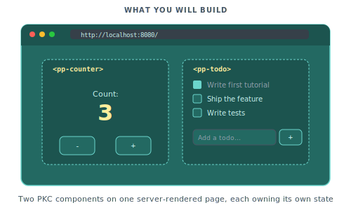

# Adding interactivity

In this tutorial we will take a server-rendered Piko page and make parts of it reactive on the client. We start with a counter that increments on click, then extend it into a small todo list with reactive state, keyed loops, and event handling. The finished project is the same shape as scenarios [003](../showcase/003-reactive-counter.md) and [007](../showcase/007-todo-app.md).

<p align="center">
  
</p>

Before starting, finish the [Your first page](01-your-first-page.md) tutorial. You should have a working Piko project with a dev server running.

## Step 1: Create a client component

Interactivity lives in `.pkc` files, Piko's client-component format. See [about reactivity](../explanation/about-reactivity.md) for why the PK/PKC split exists, and [client components reference](../reference/client-components.md) for the format specification. Create `components/pp-counter.pkc`:

```pkc
<template name="pp-counter">
    <div class="counter">
        <p>Count: {{ state.count }}</p>
        <button p-on:click="increment">+1</button>
    </div>
</template>

<script lang="ts">
    const state = {
        count: 0 as number,
    };

    function increment() {
        state.count++;
    }
</script>

<style>
    .counter {
        display: flex;
        gap: 1rem;
        align-items: center;
        padding: 1rem;
        border: 1px solid #e5e7eb;
        border-radius: 0.5rem;
    }
    button {
        padding: 0.5rem 1rem;
        background: #6F47EB;
        color: white;
        border: none;
        border-radius: 0.25rem;
        cursor: pointer;
    }
</style>
```

## Step 2: Use the component on a page

Create `pages/counter.pk`:

```piko
<template>
    <piko:partial is="layout" :server.page_title="'Counter demo'">
        <h1>Counter demo</h1>
        <p>Click the button to increment the counter:</p>

        <pp-counter />

        <p>
            This entire page is rendered on the server, but the counter
            lives on the client.
        </p>
    </piko:partial>
</template>

<script type="application/x-go">
package main

import (
    "piko.sh/piko"
    layout "myapp/partials/layout.pk"
)

func Render(r *piko.RequestData, props piko.NoProps) (piko.NoResponse, piko.Metadata, error) {
    return piko.NoResponse{}, piko.Metadata{
        Title: "Counter demo",
    }, nil
}
</script>
```

Visit `http://localhost:8080/counter` and click the button. The "Count: 0" text changes to "Count: 1", "Count: 2", and so on. No network request fires. For `p-on:click`, `state`, and `template name`, see [client components reference](../reference/client-components.md).

## Step 3: Read props into the component

Make the starting count and step size configurable with props.

Update `components/pp-counter.pkc`:

```pkc
<template name="pp-counter">
    <div class="counter">
        <p>{{ state.label }}: {{ state.count }}</p>
        <button p-on:click="increment">+{{ state.step }}</button>
    </div>
</template>

<script lang="ts">
    const props = {
        label: 'Count' as string,
        start: 0 as number,
        step: 1 as number,
    };

    const state = {
        count: props.start,
        label: props.label,
        step: props.step,
    };

    function increment() {
        state.count += state.step;
    }
</script>
```

Now pass props from the page:

```html
<pp-counter label="Visitors" start="100" step="5" />
```

Reload `/counter`. The counter now reads "Visitors: 100" and each click adds 5. Props flow one way, from page into component. For the full prop specification see [client components reference](../reference/client-components.md#props).

## Step 4: Build a todo list

A keyed loop lets the framework track each `<li>` across add, remove, and reorder operations. See [directives reference](../reference/directives.md) for `p-for`, `p-key`, `p-model`, and `p-on:submit.prevent`. Create `components/pp-todo-list.pkc`:

```pkc
<template name="pp-todo-list">
    <div class="todo-list">
        <h2>{{ state.items.length }} items</h2>

        <form p-on:submit.prevent="add">
            <input type="text" p-model="state.draft" placeholder="What needs doing?" />
            <button type="submit">Add</button>
        </form>

        <ul>
            <li p-for="item in state.items" p-key="item.id">
                <input
                    type="checkbox"
                    :checked="item.done"
                    p-on:change="toggle(item.id)"
                />
                <span :class="item.done ? 'done' : ''">{{ item.text }}</span>
                <button p-on:click="remove(item.id)">Delete</button>
            </li>
        </ul>

        <p p-if="state.items.length === 0">No items yet. Add one above.</p>
    </div>
</template>

<script lang="ts">
    type Item = {
        id: number;
        text: string;
        done: boolean;
    };

    const state = {
        items: [] as Item[],
        draft: '' as string,
        nextId: 1 as number,
    };

    function add() {
        const text = state.draft.trim();
        if (text === '') {
            return;
        }
        state.items.push({ id: state.nextId, text, done: false });
        state.nextId++;
        state.draft = '';
    }

    function toggle(id: number) {
        const item = state.items.find(i => i.id === id);
        if (item) {
            item.done = !item.done;
        }
    }

    function remove(id: number) {
        state.items = state.items.filter(i => i.id !== id);
    }
</script>

<style>
    .done { text-decoration: line-through; opacity: 0.6; }
    form { display: flex; gap: 0.5rem; margin-bottom: 1rem; }
    input[type="text"] { flex: 1; padding: 0.5rem; }
    ul { list-style: none; padding: 0; }
    li { display: flex; gap: 0.5rem; align-items: center; padding: 0.25rem 0; }
</style>
```

## Step 5: Add the todo list to a page

Create `pages/todos.pk`:

```piko
<template>
    <piko:partial is="layout" :server.page_title="'Todo list'">
        <h1>Todo list</h1>
        <p>A reactive todo list rendered entirely on the client.</p>

        <pp-todo-list />
    </piko:partial>
</template>

<script type="application/x-go">
package main

import (
    "piko.sh/piko"
    layout "myapp/partials/layout.pk"
)

func Render(r *piko.RequestData, props piko.NoProps) (piko.NoResponse, piko.Metadata, error) {
    return piko.NoResponse{}, piko.Metadata{Title: "Todo list"}, nil
}
</script>
```

Visit `http://localhost:8080/todos`. Type "buy milk" and press Enter. A new `<li>` appears above the "No items yet" message, which disappears once the list is non-empty. Tick the checkbox and the text gains a strikethrough. Click Delete and the item vanishes.

## Step 6: Seed the list from the server

Pass an initial list as a JSON-encoded prop. Update the page:

```piko
<template>
    <piko:partial is="layout" :server.page_title="'Todo list'">
        <h1>Todo list</h1>
        <pp-todo-list :items="state.ItemsJSON" />
    </piko:partial>
</template>

<script type="application/x-go">
package main

import (
    "encoding/json"
    "piko.sh/piko"
    layout "myapp/partials/layout.pk"
)

type Item struct {
    ID   int    `json:"id"`
    Text string `json:"text"`
    Done bool   `json:"done"`
}

type Response struct {
    ItemsJSON string
}

func Render(r *piko.RequestData, props piko.NoProps) (Response, piko.Metadata, error) {
    initial := []Item{
        {ID: 1, Text: "Read the tutorial", Done: true},
        {ID: 2, Text: "Build something", Done: false},
    }
    raw, _ := json.Marshal(initial)

    return Response{ItemsJSON: string(raw)}, piko.Metadata{Title: "Todo list"}, nil
}
</script>
```

Update `components/pp-todo-list.pkc` to accept the prop and parse it:

```typescript
const props = {
    items: '[]' as string,
};

const state = {
    items: JSON.parse(props.items) as Item[],
    draft: '' as string,
    nextId: 100 as number,
};
```

Reload `/todos`. The two seeded items appear on first paint. Adding, ticking, and deleting work as before. The JSON-prop pattern keeps the server and client data boundary narrow. For how this interacts with hydration see [about reactivity](../explanation/about-reactivity.md).

## Next steps

- [Server actions and forms](03-server-actions-and-forms.md): learn how a PKC component saves its state back to the server.
- [Client components reference](../reference/client-components.md): the full PKC file format.
- [Scenario 003: reactive counter](../showcase/003-reactive-counter.md) and [Scenario 007: todo app](../showcase/007-todo-app.md) for the runnable source of what you just built.
