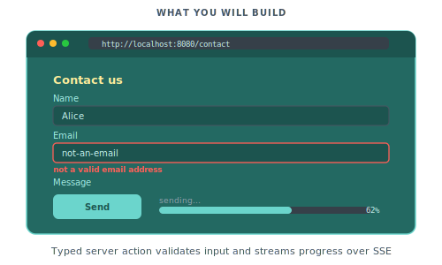

# Server actions and forms

In this tutorial we will build a contact form with server-side validation and a typed response, then add a streaming action that drives a progress bar from the server.

<p align="center">
  
</p>

You should have completed [Adding interactivity](02-adding-interactivity.md) first.

## Step 1: Create the action

Create `actions/contact/submit.go`:

```go
package contact

import (
    "piko.sh/piko"
)

type SubmitInput struct {
    Name    string `json:"name"    validate:"required,min=2"`
    Email   string `json:"email"   validate:"required,email"`
    Message string `json:"message" validate:"required,min=10"`
}

type SubmitResponse struct {
    Ticket string `json:"ticket"`
}

type SubmitAction struct {
    piko.ActionMetadata
}

func (a *SubmitAction) Call(input SubmitInput) (SubmitResponse, error) {
    return SubmitResponse{Ticket: "T-12345"}, nil
}
```

Regenerate the dispatch code:

```bash
go run ./cmd/generator/main.go all
```

For action discovery rules and the full API see [server actions reference](../reference/server-actions.md). For why actions use typed RPC instead of free-form HTTP handlers see [about the action protocol](../explanation/about-the-action-protocol.md).

## Step 2: Create the form page

Create `pages/contact.pk`:

```piko
<template>
    <piko:partial is="layout" :server.page_title="'Contact us'">
        <h1>Contact us</h1>

        <form id="contact-form" p-on:submit.prevent="handleSubmit($event, $form)" class="contact-form">
            <label>
                Your name
                <input type="text" name="name" required minlength="2" />
            </label>

            <label>
                Email
                <input type="email" name="email" required />
            </label>

            <label>
                Message
                <textarea name="message" required minlength="10"></textarea>
            </label>

            <button type="submit">Send</button>
        </form>
    </piko:partial>
</template>

<script type="application/x-go">
package main

import (
    "piko.sh/piko"
    layout "myapp/partials/layout.pk"
)

func Render(r *piko.RequestData, props piko.NoProps) (piko.NoResponse, piko.Metadata, error) {
    return piko.NoResponse{}, piko.Metadata{Title: "Contact us"}, nil
}
</script>

<script lang="ts">
async function handleSubmit(event: SubmitEvent, form: FormDataHandle): Promise<void> {
    try {
        const data = await action.contact.Submit(form).call();
        console.log("Submitted. Ticket:", data.ticket);
    } catch (err) {
        console.error("Submit failed", err);
    }
}
</script>
```

Visit `http://localhost:8080/contact`, fill in the fields, and submit. Open the browser's console. `Submitted. Ticket: T-12345` logs. Piko handled the POST, the CSRF token, JSON parsing, and the `validate` struct tags in one round-trip. Submitting fewer than 10 characters in the message field returns a 422 with a per-field error before `Call` ever runs. (The scaffold wires `piko.WithValidator(playground.NewValidator())` for you. See Step 3 if you need to add it manually.)

For the contract between `Call` and the client runtime see [server actions reference](../reference/server-actions.md#call-signature).

## Step 3: Add field-level validation and a success toast

The `validate:"required,email"` tag already rejects malformed emails before `Call` runs. Let's add a domain-level rule on top of that. Block disposable mailbox addresses, and surface the error against the `email` field. We will also queue a success toast that slides in once the submission goes through:

```go
package contact

import (
    "strings"

    "piko.sh/piko"
)

type SubmitInput struct {
    Name    string `json:"name"    validate:"required,min=2"`
    Email   string `json:"email"   validate:"required,email"`
    Message string `json:"message" validate:"required,min=10"`
}

type SubmitResponse struct {
    Ticket string `json:"ticket"`
}

type SubmitAction struct {
    piko.ActionMetadata
}

var disposableEmailDomains = map[string]struct{}{
    "mailinator.com": {},
    "guerrillamail.com": {},
    "tempmail.org": {},
}

func (a *SubmitAction) Call(input SubmitInput) (SubmitResponse, error) {
    domain := strings.ToLower(input.Email[strings.IndexByte(input.Email, '@')+1:])
    if _, blocked := disposableEmailDomains[domain]; blocked {
        return SubmitResponse{}, piko.ValidationField("email", "Please use a non-disposable email address.")
    }

    ticket := generateTicket()

    a.Response().AddHelper("showToast", "Message sent. We will reply shortly.", "success")

    return SubmitResponse{Ticket: ticket}, nil
}

func generateTicket() string {
    return "T-12345"
}
```

The `validate` tags run before `Call`, and `piko.ValidationField` attaches further errors inside `Call`. Errors auto-render next to the input whose `name` attribute matches the JSON key. See [about the action protocol](../explanation/about-the-action-protocol.md) for the validation pipeline.

Now enable the toast frontend module so the queued toast renders. The scaffold puts framework options in `internal/piko.go`. Add `piko.WithFrontendModule(piko.ModuleToasts)` to the `baseOptions()` slice there, alongside the options that are already present:

```go
return []Option{
    piko.WithCSSReset(piko.WithCSSResetComplete()),
    piko.WithAutoMemoryLimit(automemlimit.Provider()),
    piko.WithImageProvider("imaging", imaging.NewProvider(imaging.Config{})),
    piko.WithAutoNextPort(true),
    piko.WithValidator(playground.NewValidator()),
    piko.WithFrontendModule(piko.ModuleToasts),
    // ... existing WithWebsiteConfig, etc.
}
```

The `WithValidator(playground.NewValidator())` line is the one that makes the `validate` tags actually run. If you bootstrap Piko without it, validation tags silently no-op.

Run the server and submit with a malformed email (`not-an-email`). A red message appears under the email input. Submit with `someone@mailinator.com` and the same field shows the disposable-mailbox message. Submit with valid data and a green toast slides in reading "Message sent. We will reply shortly."

For the full list of validation and action-error constructors see [errors reference](../reference/errors.md).

## Step 4: Add a streaming action

Create `actions/task/process.go`:

```go
package task

import (
    "fmt"
    "time"

    "piko.sh/piko"
)

type ProcessInput struct {
    JobID string `json:"jobId" validate:"required"`
}

type ProcessResponse struct {
    Total int `json:"total"`
}

type ProcessAction struct {
    piko.ActionMetadata
}

func (a *ProcessAction) Call(input ProcessInput) (ProcessResponse, error) {
    return ProcessResponse{Total: 10}, nil
}

func (a *ProcessAction) StreamProgress(stream *piko.SSEStream) error {
    total := 10

    for i := 1; i <= total; i++ {
        if err := stream.Send("progress", map[string]any{
            "done":  i,
            "total": total,
            "label": fmt.Sprintf("Processing step %d of %d", i, total),
        }); err != nil {
            return err
        }

        select {
        case <-a.Ctx().Done():
            return a.Ctx().Err()
        case <-time.After(400 * time.Millisecond):
        }
    }

    return stream.SendComplete(ProcessResponse{Total: total})
}
```

`Call` is the entry point for normal (non-streaming) invocations. `StreamProgress` runs instead when the client opts into SSE via `.withOnProgress(...).call()`. Only one of the two methods runs per request. The action struct embeds `piko.ActionMetadata`, which gives us `a.Ctx()` for cancellation.

Run `go run ./cmd/generator/main.go all` again to pick up the new action.

For the full streaming signature, cancellation, and reconnection see [how to streaming with SSE](../how-to/actions/streaming-with-sse.md).

## Step 5: Consume the stream on the client

Create `components/pp-progress.pkc`:

```pkc
<template name="pp-progress">
    <div class="progress">
        <button p-if="state.status == 'idle'" p-on:click="start">
            Start
        </button>

        <div p-if="state.status == 'running' || state.status == 'done'">
            <progress :value="state.done" :max="state.total"></progress>
            <p>{{ state.label }}</p>
        </div>

        <p p-if="state.status == 'done'">Complete! Job: {{ state.jobId }}</p>
        <p p-if="state.status == 'error'" class="error">{{ state.error }}</p>
    </div>
</template>

<script lang="ts">
    const state = {
        status: 'idle' as 'idle' | 'running' | 'done' | 'error',
        done: 0 as number,
        total: 0 as number,
        label: '' as string,
        jobId: '' as string,
        error: '' as string,
    };

    async function start() {
        state.status = 'running';
        state.done = 0;
        state.label = 'Starting...';

        const jobId = crypto.randomUUID();
        try {
            const result = await action.task.Process({ jobId })
                .withOnProgress((data: unknown, eventType: string) => {
                    const event = data as { done: number; total: number; label: string };
                    state.done = event.done;
                    state.total = event.total;
                    state.label = event.label;
                })
                .call();

            state.status = 'done';
            state.jobId = jobId;
            state.total = result.total;
            state.done = result.total;
        } catch (err) {
            state.status = 'error';
            state.error = (err as Error).message;
        }
    }
</script>

<style>
    progress { width: 100%; height: 1rem; }
    .error { color: #b91c1c; }
</style>
```

## Step 6: Drop the component on a page

Create `pages/progress.pk`:

```piko
<template>
    <piko:partial is="layout" :server.page_title="'Progress demo'">
        <h1>Progress demo</h1>
        <p>Click Start to begin a long-running task.</p>
        <pp-progress></pp-progress>
    </piko:partial>
</template>

<script type="application/x-go">
package main

import (
    "piko.sh/piko"
    layout "myapp/partials/layout.pk"
)

func Render(r *piko.RequestData, props piko.NoProps) (piko.NoResponse, piko.Metadata, error) {
    return piko.NoResponse{}, piko.Metadata{Title: "Progress demo"}, nil
}
</script>
```

Visit `http://localhost:8080/progress` and click Start. The progress bar advances in ten steps of roughly 400 ms each. The label underneath updates with every step. When the run finishes, "Complete. Job: &lt;uuid&gt;" replaces the running label.

For the `withOnProgress(...).call()` builder see [how to streaming with SSE](../how-to/actions/streaming-with-sse.md).

## Where to next

- Next tutorial: [Shipping a real site](04-shipping-a-real-site.md) assembles the pieces into a deployable project.
- Reference: [Server actions reference](../reference/server-actions.md), [errors reference](../reference/errors.md) for the full validation/error constructors.
- Explanation: [About the action protocol](../explanation/about-the-action-protocol.md) covers why actions use typed RPC instead of free-form HTTP handlers.
- How-to: [Forms](../how-to/actions/forms.md), [streaming with SSE](../how-to/actions/streaming-with-sse.md), [rate limiting](../how-to/actions/rate-limiting.md).
- Runnable source: [`examples/scenarios/002_contact_form/`](../../examples/scenarios/002_contact_form/) and [`examples/scenarios/010_progress_tracker/`](../../examples/scenarios/010_progress_tracker/).
