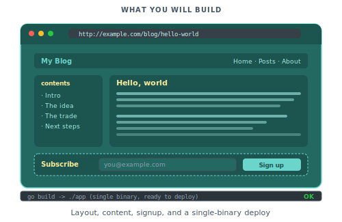

# Shipping a real site

In this tutorial we will assemble the pieces from the earlier tutorials into a complete site. We will build a blog with a shared layout, post pages with a table of contents, a newsletter-signup form, and a metadata configuration ready for deployment. The finished project mirrors scenario [005](../showcase/005-blog-with-layout.md) and pulls in ideas from [020](../showcase/020-m3e-recipe-app.md).

<p align="center">
  
</p>

You should have completed [Your first page](01-your-first-page.md), [Adding interactivity](02-adding-interactivity.md), and [Server actions and forms](03-server-actions-and-forms.md).

## Step 1: Build a layout partial

A layout holds the parts of the page every other page shares. These include the header, the footer, the document head, and the site-wide CSS. Create `partials/layout.pk`:

```piko
<template>
    <!DOCTYPE html>
    <html lang="en">
        <head>
            <meta charset="UTF-8" />
            <meta name="viewport" content="width=device-width, initial-scale=1" />
            <title>{{ state.PageTitle }}</title>
            <meta name="description" :content="state.PageDescription" />
        </head>
        <body>
            <header class="site-header">
                <piko:a href="/" class="brand">MyBlog</piko:a>
                <nav>
                    <piko:a href="/">Home</piko:a>
                    <piko:a href="/about">About</piko:a>
                </nav>
            </header>

            <main>
                <piko:slot />
            </main>

            <footer>
                <p>Built with Piko.</p>
                <piko:slot name="footer" />
            </footer>
        </body>
    </html>
</template>

<script type="application/x-go">
package main

import "piko.sh/piko"

type Props struct {
    PageTitle       string `prop:"page_title" default:"MyBlog"`
    PageDescription string `prop:"page_description" default:""`
}

type Response struct {
    PageTitle       string
    PageDescription string
}

func Render(r *piko.RequestData, props Props) (Response, piko.Metadata, error) {
    return Response{
        PageTitle:       props.PageTitle,
        PageDescription: props.PageDescription,
    }, piko.Metadata{}, nil
}
</script>

<style>
    body { font-family: system-ui, sans-serif; max-width: 768px; margin: 0 auto; padding: 2rem; }
    .site-header { display: flex; justify-content: space-between; padding-bottom: 1rem; border-bottom: 1px solid #e5e7eb; }
    .brand { font-weight: 700; text-decoration: none; color: inherit; }
    nav { display: flex; gap: 1rem; }
    footer { margin-top: 4rem; padding-top: 1rem; border-top: 1px solid #e5e7eb; color: #6b7280; }
</style>
```

See [how to partials/layout](../how-to/partials/layout.md) for a deeper walk through slots and nested layouts, and [directives reference](../reference/directives.md) for the `piko:partial` and `piko:slot` directive grammar.

## Step 2: Create a markdown collection for posts

Blog posts live under `content/blog/`. Create `content/blog/hello-world.md`:

```markdown
---
title: Hello, world
slug: hello-world
date: 2026-01-15
author: Alice Smith
description: A short first post to prove the blog works.
---

# Hello, world

This is the first post on the blog. It is written in **markdown** and rendered by Piko.

## Why a blog?

A blog is a good first real-world Piko project. It exercises routing, collections, layouts, metadata, and content rendering without requiring external services.

## What comes next

The next post will cover how Piko renders this very content.
```

Add one or two more posts with the same shape.

## Step 3: Create the post page

The page template lives at `pages/blog/{slug}.pk`. Piko generates one route per markdown file at build time. [about collections](../explanation/about-collections.md) explains why this happens at build time instead of at request time. [collections API reference](../reference/collections-api.md) documents the full provider surface.

> **Note:** `p-collection` runs at build time, not request time. The generator reads the collection once, fans `pages/blog/{slug}.pk` into one compiled route per markdown file, and bakes the typed frontmatter into each. Adding a post means rebuilding, not just dropping the file in.

```piko
<template p-collection="blog">
    <piko:partial
        is="layout"
        :server.page_title="state.Title + ' | MyBlog'"
        :server.page_description="state.Description"
    >
        <article>
            <header>
                <h1 p-text="state.Title"></h1>
                <p class="byline">
                    By <span p-text="state.Author"></span> on <span p-text="state.Date"></span>
                </p>
            </header>

            <aside p-if="state.TOC !== nil && len(state.TOC) > 0" class="toc">
                <h2>Contents</h2>
                <ol>
                    <li p-for="section in state.TOC" p-key="section.ID">
                        <a :href="'#' + section.ID" p-text="section.Title"></a>
                    </li>
                </ol>
            </aside>

            <main class="post-body">
                <piko:content />
            </main>
        </article>
    </piko:partial>
</template>

<script type="application/x-go">
package main

import (
    "piko.sh/piko"
    layout "myapp/partials/layout.pk"
)

type Post struct {
    Title       string `json:"title"`
    Slug        string `json:"slug"`
    Date        string `json:"date"`
    Author      string `json:"author"`
    Description string `json:"description"`
}

type Response struct {
    Title       string
    Slug        string
    Date        string
    Author      string
    Description string
    TOC         []piko.SectionNode
}

func Render(r *piko.RequestData, props piko.NoProps) (Response, piko.Metadata, error) {
    post := piko.GetData[Post](r)
    toc := piko.GetSectionsTree(r, piko.WithMinLevel(2), piko.WithMaxLevel(3))

    return Response{
        Title:       post.Title,
        Slug:        post.Slug,
        Date:        post.Date,
        Author:      post.Author,
        Description: post.Description,
        TOC:         toc,
    }, piko.Metadata{
        Title:        post.Title + " | MyBlog",
        Description:  post.Description,
        CanonicalURL: "https://myblog.example.com/blog/" + post.Slug,
    }, nil
}
</script>

<style>
    .byline { color: #6b7280; font-style: italic; }
    .toc { background: #f9fafb; padding: 1rem; border-radius: 0.5rem; margin: 1.5rem 0; }
    .toc ol { margin: 0; padding-left: 1.5rem; }
    .post-body { line-height: 1.7; }
    .post-body h2 { margin-top: 2rem; }
</style>
```

> **Note:** `<piko:content />` is a meta element. Anything in the `piko:` namespace renders as the post-colon name with framework behaviour injected; this one disappears from the output, and the framework substitutes the rendered markdown body. It only resolves on a page that declares `p-collection`. To match it in CSS or JS, target the surrounding `<main>`; no `piko-content` element appears in the final HTML.

Run `piko generate` and visit `http://localhost:8080/blog/hello-world`. The post title, byline, a table of contents listing the H2/H3 headings, and the rendered markdown body all appear. Each post gets its own URL derived from its `slug` frontmatter. [collections API reference](../reference/collections-api.md) and [metadata fields reference](../reference/metadata-fields.md) document the helpers used above (`GetData`, `GetSectionsTree`, `<piko:content />`, and the `Metadata` fields).

## Step 4: Build the post index

`pages/blog/index.pk` lists every post. The listing page uses `piko.GetAllCollectionItems`:

```piko
<template>
    <piko:partial is="layout" :server.page_title="'Blog'">
        <h1>All posts</h1>
        <article p-for="post in state.Posts" p-key="post.Slug" class="post-summary">
            <h2>
                <a :href="'/blog/' + post.Slug" p-text="post.Title"></a>
            </h2>
            <p class="byline">By {{ post.Author }} on {{ post.Date }}</p>
            <p p-text="post.Description"></p>
        </article>
    </piko:partial>
</template>

<script type="application/x-go">
package main

import (
    "sort"

    "piko.sh/piko"
    layout "myapp/partials/layout.pk"
)

type PostSummary struct {
    Title       string
    Slug        string
    Date        string
    Author      string
    Description string
}

type Response struct {
    Posts []PostSummary
}

func Render(r *piko.RequestData, props piko.NoProps) (Response, piko.Metadata, error) {
    raw, err := piko.GetAllCollectionItems("blog")
    if err != nil {
        return Response{}, piko.Metadata{}, err
    }

    posts := make([]PostSummary, 0, len(raw))
    for _, item := range raw {
        posts = append(posts, PostSummary{
            Title:       stringOr(item, "title"),
            Slug:        stringOr(item, "slug"),
            Date:        stringOr(item, "date"),
            Author:      stringOr(item, "author"),
            Description: stringOr(item, "description"),
        })
    }

    sort.Slice(posts, func(i, j int) bool {
        return posts[i].Date > posts[j].Date
    })

    return Response{Posts: posts}, piko.Metadata{
        Title:       "Blog",
        Description: "Recent posts from MyBlog.",
    }, nil
}

func stringOr(item map[string]any, key string) string {
    if v, ok := item[key].(string); ok {
        return v
    }
    return ""
}
</script>

<style>
    .post-summary { padding: 1rem 0; border-bottom: 1px solid #f3f4f6; }
    .post-summary:last-child { border-bottom: none; }
    .byline { color: #6b7280; font-size: 0.9rem; }
</style>
```

The listing sorts by date descending and renders a summary for each post. Visit `http://localhost:8080/blog/` to see the index. For querying, filtering, and pagination patterns see [how to querying and filtering collections](../how-to/collections/querying-and-filtering.md).

## Step 5: Add a newsletter signup

Create `actions/newsletter/subscribe.go`:

```go
package newsletter

import (
    "net/mail"

    "piko.sh/piko"
)

type SubscribeResponse struct {
    OK bool `json:"ok"`
}

type SubscribeAction struct {
    piko.ActionMetadata
}

func (a SubscribeAction) Call(email string) (SubscribeResponse, error) {
    if _, err := mail.ParseAddress(email); err != nil {
        return SubscribeResponse{}, piko.ValidationField("email", "Enter a valid email address.")
    }

    // Save to your database or email service here.

    a.Response().AddHelper("showToast", "Subscribed. Thanks for signing up.", "success")

    return SubscribeResponse{OK: true}, nil
}
```

Run `piko generate` to regenerate the dispatch code.

Drop the form into the layout's footer slot. Update any page (or create a reusable partial for the signup form):

```piko
<piko:partial
    is="layout"
    :server.page_title="'Home'"
>
    <!-- page content -->

    <form p-slot="footer" id="newsletter-form" p-on:submit.prevent="subscribe($event, $form)" class="signup">
        <label>
            Get new posts by email
            <input type="email" name="email" required />
        </label>
        <button type="submit">Subscribe</button>
    </form>
</piko:partial>
```

```html
<script lang="ts">
async function subscribe(event: SubmitEvent, form: FormDataHandle): Promise<void> {
    await action.newsletter.Subscribe(form).call();
}
</script>
```

Enable the toasts module at bootstrap:

```go
ssr := piko.New(
    piko.WithFrontendModule(piko.ModuleToasts),
)
```

After `piko generate`, reload `/blog/hello-world`. The footer slot now carries a signup form that POSTs through an action. Submit a valid address and a success toast appears. Submit an invalid one and the field error renders under the input. For the full list of action lifecycle and form helpers see [server actions reference](../reference/server-actions.md).

## Step 6: Prepare for production

Before shipping, turn on the configuration that matters in production. See [bootstrap options reference](../reference/bootstrap-options.md) for every available `With*(...)`, and [how to production build](/docs/how-to/production-build) for deployment targets.

**SEO**. Add sitemap and robots.txt generation:

```go
ssr := piko.New(
    piko.WithSEO(seo.Config{
        BaseURL: "https://myblog.example.com",
    }),
)
```

**CSS tree-shaking**. Remove unused CSS classes from the shipped bundle:

```go
ssr := piko.New(
    piko.WithCSSTreeShaking(),
)
```

**Health endpoint**. Bind to `0.0.0.0` so your orchestrator can probe it (but terminate TLS at a reverse proxy first, not the health endpoint). Update `piko.yaml`:

```yaml
healthProbe:
  bindAddress: "0.0.0.0"
```

**Monitoring**. Enable the gRPC monitoring endpoint so `piko get`, `piko watch`, and your metrics pipeline can reach it:

```go
ssr := piko.New(
    piko.WithMonitoring(
        piko.WithMonitoringBindAddress("127.0.0.1"),
    ),
)
```

**Analytics**. Register at least one collector so Piko logs every pageview somewhere:

```go
import "piko.sh/piko/wdk/analytics/analytics_collector_stdout"

ssr := piko.New(
    piko.WithBackendAnalytics(
        analytics_collector_stdout.NewCollector(),
    ),
)
```

In production you would replace the stdout collector with `analytics_collector_ga4`, `analytics_collector_plausible`, `analytics_collector_webhook`, or a custom collector that satisfies the five-method `Collector` interface.

## Step 7: Ship the binary

Build a static binary:

```bash
piko generate
CGO_ENABLED=0 go build -o myblog ./cmd/main
```

The resulting binary is self-contained. Copy it to the server, set environment variables for any secrets, and run:

```bash
./myblog prod
```

Put a reverse proxy (Caddy, nginx, Cloudflare) in front for TLS termination and static-asset caching. From here, the hexagonal bootstrap layer lets you swap each piece. [about the hexagonal architecture](../explanation/about-the-hexagonal-architecture.md) covers the rationale. [Data-backed pages with the querier](05-data-backed-pages.md) takes the blog to the next stage by adding a real database. [Scenario 024 (database/postgres)](../showcase/024-database-postgres.md) and [Scenario 028 (analytics ecommerce)](../showcase/028-analytics-ecommerce.md) show worked substitutions.

## Next steps

- Read [About PK files](../explanation/about-pk-files.md), [About reactivity](../explanation/about-reactivity.md), and [About the action protocol](../explanation/about-the-action-protocol.md) to understand why the pieces fit the way they do.
- Explore the [reference](/docs/reference/README) section when you need to look up an API detail.
- Skim the [how-to guides](/docs/how-to/README) for recipes on specific tasks.
- Browse the [showcase](../showcase/overview.md) gallery for complete runnable examples.
