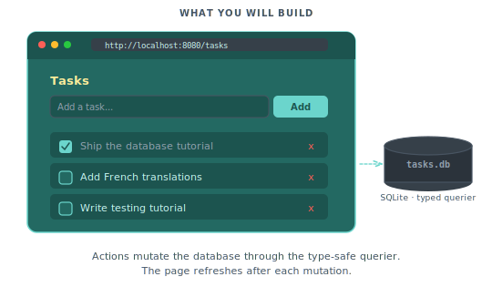

# Data-backed pages with the querier

In this tutorial we will build a task manager backed by a real database. Users add, toggle, and delete tasks that persist to SQLite. The page renders the current list server-side, and a public partial reloads after each mutation so the list stays fresh without a full page navigation.

<p align="center">
  
</p>

The tutorial uses SQLite because it needs no external service. The same querier pattern works with PostgreSQL, MySQL, MariaDB, and DuckDB. See [Scenario 023 (MySQL)](../showcase/023-database-mysql.md), [Scenario 024 (PostgreSQL)](../showcase/024-database-postgres.md), and [Scenario 025 (DuckDB)](../showcase/025-database-duckdb.md) for the equivalent setups on other engines.

You should have completed [Shipping a real site](04-shipping-a-real-site.md) first.

## Step 1: Add SQLite and the querier to go.mod

From the project root:

```bash
go get modernc.org/sqlite
go get piko.sh/piko/wdk/db
go get piko.sh/piko/wdk/db/db_engine_sqlite
```

`modernc.org/sqlite` is a pure-Go SQLite driver. No CGO required, which keeps `CGO_ENABLED=0` builds working.

## Step 2: Write the schema migration

Create `db/migrations/001_tasks.up.sql`:

```sql
CREATE TABLE IF NOT EXISTS tasks (
  id INTEGER PRIMARY KEY AUTOINCREMENT,
  title TEXT NOT NULL,
  completed INTEGER NOT NULL DEFAULT 0,
  created_at INTEGER NOT NULL
);
```

SQLite stores booleans as `INTEGER` with `0` or `1`, and timestamps as `INTEGER` Unix seconds. The migration runner executes every `*.up.sql` file in order on startup.

Embed the migration folder in `db/schema.go`:

```go
package db

import "embed"

//go:embed migrations/*.sql
var Migrations embed.FS
```

## Step 3: Write SQL queries with piko annotations

Create `db/queries/tasks.sql`:

```sql
-- piko.name: ListTasks
-- piko.command: many
SELECT id, title, completed, created_at
FROM tasks
ORDER BY created_at DESC;

-- piko.name: CreateTask
-- piko.command: one
INSERT INTO tasks (title, completed, created_at)
VALUES (?, 0, ?)
RETURNING id, title, completed, created_at;

-- piko.name: ToggleComplete
-- piko.command: exec
UPDATE tasks SET completed = CASE WHEN completed = 0 THEN 1 ELSE 0 END
WHERE id = ?;

-- piko.name: DeleteTask
-- piko.command: exec
DELETE FROM tasks WHERE id = ?;
```

Three annotations drive the generator:

- `piko.name` sets the generated function name.
- `piko.command: many` generates a function returning a slice of rows.
- `piko.command: one` generates a function returning a single row and `error`.
- `piko.command: exec` generates a function that returns only an error.

For the full annotation grammar see [querier reference](../reference/querier.md).

## Step 4: Run the generator

Add a generator command at `cmd/generator/main.go`:

```go
package main

import "piko.sh/piko/wdk/db/db_engine_sqlite/db_generator_sqlite"

func main() {
    db_generator_sqlite.Generate("./db/queries", "./db/generated")
}
```

Run it:

```bash
go run ./cmd/generator
```

The generator walks `db/queries/*.sql` and writes Go source under `db/generated/`. Each SQL file becomes a `<name>.sql.go` file with typed functions and result structs.

Run `piko generate` afterward. The normal Piko generator walks everything else (pages, actions, partials).

## Step 5: Wire the database at bootstrap

Replace `cmd/main/main.go`:

```go
package main

import (
    "context"
    "database/sql"
    "os"

    _ "modernc.org/sqlite"

    "piko.sh/piko"
    "piko.sh/piko/wdk/db"
    "piko.sh/piko/wdk/db/db_engine_sqlite"

    taskdb "myapp/db"
    _ "myapp/dist"
)

func main() {
    if err := os.MkdirAll("./data", 0o755); err != nil {
        panic(err)
    }

    database, err := sql.Open("sqlite", "file:./data/tasks.db")
    if err != nil {
        panic(err)
    }
    database.SetMaxOpenConns(1)

    _, err = database.Exec(
        "PRAGMA journal_mode=WAL; PRAGMA foreign_keys=ON; PRAGMA busy_timeout=5000",
    )
    if err != nil {
        panic(err)
    }

    executor := db.NewMigrationExecutor(database, db.SQLiteDialect())
    fileReader := db.NewFSFileReader(taskdb.Migrations)
    migrator := db.NewMigrationService(executor, fileReader, "migrations")

    if _, err := migrator.Up(context.Background()); err != nil {
        panic(err)
    }

    ssr := piko.New(
        piko.WithDatabase("tasks", &db.DatabaseRegistration{
            DB:           database,
            EngineConfig: db_engine_sqlite.SQLite(),
        }),
    )

    command := piko.RunModeDev
    if len(os.Args) > 1 {
        command = os.Args[1]
    }
    if err := ssr.Run(command); err != nil {
        panic(err)
    }
}
```

Three key pieces:

- `database.SetMaxOpenConns(1)` avoids SQLite lock contention in dev mode. Production setups using WAL mode can raise this.
- The `PRAGMA` statements enable write-ahead logging, foreign keys, and a sane busy timeout.
- `piko.WithDatabase("tasks", ...)` registers the connection under the name `"tasks"` so actions and render functions can retrieve it later.

For the full bootstrap surface see [bootstrap options reference](../reference/bootstrap-options.md#database).

## Step 6: Build the task list partial

Create `partials/task-list.pk`:

> **Note:** The `public` keyword on `<template>` is what makes a partial independently reloadable. Without it, the partial is private; it only renders inside its parent, and `piko.partials.reload(...)` cannot target it. Add `public` whenever the browser needs to refresh a region without reloading the whole page.

```piko
<template public>
  <div class="task-list-container">
    <ul class="task-list" p-if="len(state.Tasks) > 0">
      <li p-for="task in state.Tasks" p-key="task.ID"
          p-class="'task-item' + (task.Completed ? ' completed' : '')">
        <button class="toggle-btn" p-on:click="handleToggle(task.ID)">
          <span p-if="task.Completed">&#10003;</span>
          <span p-if="!task.Completed">&#9675;</span>
        </button>
        <span class="task-title" p-text="task.Title"></span>
        <button class="delete-btn" p-on:click="handleDelete(task.ID)">
          &times;
        </button>
      </li>
    </ul>

    <p p-if="len(state.Tasks) == 0" class="empty-message">
      No tasks yet. Add one above.
    </p>
  </div>
</template>

<script type="application/x-go">
package main

import (
    "piko.sh/piko"
    pikoDb "piko.sh/piko/wdk/db"

    "myapp/db/generated"
)

type Task struct {
    ID        int32  `json:"id"`
    Title     string `json:"title"`
    Completed bool   `json:"completed"`
}

type Response struct {
    Tasks []Task `json:"tasks"`
}

func Render(r *piko.RequestData, props piko.NoProps) (Response, piko.Metadata, error) {
    conn, err := pikoDb.GetDatabaseConnection("tasks")
    if err != nil {
        return Response{}, piko.Metadata{}, err
    }

    queries := generated.New(conn)
    rows, err := queries.ListTasks(r.Context())
    if err != nil {
        return Response{}, piko.Metadata{}, err
    }

    taskList := make([]Task, len(rows))
    for i, row := range rows {
        taskList[i] = Task{
            ID:        row.ID,
            Title:     row.Title,
            Completed: row.Completed != 0,
        }
    }

    return Response{Tasks: taskList}, piko.Metadata{}, nil
}
</script>

<script lang="ts">
async function handleToggle(id: number): Promise<void> {
    await action.tasks.Toggle({ id }).call();
    piko.partials.reload("task-list");
}

async function handleDelete(id: number): Promise<void> {
    await action.tasks.Delete({ id }).call();
    piko.partials.reload("task-list");
}
</script>
```

Two things to notice.

`<template public>` marks this partial as independently reloadable. The client-side runtime can call `piko.partials.reload("task-list")` to re-render only this region. For the full partial surface see [pk-file format reference](../reference/pk-file-format.md).

`pikoDb.GetDatabaseConnection("tasks")` retrieves the `*sql.DB` registered at bootstrap under the name `"tasks"`. `generated.New(conn)` wraps it in the generated querier type.

## Step 7: Build the index page

Create `pages/index.pk`:

```piko
<template>
  <div id="app">
    <h1>Task Manager</h1>

    <form id="add-form" p-on:submit.prevent="handleAdd($event, $form)">
      <div class="add-row">
        <input type="text" name="title" placeholder="What needs doing?" required />
        <button type="submit">Add</button>
      </div>
    </form>

    <piko:partial is="task_list" />
  </div>
</template>

<script type="application/x-go">
package main

import (
    "piko.sh/piko"

    task_list "myapp/partials/task-list.pk"
)

type Response struct{}

func Render(r *piko.RequestData, props piko.NoProps) (Response, piko.Metadata, error) {
    return Response{}, piko.Metadata{Title: "Task Manager"}, nil
}
</script>

<script lang="ts">
async function handleAdd(_event: SubmitEvent, form: FormDataHandle): Promise<void> {
    await action.tasks.Create(form).call();
    piko.partials.reload("task-list");

    const input = form.raw().querySelector('input[name="title"]') as HTMLInputElement;
    if (input) {
        input.value = '';
        input.focus();
    }
}
</script>
```

The page itself has no database state. The partial handles its own data fetch. This keeps the page render cheap and lets the partial reload independently.

## Step 8: Write the Create action

Create `actions/tasks/create.go`:

```go
package tasks

import (
    "time"

    "piko.sh/piko"
    "piko.sh/piko/wdk/db"

    "myapp/db/generated"
)

type CreateAction struct {
    piko.ActionMetadata
}

type CreateInput struct {
    Title string `json:"title" validate:"required,min=1,max=500"`
}

type CreateResponse struct {
    ID    int32  `json:"id"`
    Title string `json:"title"`
}

func (a CreateAction) Call(input CreateInput) (CreateResponse, error) {
    conn, err := db.GetDatabaseConnection("tasks")
    if err != nil {
        return CreateResponse{}, err
    }

    queries := generated.New(conn)
    row, err := queries.CreateTask(a.Ctx(), generated.CreateTaskParams{
        P1: input.Title,
        P2: int32(time.Now().Unix()),
    })
    if err != nil {
        return CreateResponse{}, err
    }

    return CreateResponse{ID: row.ID, Title: row.Title}, nil
}
```

`generated.CreateTaskParams` is the generated input struct. The fields `P1` and `P2` map to the two `?` placeholders in the SQL. The generator assigns positional names because SQLite uses `?` placeholders without names. Query engines with named parameters (PostgreSQL `$1`, `$2`) yield semantically named fields.

## Step 9: Add toggle and delete

Create `actions/tasks/toggle.go`:

```go
package tasks

import (
    "piko.sh/piko"
    "piko.sh/piko/wdk/db"

    "myapp/db/generated"
)

type ToggleAction struct {
    piko.ActionMetadata
}

type ToggleInput struct {
    ID int32 `json:"id" validate:"required"`
}

type ToggleResponse struct{}

func (a ToggleAction) Call(input ToggleInput) (ToggleResponse, error) {
    conn, err := db.GetDatabaseConnection("tasks")
    if err != nil {
        return ToggleResponse{}, err
    }

    queries := generated.New(conn)
    if err := queries.ToggleComplete(a.Ctx(), input.ID); err != nil {
        return ToggleResponse{}, err
    }

    return ToggleResponse{}, nil
}
```

And `actions/tasks/delete.go`:

```go
package tasks

import (
    "piko.sh/piko"
    "piko.sh/piko/wdk/db"

    "myapp/db/generated"
)

type DeleteAction struct {
    piko.ActionMetadata
}

type DeleteInput struct {
    ID int32 `json:"id" validate:"required"`
}

type DeleteResponse struct{}

func (a DeleteAction) Call(input DeleteInput) (DeleteResponse, error) {
    conn, err := db.GetDatabaseConnection("tasks")
    if err != nil {
        return DeleteResponse{}, err
    }

    queries := generated.New(conn)
    if err := queries.DeleteTask(a.Ctx(), input.ID); err != nil {
        return DeleteResponse{}, err
    }

    return DeleteResponse{}, nil
}
```

Regenerate and rebuild:

```bash
go run ./cmd/generator
piko generate
go build ./cmd/main
```

## Step 10: Run the app

```bash
./main
```

Visit `http://localhost:8080/`. Type "buy milk" and press Enter. The partial reloads and the task appears. Click the toggle button and the task gains a strikethrough. Click the delete button and it disappears. The task list persists across restarts because SQLite stores the rows in `./data/tasks.db`.

## Swap to a different engine

The querier pattern is engine-agnostic. To move to PostgreSQL:

1. Replace the driver import with `_ "github.com/jackc/pgx/v5/stdlib"`.
2. Change `sql.Open("sqlite", ...)` to `sql.Open("pgx", "postgres://...")`.
3. Swap `db_engine_sqlite.SQLite()` for `db_engine_postgres.Postgres()`.
4. Swap `db.SQLiteDialect()` for `db.PostgresDialect()` in the migration executor.
5. Adapt the SQL to PostgreSQL syntax (`$1` placeholders, `SERIAL` or `BIGSERIAL` for auto-increment, `TIMESTAMPTZ` for timestamps).
6. Run the generator again. The generated Go signatures gain PostgreSQL-shaped types.

See [Scenario 024: PostgreSQL](../showcase/024-database-postgres.md) for the complete PostgreSQL variant, [Scenario 023: MySQL](../showcase/023-database-mysql.md) for MySQL, and [Scenario 025: DuckDB](../showcase/025-database-duckdb.md) for DuckDB analytics.

## Next steps

- [Testing what you built](06-testing-what-you-built.md): add pikotest coverage to the task manager.
- [Querier reference](../reference/querier.md) for the annotation grammar and generator options.
- [Bootstrap options reference](../reference/bootstrap-options.md#database) for the `WithDatabase` surface.
- [Scenario 022: SQLite database](../showcase/022-database-sqlite.md) for the runnable source of what you built.
