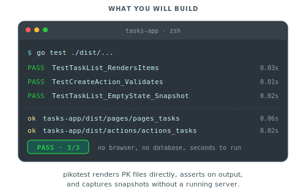

# Testing what you built

In this tutorial we add a test suite to the task manager from [Data-backed pages with the querier](05-data-backed-pages.md). The suite covers a component test for the task list, an action test for the Create action, and a snapshot over the empty state.

<p align="center">
  
</p>

## Step 1: Add a database test helper

Create `testhelpers/db.go`:

```go
package testhelpers

import (
    "context"
    "database/sql"
    "testing"

    _ "modernc.org/sqlite"

    "myapp/db/generated"
)

// OpenMemoryDB returns a fresh in-memory SQLite connection seeded with the
// task schema. Each call gives a clean database.
func OpenMemoryDB(t *testing.T) *sql.DB {
    t.Helper()

    db, err := sql.Open("sqlite", ":memory:")
    if err != nil {
        t.Fatalf("open: %v", err)
    }
    t.Cleanup(func() { db.Close() })

    _, err = db.Exec(`
        CREATE TABLE tasks (
          id INTEGER PRIMARY KEY AUTOINCREMENT,
          title TEXT NOT NULL,
          completed INTEGER NOT NULL DEFAULT 0,
          created_at INTEGER NOT NULL
        );
    `)
    if err != nil {
        t.Fatalf("schema: %v", err)
    }

    return db
}

// SeedTasks inserts a small fixture for tests that need existing data.
func SeedTasks(t *testing.T, db *sql.DB, titles ...string) {
    t.Helper()
    q := generated.New(db)
    for i, title := range titles {
        if _, err := q.CreateTask(context.Background(), generated.CreateTaskParams{
            P1: title,
            P2: int32(1_700_000_000 + i),
        }); err != nil {
            t.Fatalf("seed: %v", err)
        }
    }
}
```

## Step 2: Make the app read the database from context

Tests need to inject their own connection. Create `dbconn/conn.go`:

```go
package dbconn

import (
    "context"
    "database/sql"

    "piko.sh/piko/wdk/db"
)

type ctxKey struct{}

func WithConn(ctx context.Context, c *sql.DB) context.Context {
    return context.WithValue(ctx, ctxKey{}, c)
}

func Conn(ctx context.Context) (*sql.DB, error) {
    if c, ok := ctx.Value(ctxKey{}).(*sql.DB); ok {
        return c, nil
    }
    return db.GetDatabaseConnection("tasks")
}
```

Update the task-list partial to use the new helper. In `partials/task-list.pk`, swap the connection lookup:

```go
conn, err := dbconn.Conn(r.Context())
```

Apply the same change to `actions/tasks/create.go`, replacing `db.GetDatabaseConnection("tasks")` with `dbconn.Conn(a.Ctx())`. The toggle and delete actions follow the same pattern.

Production behaviour is identical because `Conn` falls through to the bootstrap registry when no test connection is present.

## Step 3: Write the first component test

Create `src/partials/task_list_pikotest_test.go` next to the partial. The generator emits a per-partial Go package under `dist/partials/`. List it to find the exact import path:

```bash
ls dist/partials | grep task_list
# partials_task_list_a1b2c3d4
```

Use the printed directory name (here `partials_task_list_a1b2c3d4`) as the last segment of the import:

```go
package partials_test

import (
    "context"
    "testing"

    "piko.sh/piko"

    taskList "myapp/dist/partials/partials_task_list_a1b2c3d4"
    "myapp/dbconn"
    "myapp/testhelpers"
)

func TestTaskListPartial_EmptyState(t *testing.T) {
    db := testhelpers.OpenMemoryDB(t)
    ctx := dbconn.WithConn(context.Background(), db)

    req := piko.NewTestRequest("GET", "/").Build(ctx)

    tester := piko.NewComponentTester(t, taskList.BuildAST)
    view := tester.Render(req, piko.NoProps{})

    view.QueryAST("ul.task-list").NotExists()
    view.QueryAST("p.empty-message").Exists()
    view.QueryAST("p.empty-message").ContainsText("No tasks yet")
}
```

Run the test:

```bash
go test ./src/partials/...
```

A single pass.

## Step 4: Cover the populated state

Add a second test to the same file:

```go
func TestTaskListPartial_PopulatedState(t *testing.T) {
    db := testhelpers.OpenMemoryDB(t)
    testhelpers.SeedTasks(t, db, "buy milk", "walk the dog", "write tests")

    ctx := dbconn.WithConn(context.Background(), db)
    req := piko.NewTestRequest("GET", "/").Build(ctx)

    tester := piko.NewComponentTester(t, taskList.BuildAST)
    view := tester.Render(req, piko.NoProps{})

    view.QueryAST("li.task-item").Count(3)
    view.QueryAST("li.task-item").FirstResult().ContainsText("write tests")
    view.QueryAST("p.empty-message").NotExists()
}
```

Re-run `go test ./src/partials/...`. Both tests pass. `SeedTasks` uses increasing timestamps so the partial's `ORDER BY created_at DESC` puts "write tests" first.

## Step 5: Tighten the Create action

Add an explicit title guard at the top of `Call` so the action validates its own input. See [about the action protocol](../explanation/about-the-action-protocol.md) for why `validate:"..."` tags do not fire under `pikotest`.

Update `actions/tasks/create.go`:

```go
func (a CreateAction) Call(input CreateInput) (CreateResponse, error) {
    if strings.TrimSpace(input.Title) == "" {
        return CreateResponse{}, piko.ValidationField("title", "Title is required.")
    }

    conn, err := dbconn.Conn(a.Ctx())
    if err != nil {
        return CreateResponse{}, err
    }

    queries := generated.New(conn)
    row, err := queries.CreateTask(a.Ctx(), generated.CreateTaskParams{
        P1: input.Title,
        P2: int32(time.Now().Unix()),
    })
    if err != nil {
        return CreateResponse{}, err
    }

    return CreateResponse{ID: row.ID, Title: row.Title}, nil
}
```

Add `"strings"` to the import block. The action tester surfaces the resulting error through `result.AssertError()` and `result.AssertErrorContains(...)`. See [errors reference](../reference/errors.md) for `ValidationField` and the 422 mapping.

## Step 6: Write an action test

Add a registry helper at `testhelpers/actions.go`:

```go
package testhelpers

import (
    "piko.sh/piko"

    actions "myapp/dist/actions"
)

func ActionEntry(name string) piko.ActionHandlerEntry {
    handler, ok := actions.Registry()[name]
    if !ok {
        panic("unknown action: " + name)
    }
    return piko.ActionHandlerEntry{
        Name:   handler.Name,
        Method: handler.Method,
        Create: handler.Create,
        Invoke: handler.Invoke,
        HasSSE: handler.HasSSE,
    }
}
```

Then create `actions/tasks/create_test.go`:

```go
package tasks_test

import (
    "context"
    "testing"

    "piko.sh/piko"

    "myapp/actions/tasks"
    "myapp/dbconn"
    "myapp/testhelpers"
)

func TestCreateAction_Success(t *testing.T) {
    db := testhelpers.OpenMemoryDB(t)
    ctx := dbconn.WithConn(context.Background(), db)

    tester := piko.NewActionTester(t, testhelpers.ActionEntry("tasks.Create"))
    result := tester.Invoke(ctx, map[string]any{
        "title": "buy milk",
    })

    result.AssertSuccess()
    data, ok := result.Data().(tasks.CreateResponse)
    if !ok {
        t.Fatalf("expected tasks.CreateResponse, got %T", result.Data())
    }
    if data.Title != "buy milk" {
        t.Fatalf("got title %q, want buy milk", data.Title)
    }
    if data.ID == 0 {
        t.Fatal("expected a non-zero ID")
    }
}

func TestCreateAction_ValidationError(t *testing.T) {
    db := testhelpers.OpenMemoryDB(t)
    ctx := dbconn.WithConn(context.Background(), db)

    tester := piko.NewActionTester(t, testhelpers.ActionEntry("tasks.Create"))
    result := tester.Invoke(ctx, map[string]any{
        "title": "",
    })

    result.AssertError()
    result.AssertErrorContains("title")
}
```

Run `go test ./actions/tasks/...`. Both tests pass. The empty title trips the manual guard added in step 5 and the action returns a `ValidationError` before touching the database.

For the full `*ActionResultView` assertion surface see [testing API reference](../reference/testing-api.md#action-tester).

## Step 7: Pin the empty-state markup

Snapshot tests in `pikotest` require a wired `RenderService`, which is only constructed by the framework's bootstrap pipeline. The default `piko.NewComponentTester` runs without one so most assertions stay fast and dependency-free. For tutorial-grade markup pinning, AST queries cover the same ground without a renderer. Add to the partial test:

```go
func TestTaskListPartial_EmptyStateMarkup(t *testing.T) {
    db := testhelpers.OpenMemoryDB(t)
    ctx := dbconn.WithConn(context.Background(), db)

    req := piko.NewTestRequest("GET", "/").Build(ctx)
    tester := piko.NewComponentTester(t, taskList.BuildAST)
    view := tester.Render(req, piko.NoProps{})

    view.QueryAST("ul.task-list").NotExists()
    view.QueryAST("p.empty-message").Exists()
    view.QueryAST("p.empty-message").HasText("No tasks yet. Add one above.")
    view.QueryAST("div.task-list-container").Exists()
}
```

Each assertion targets one structural promise. If a future change drops the empty-message paragraph, replaces the wrapper class, or surfaces the list early, the relevant line fails with a clear diagnostic. Diffs in a pull request make visual changes reviewable without a golden file to maintain.

> **Note:** True HTML snapshots (`view.MatchSnapshot(...)`) require attaching a `RenderService` via the internal `pikotest_domain.WithRenderer` option, which is not part of the public API surface. AST queries are the supported surface for partial-level structural tests.

## Step 8: Run everything

```bash
go test ./...
```

The full suite passes in well under a second.

## Where to next

- Next tutorial: [Going multilingual](07-going-multilingual.md) adds i18n to the blog from tutorial 04.
- Reference: [Testing API reference](../reference/testing-api.md) for the full builder, tester, and assertion surface; [browser testing reference](../reference/browser-testing.md).
- Explanation: [About browser testing](../explanation/about-browser-testing.md) covers the runtime model used by the headless harness.
- How-to: [Testing](../how-to/testing.md) for mocking, benchmarking, and table-driven patterns; [browser testing](../how-to/browser-testing.md) for client-side and middleware coverage.
- Runnable source: [`examples/scenarios/022_database_sqlite/`](../../examples/scenarios/022_database_sqlite/) is the canonical task-manager scenario this tutorial extends.
