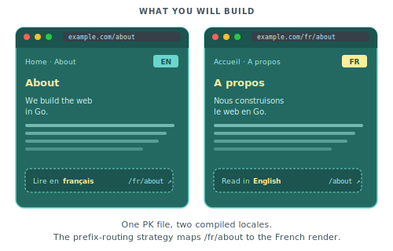

# Going multilingual

In this tutorial we will add French to the blog from [Shipping a real site](04-shipping-a-real-site.md). Visitors will reach `/about` in English and `/fr/about` in French, with localised navigation, metadata, and post bodies.

<p align="center">
  
</p>

You should have completed [Shipping a real site](04-shipping-a-real-site.md) first. The querier and testing tutorials are not prerequisites.

## Step 1: Create global locale files

Create `locales/en.json` at the project root:

```json
{
  "nav": {
    "home": "Home",
    "about": "About",
    "blog": "Blog"
  },
  "footer": {
    "built_with": "Built with Piko."
  },
  "site": {
    "title": "MyBlog",
    "tagline": "Notes on web, code, and coffee."
  },
  "signup": {
    "label": "Get new posts by email",
    "submit": "Subscribe",
    "success": "Subscribed. Thanks for signing up.",
    "invalid_email": "Enter a valid email address."
  }
}
```

And `locales/fr.json`:

```json
{
  "nav": {
    "home": "Accueil",
    "about": "À propos",
    "blog": "Blog"
  },
  "footer": {
    "built_with": "Propulsé par Piko."
  },
  "site": {
    "title": "MonBlog",
    "tagline": "Notes sur le web, le code et le café."
  },
  "signup": {
    "label": "Recevoir les nouveaux articles par email",
    "submit": "S'abonner",
    "success": "Inscription réussie. Merci !",
    "invalid_email": "Entrez une adresse email valide."
  }
}
```

Nested JSON keys flatten to dot notation at runtime, so `nav.home` becomes the lookup key.

## Step 2: Declare the locales in `func main`

Add `WithWebsiteConfig` to the call to `piko.New(...)` in `cmd/main/main.go`:

```go
ssr := piko.New(
    piko.WithWebsiteConfig(piko.WebsiteConfig{
        Name: "MyBlog",
        I18n: piko.I18nConfig{
            DefaultLocale: "en",
            Strategy:      "prefix_except_default",
            Locales:       []string{"en", "fr"},
        },
    }),
)
```

`Strategy: "prefix_except_default"` maps `/about` to English and `/fr/about` to French. For the other strategies see [how to i18n routing strategy](../how-to/i18n/routing-strategy.md).

## Step 3: Translate the layout

Update `partials/layout.pk`. Replace hardcoded strings with `T()` calls and let `<piko:a>` rewrite hrefs against the current locale:

```piko
<template>
  <header class="site-header">
    <piko:a href="/" class="brand">{{ T("site.title") }}</piko:a>
    <nav>
      <piko:a href="/">{{ T("nav.home") }}</piko:a>
      <piko:a href="/about">{{ T("nav.about") }}</piko:a>
      <piko:a href="/blog">{{ T("nav.blog") }}</piko:a>
    </nav>
  </header>

  <main>
    <piko:slot />
  </main>

  <footer>
    <p>{{ T("footer.built_with") }}</p>
    <piko:slot name="footer" />
  </footer>
</template>

<script type="application/x-go">
package main

import "piko.sh/piko"

type Response struct{}

func Render(r *piko.RequestData, props piko.NoProps) (Response, piko.Metadata, error) {
    return Response{}, piko.Metadata{
        Language: r.Locale(),
    }, nil
}
</script>
```

The renderer auto-injects `<!DOCTYPE html>`, `<html lang="...">`, `<head>` (with `<title>` and `<meta name="description">` populated from the page's `Metadata`), and `<body>`. Setting `Metadata.Language` from `r.Locale()` makes the `<html lang>` attribute switch with the request locale. Layouts only contain the body markup. Never write the document wrappers by hand.

Reload `/about` and `/fr/about`. The nav labels and footer text change.

For the `T` helper and the `piko:a` href rewriting see [i18n API reference](../reference/i18n-api.md).

## Step 4: Translate a page from inline i18n

Page-scoped strings live inline. Two helpers reach the translation stores from different angles:

- `T(key)` (template) and `r.T(key)` (Go) walk the global locale files first, then the page's inline `<i18n>` block, and fall back to the literal key. Use `T` for site-wide labels that may also have a page-level override.
- `LT(key)` (template) and `r.LT(key)` (Go) consult only the page's inline `<i18n>` block. Use `LT` for page-only copy that has no business in `locales/*.json`.

Both return a `*Translation` builder. See the [i18n API reference](../reference/i18n-api.md) for the full surface.

Update `pages/about.pk`:

```piko
<template>
  <piko:partial is="layout">
    <article>
      <h1>{{ LT("heading") }}</h1>
      <p>{{ LT("intro") }}</p>
      <p>{{ LT("body") }}</p>
    </article>
  </piko:partial>
</template>

<script type="application/x-go">
package main

import (
    "piko.sh/piko"
    layout "myapp/partials/layout.pk"
)

type Response struct{}

func Render(r *piko.RequestData, props piko.NoProps) (Response, piko.Metadata, error) {
    return Response{}, piko.Metadata{
        Title:       r.LT("title").String(),
        Description: r.LT("description").String(),
    }, nil
}
</script>

<i18n lang="json">
{
  "en": {
    "title": "About MyBlog",
    "description": "A short history of the blog.",
    "heading": "About MyBlog",
    "intro": "MyBlog is a small, quiet site about web, code, and coffee.",
    "body": "It ships as a single Go binary. The whole system fits in your head."
  },
  "fr": {
    "title": "À propos de MonBlog",
    "description": "Une courte histoire du blog.",
    "heading": "À propos de MonBlog",
    "intro": "MonBlog est un petit site discret sur le web, le code et le café.",
    "body": "Il se déploie comme un binaire Go unique. Tout le système tient dans votre tête."
  }
}
</i18n>
```

Reload `/about` and `/fr/about`. The heading, intro, body, and tab title all switch languages.

For `T`, `LT`, `r.T(...)`, `r.LT(...)`, and the `*Translation` builder API see [i18n API reference](../reference/i18n-api.md).

## Step 5: Translate strings with variables

Add a welcome line with two variables. In `locales/en.json`:

```json
{
  "welcome": "Welcome back, ${name}. You have ${count} new messages."
}
```

In `locales/fr.json`:

```json
{
  "welcome": "Bon retour, ${name}. Vous avez ${count} nouveaux messages."
}
```

Bind variables on the `*Translation` builder:

```piko
<p>
  {{ T("welcome").
       StringVar("name", state.Username).
       IntVar("count", state.MessageCount) }}
</p>
```

For the full setter list (`StringVar`, `IntVar`, `FloatVar`, `DecimalVar`, `MoneyVar`, `BigIntVar`, `TimeVar`, `DateTimeVar`) see [how to bind typed variables to translations](../how-to/i18n/variable-binding.md).

For pluralisation, declare pipe-separated forms and call `.Count(n)`:

```json
{
  "messages": "no new messages|one new message|${count} new messages"
}
```

```piko
<p>{{ T("messages").Count(state.MessageCount) }}</p>
```

`Count` selects the right plural variant using Common Locale Data Repository (CLDR) rules. For per-language ordering see [how to pluralise translations](../how-to/i18n/pluralisation.md).

## Step 6: Localise the blog post content

Restructure `content/blog/` per locale:

```
content/
  blog/
    en/
      hello-world.md
      deployment.md
    fr/
      hello-world.md
      deployment.md
```

Each file keeps the same frontmatter. The filename becomes the slug in both languages.

The `pages/blog/{slug}.pk` template stays unchanged from tutorial 04:

```piko
<template p-collection="blog" p-provider="markdown">
  <piko:partial is="layout">
    <!-- existing post body -->
  </piko:partial>
</template>
```

The post page sets `Metadata.Title`, `Metadata.Description`, and `Metadata.Language` from its own `Render`. The layout no longer needs page-title or description props because the document `<head>` is auto-injected from the page's metadata.

Visit `/blog/hello-world` and `/fr/blog/hello-world`. Each serves the locale-specific post body.

For how the markdown driver maps directories to locales see [about collections](../explanation/about-collections.md).

## Step 7: Offer a language switcher

The `<piko:a lang="...">` directive rewrites a bare path *into* the target locale. It does not rewrite a path that is already prefixed for another locale, so the layout has to compute a "neutral" path before the switcher renders. Extend the layout's `Render` to strip the active locale prefix:

```go
import (
    "strings"

    "piko.sh/piko"
)

type Response struct {
    NeutralPath string
}

func Render(r *piko.RequestData, props piko.NoProps) (Response, piko.Metadata, error) {
    path := r.URL().Path
    if locale := r.Locale(); locale != "" && locale != r.DefaultLocale() {
        path = strings.TrimPrefix(path, "/"+locale)
        if path == "" {
            path = "/"
        }
    }

    return Response{NeutralPath: path}, piko.Metadata{
        Language: r.Locale(),
    }, nil
}
```

Then add the switcher to the footer:

```piko
<nav class="lang-switcher">
  <piko:a :href="state.NeutralPath" lang="en">English</piko:a>
  <piko:a :href="state.NeutralPath" lang="fr">Français</piko:a>
</nav>
```

`state.NeutralPath` is `/about` whether the visitor is on `/about` or `/fr/about`. The directive then prepends `/fr` for the French link under the `prefix_except_default` strategy and leaves the English link bare. A user on `/fr/about` clicks "English" and lands on `/about`. A user on `/about` clicks "Français" and lands on `/fr/about`. No JavaScript needed.

For the `lang` attribute and href rewriting rules see [i18n API reference](../reference/i18n-api.md).

## Step 8: Test the localisation

Run the dev server and walk through the checklist:

- Visit `/`. The header reads "MyBlog", the nav reads "Home / About / Blog".
- Visit `/fr/`. The header reads "MonBlog", the nav reads "Accueil / À propos / Blog".
- Visit `/about`. The page title in the browser tab reads "About MyBlog".
- Visit `/fr/about`. The tab reads "À propos de MonBlog".
- View the page source. The `<html lang>` attribute matches.
- View the `<meta name="description">` tag. The text is locale-appropriate.
- Click "Français" on `/about`. You land on `/fr/about`.
- Visit `/blog/hello-world` and `/fr/blog/hello-world`. Each serves the locale-specific post body.

Pikotest covers the rendering. Add a test case per locale:

```go
for _, locale := range []string{"en", "fr"} {
    t.Run(locale, func(t *testing.T) {
        req := piko.NewTestRequest("GET", "/about").
            WithLocale(locale).
            Build(context.Background())
        view := tester.Render(req, piko.NoProps{})

        switch locale {
        case "en":
            view.QueryAST("h1").HasText("About MyBlog")
        case "fr":
            view.QueryAST("h1").HasText("À propos de MonBlog")
        }
    })
}
```

## Where to next

- Reference: [i18n API reference](../reference/i18n-api.md) for the full `T`, `LT`, and `*Translation` surface, [metadata fields reference](../reference/metadata-fields.md) for `AlternateLinks`.
- Explanation: [About i18n](../explanation/about-i18n.md) for the rationale behind the runtime store and fluent builder.
- How-to: [Choose an i18n routing strategy](../how-to/i18n/routing-strategy.md) for the three strategy options, [add another locale to an existing site](../how-to/i18n/basic-setup.md#add-another-locale-to-an-existing-site), [pluralise translations](../how-to/i18n/pluralisation.md), [bind typed variables](../how-to/i18n/variable-binding.md), [format dates and times for a locale](../how-to/i18n/date-time-formatting.md).
- Runnable source: [`examples/scenarios/005_blog_with_layout/`](../../examples/scenarios/005_blog_with_layout/) is the closest scenario; couple it with the i18n config in this tutorial.
